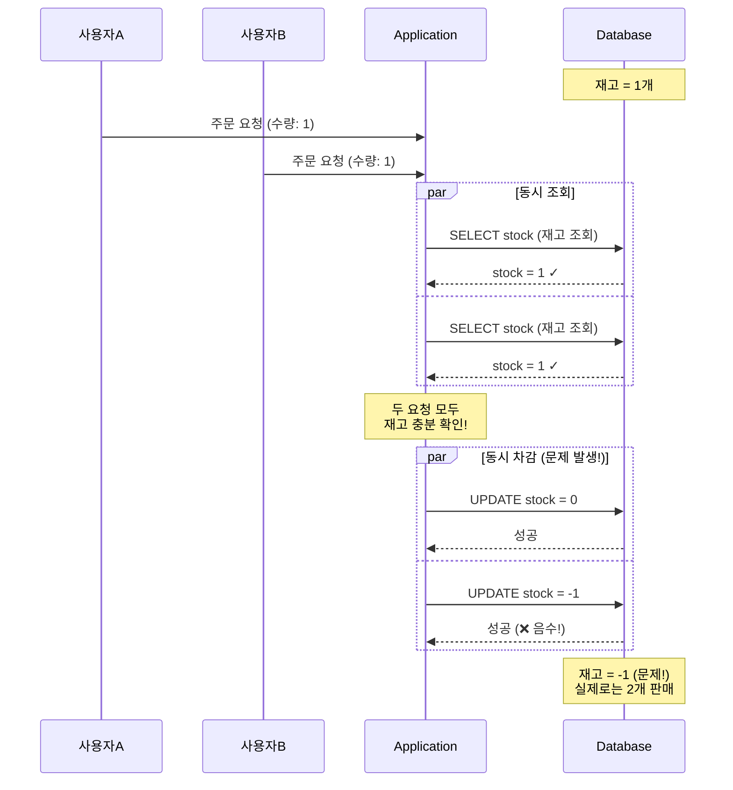
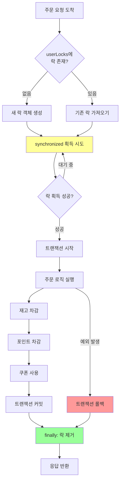
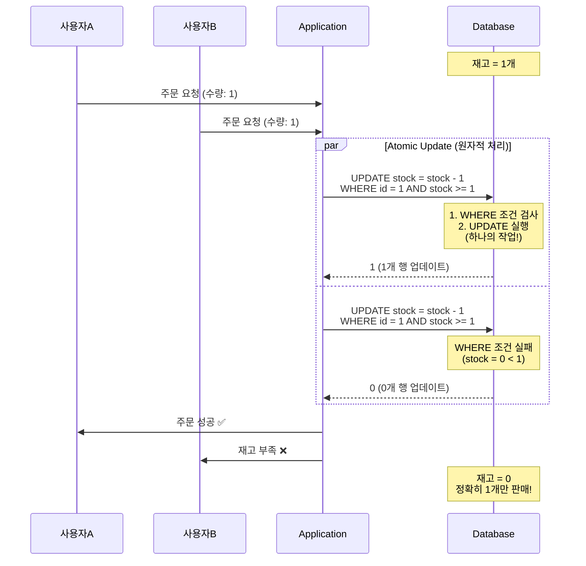
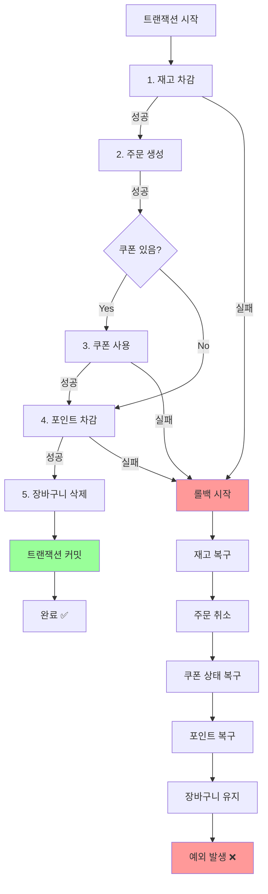
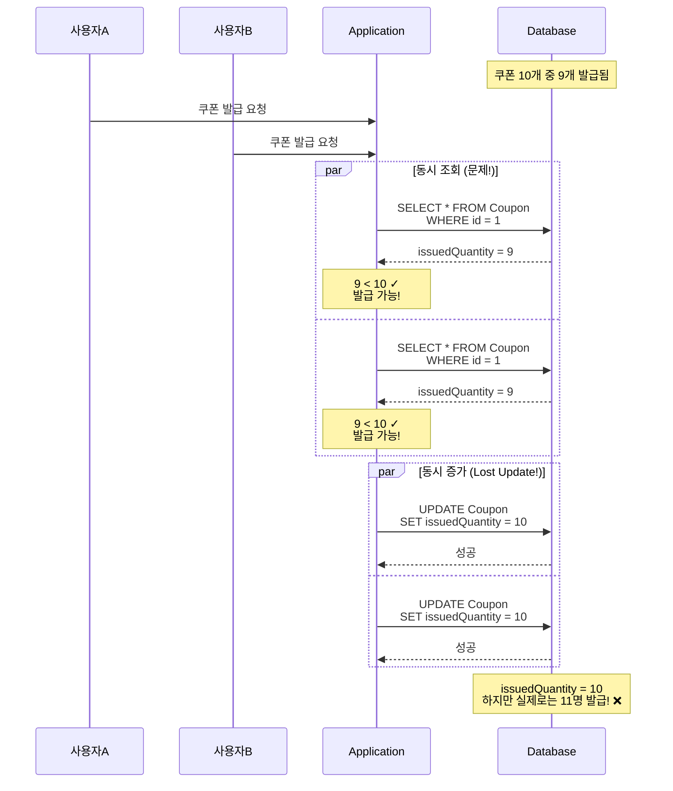
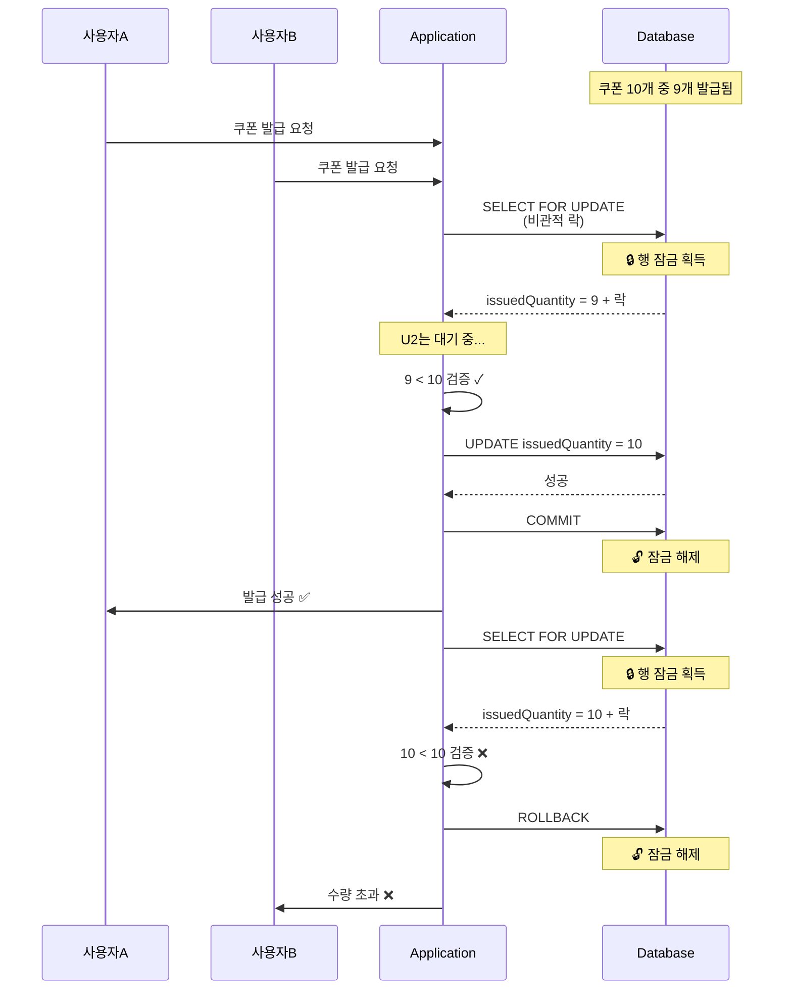
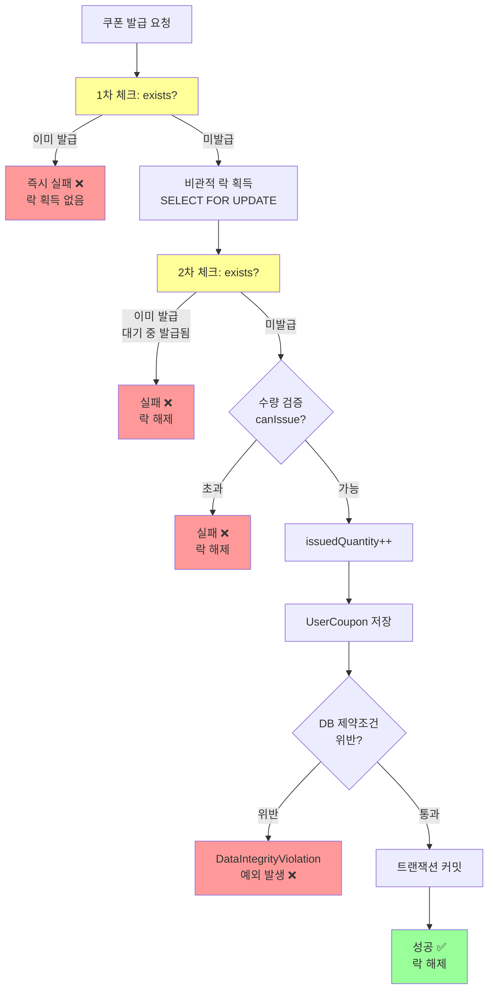

## 동시성 관련 report

> 주문시 + 쿠폰 발급시 동시성 발급이 되는 곳에 대한 분석입니다.

## 주문 생성 로직의 동시성 문제 분석

### 동시성 문제가 발생할 수 있는 부분

#### 1. 재고 차감 (여러 사용자가 동시에 같은 상품 주문)
- **문제**: 여러 사용자가 동시에 같은 상품을 주문할 때 재고보다 많이 차감될 수 있음
- **시나리오**: 재고가 10개인데 20명이 동시에 주문하면?

#### 2. 포인트 차감 (같은 사용자의 동시 주문)
- **문제**: 같은 사용자가 여러 창에서 동시 주문 시 포인트 잔액보다 많이 차감될 수 있음
- **시나리오**: 잔액 10만원인데 동시에 6만원씩 2건 주문하면?

#### 3. 쿠폰 사용 (동일 쿠폰 중복 사용)
- **문제**: 같은 쿠폰을 여러 주문에서 동시에 사용할 수 있음
- **시나리오**: 1회용 쿠폰을 동시에 여러 주문에 적용하면?

### 재고 차감 Race Condition 시나리오



**문제점**: 조회와 차감이 분리되어 있어 Race Condition 발생

---

## 적용된 동시성 방어 메커니즘

### 1. Application Level - 사용자 단위 락

```java
private final ConcurrentHashMap<Long, Object> userLocks = new ConcurrentHashMap<>();

public CreateOrderResponse execute(Long userId, CreateOrderRequest request) {
    Object lock = userLocks.computeIfAbsent(userId, k -> new Object());

    synchronized (lock) {
        try {
            return orderTransactionService.executeOrderLogic(userId, request);
        } finally {
            userLocks.remove(userId);
        }
    }
}
```

**방어 효과:**
- ✅ **같은 사용자**의 동시 주문을 순차적으로 처리
- ✅ 포인트 이중 차감 방지
- ✅ 쿠폰 이중 사용 방지
- ❌ **다른 사용자**의 동시 주문은 방어하지 못함 (재고 경합)


### 🔄 사용자 락 메커니즘 플로우



**동작 원리:**
1. 사용자별 락 객체 생성 (같은 사용자 = 같은 락)
2. synchronized 블록으로 직렬화
3. finally 블록으로 반드시 락 제거 (메모리 누수 방지)

---

### 2. Database Level - Atomic Update (재고 차감)

```java
@Modifying(clearAutomatically = true)
@Query("UPDATE ProductOption p SET p.stock = p.stock - :quantity " +
       "WHERE p.id = :id AND p.stock >= :quantity")
int decreaseStock(@Param("id") Long id, @Param("quantity") int quantity);
```

**방어 효과:**
- ✅ **여러 사용자**가 동시에 같은 상품을 주문해도 재고 보장
- ✅ WHERE 조건에 `p.stock >= :quantity` 포함으로 재고 부족 시 0 반환
- ✅ UPDATE 자체가 원자적으로 실행되어 Race Condition 방지
- ✅ `clearAutomatically = true`로 영속성 컨텍스트 자동 정리

**동작 원리:**
1. UPDATE 쿼리가 데이터베이스에서 원자적으로 실행
2. WHERE 조건 검사와 UPDATE가 하나의 작업으로 처리
3. 조건을 만족하는 행만 업데이트되고, 실패 시 영향받은 행 수 = 0 반환
4. 애플리케이션에서 반환값 0을 확인하여 재고 부족 예외 발생

### 🎯 Atomic Update 동작 원리



---

### 3. Database Level - Atomic Update (포인트 차감)


```java
@Modifying(clearAutomatically = true)
@Query("UPDATE Point p SET p.amount = p.amount - :deductAmount, " +
       "p.version = p.version + 1, p.updatedAt = CURRENT_TIMESTAMP " +
       "WHERE p.userId = :userId AND p.amount >= :deductAmount")
int deductPoint(@Param("userId") Long userId, @Param("deductAmount") int deductAmount);
```

**방어 효과:**
- ✅ WHERE 조건에 `p.amount >= :deductAmount` 포함으로 잔액 부족 시 0 반환
- ✅ version 필드 업데이트로 낙관적 락과 유사한 효과
- ✅ **User Lock과 함께** 이중 방어 구조
- ✅ updatedAt 자동 갱신으로 최종 수정 시간 추적

**동작 원리:**
1. WHERE 조건으로 잔액 검증과 차감을 원자적으로 수행
2. version 필드 증가로 동시성 제어 강화
3. User Lock(synchronized)이 1차 방어, Atomic Update가 2차 방어


---

### 4. Database Level - Atomic Update (쿠폰 사용)

```java
@Modifying(clearAutomatically = true)
@Query("UPDATE UserCoupon uc SET uc.status = 'USED', uc.usedAt = CURRENT_TIMESTAMP " +
       "WHERE uc.id = :userCouponId AND uc.status = 'AVAILABLE'")
int useCoupon(@Param("userCouponId") Long userCouponId);
```

**방어 효과:**
- ✅ WHERE 조건에 `uc.status = 'AVAILABLE'` 포함으로 이미 사용된 쿠폰은 0 반환
- ✅ **User Lock과 함께** 이중 방어 구조
- ✅ usedAt 타임스탬프로 사용 시점 기록

**동작 원리:**
1. WHERE 조건으로 AVAILABLE 상태 확인과 USED 상태 변경을 원자적으로 수행
2. 이미 사용된 쿠폰은 WHERE 조건 불일치로 업데이트되지 않음
3. User Lock이 같은 사용자의 동시 요청을 직렬화

---

### 5. Application Level - 낙관적 락 재시도 메커니즘

```java
@Retryable(
    retryFor = OptimisticLockException.class,
    maxAttempts = 3,
    backoff = @Backoff(delay = 100, maxDelay = 500, multiplier = 2)
)
@Transactional
public CreateOrderResponse executeOrderLogic(Long userId, CreateOrderRequest request) {
    // 주문 로직 실행
}

@Recover
public CreateOrderResponse recoverFromOptimisticLock(OptimisticLockException e, Long userId, CreateOrderRequest request) {
    log.error("낙관적 락 재시도 실패 - userId: {}, 최대 재시도 횟수 초과", userId, e);
    throw new OrderException(OrderErrorCode.ORDER_CONFLICT);
}
```

**방어 효과:**
- ✅ `OptimisticLockException` 발생 시 자동 재시도
- ✅ 최대 3회까지 재시도 (1차: 100ms, 2차: 200ms, 3차: 500ms 대기)
- ✅ 지수 백오프(Exponential Backoff)로 경합 완화
- ✅ 재시도 실패 시 명확한 에러 메시지 반환

**동작 원리:**
1. `@Transactional` 메서드 실행 중 `OptimisticLockException` 발생
2. Spring Retry가 자동으로 메서드 재실행
3. 백오프 시간만큼 대기 후 재시도 (100ms → 200ms → 500ms)
4. 최대 3회 재시도 후에도 실패하면 `@Recover` 메서드 실행
5. 최종적으로 `OrderException`으로 변환하여 사용자에게 반환

### 🔁 낙관적 락 재시도 플로우

```mermaid
flowchart TD
    A[주문 로직 실행] --> B{성공?}
    B -->|성공| C[응답 반환 ✅]
    B -->|OptimisticLockException| D[1차 재시도<br/>100ms 대기]

    D --> E{성공?}
    E -->|성공| C
    E -->|OptimisticLockException| F[2차 재시도<br/>200ms 대기]

    F --> G{성공?}
    G -->|성공| C
    G -->|OptimisticLockException| H[3차 재시도<br/>500ms 대기]

    H --> I{성공?}
    I -->|성공| C
    I -->|OptimisticLockException| J[@Recover 메서드]

    J --> K[ORDER_CONFLICT<br/>예외 발생 ❌]

    style C fill:#9f9
    style K fill:#f99
    style D fill:#ff9
    style F fill:#ff9
    style H fill:#ff9
```

**사용 이유:**
- Point 엔티티의 `version` 필드로 인해 동시 업데이트 시 낙관적 락 충돌 가능
- 재시도를 통해 일시적인 경합 상황을 자동으로 해결
- 사용자는 재시도 과정을 인지하지 못하고 성공 응답 받음

---

## 트랜잭션 롤백 처리

### 전체 트랜잭션 일관성 보장

```java
@Transactional
public CreateOrderResponse executeOrderLogic(Long userId, CreateOrderRequest request) {
    // 주문 로직 실행
}
```

**처리 순서:**
1. 재고 차감 (`decreaseStock`)
2. 주문 생성 (`orderRepository.save`)
3. 쿠폰 사용 (`useCoupon`) - 선택적
4. 포인트 차감 (`deductPoint`)
5. 장바구니 삭제 (`deleteAllByUserId`)

**롤백 시나리오:**
- 포인트 부족 시: 재고 차감 롤백, 쿠폰 상태 롤백
- 쿠폰 사용 실패 시: 재고 차감 롤백
- 재고 부족 시: 즉시 예외 발생, 트랜잭션 시작 전 상태 유지

### ↩️ 트랜잭션 롤백 흐름



---

## 선착순 쿠폰 발급 로직의 동시성 문제 분석

### 동시성 문제가 발생할 수 있는 부분

#### 1. 쿠폰 수량 차감 경쟁 조건 (Race Condition)
- **문제**: 여러 사용자가 동시에 같은 쿠폰을 발급받을 때 총 수량보다 많이 발급될 수 있음
- **시나리오**:
  ```
  총 10개 쿠폰, 현재 9개 발급됨
  - 요청 A: issuedQuantity(9) < totalQuantity(10) ✓ → 발급 시도
  - 요청 B: issuedQuantity(9) < totalQuantity(10) ✓ → 발급 시도
  → 결과: 11개 발급될 수 있음 (초과 발급)
  ```

#### 2. 중복 발급 (Duplicate Issue)
- **문제**: 동일 사용자가 같은 쿠폰을 여러 번 발급받을 수 있음
- **시나리오**:
  ```
  동일 사용자(userId=1)가 동시에 여러 번 요청
  - 요청 1: exists 체크 → false → 발급 시도
  - 요청 2: exists 체크 → false → 발급 시도 (요청 1이 아직 저장 안됨)
  → 결과: 동일 사용자가 같은 쿠폰을 2번 받음
  ```

#### 3. 갱신 손실 (Lost Update)
- **문제**: issuedQuantity++ 연산이 원자적이지 않아 발급 수량 카운트가 정확하지 않을 수 있음
- **시나리오**:
  ```
  - 트랜잭션 A: READ(issuedQuantity=10) → +1 → WRITE(11)
  - 트랜잭션 B: READ(issuedQuantity=10) → +1 → WRITE(11)
  → 결과: 2번 발급했지만 카운트는 1만 증가
  ```

### 쿠폰 발급 Race Condition 시나리오



**문제점**: 조회와 증가가 분리되어 있어 Lost Update 발생

---

## 적용된 동시성 방어 메커니즘

### 1. Database Level - 비관적 락 (Pessimistic Write Lock)

```java
@Lock(LockModeType.PESSIMISTIC_WRITE)
@Query("SELECT c FROM Coupon c WHERE c.id = :couponId")
Optional<Coupon> findByIdWithLock(@Param("couponId") Long couponId);
```

**방어 효과:**
- ✅ 쿠폰 조회 시 데이터베이스 행 잠금(Row Lock) 획득
- ✅ 다른 트랜잭션은 해당 쿠폰을 읽거나 수정할 수 없음
- ✅ `issuedQuantity++` 연산의 원자성 보장
- ✅ **Race Condition과 Lost Update 문제 해결**

**동작 원리:**
1. `findByIdWithLock()` 호출 시 해당 쿠폰 행에 배타적 잠금 설정
2. 트랜잭션이 커밋되거나 롤백될 때까지 다른 트랜잭션은 대기
3. 수량 검증(`canIssue()`)과 증가(`issuedQuantity++`)가 직렬화되어 안전하게 처리
4. 트랜잭션 종료 시 잠금 자동 해제

### 🔒 비관적 락 동작 원리



**핵심**: 한 번에 한 트랜잭션만 쿠폰에 접근 가능 (직렬화)

---

### 2. Database Level - 유니크 제약조건 (Unique Constraint)

**위치**: `src/main/java/org/hhplus/hhecommerce/domain/coupon/UserCoupon.java:11-14`

```java
@UniqueConstraint(
    name = "uk_user_coupon",
    columnNames = {"user_id", "coupon_id"}
)
```

**방어 효과:**
- ✅ 데이터베이스 레벨에서 (userId, couponId) 조합의 유일성 보장
- ✅ 애플리케이션 레벨 체크를 우회하더라도 DB가 최종 방어
- ✅ **중복 발급 문제의 최후 방어선**
- ✅ 데이터 무결성 보장

**동작 원리:**
1. INSERT 시 DB가 자동으로 (user_id, coupon_id) 조합의 유일성 검증
2. 중복 시도 시 `DataIntegrityViolationException` 발생
3. 애플리케이션에서 예외를 `CouponException`으로 변환하여 처리

---

### 3. Application Level - 이중 체크 패턴 (Double Check Pattern)

```java
// 락 획득 전 체크 (성능 최적화)
if (userCouponRepository.existsByUserIdAndCouponId(userId, couponId)) {
    throw new CouponException(CouponErrorCode.COUPON_ALREADY_ISSUED);
}

Coupon coupon = couponRepository.findByIdWithLock(couponId)  // 락 획득
        .orElseThrow(...);

// 락 획득 후 재체크 (정확성 보장)
if (userCouponRepository.existsByUserIdAndCouponId(userId, couponId)) {
    throw new CouponException(CouponErrorCode.COUPON_ALREADY_ISSUED);
}
```

**방어 효과:**
- ✅ **락 전 체크**: 불필요한 락 획득 방지로 성능 향상
- ✅ **락 후 재체크**: 락 획득 대기 중 다른 트랜잭션이 발급했을 가능성 방어
- ✅ **중복 발급 문제 방어 강화**
- ✅ Fast-fail 전략으로 리소스 낭비 최소화

**동작 원리:**
1. 1차 체크: 이미 발급받은 경우 빠르게 실패 (락 획득 없음)
2. 락 획득: 쿠폰 데이터 잠금
3. 2차 체크: 락 대기 중 발급된 경우를 방어
4. 발급 처리: 수량 증가 및 사용자 쿠폰 저장

### 🔄 이중 체크 패턴 플로우



---

### 4. Application Level - 예외 처리를 통한 방어

```java
try {
    UserCoupon userCoupon = new UserCoupon(userId, couponId, LocalDateTime.now().plusDays(30));
    userCouponRepository.save(userCoupon);

    return new IssueCouponResponse(...);
} catch (DataIntegrityViolationException e) {
    throw new CouponException(CouponErrorCode.COUPON_ALREADY_ISSUED);
}
```

**방어 효과:**
- ✅ DB 제약조건 위반 시 적절한 예외로 변환
- ✅ 유니크 제약조건 위반을 사용자 친화적 에러로 전환
- ✅ **최후의 방어선** 역할
- ✅ 예상치 못한 동시성 문제도 안전하게 처리

**동작 원리:**
1. 이중 체크를 통과한 경우에도 DB 레벨에서 최종 검증
2. 유니크 제약조건 위반 시 `DataIntegrityViolationException` 발생
3. 비즈니스 예외(`CouponException`)로 변환하여 일관된 에러 처리
