# API 명세서

## API 목록

### 1. 상품 관리 API

#### 1.1 상품 목록 조회
- **Endpoint**: `GET /api/products`
- **Description**: 전체 상품 목록을 조회합니다.

#### 1.2 상품 상세 조회
- **Endpoint**: `GET /api/products/{productId}`
- **Description**: 특정 상품의 상세 정보를 조회합니다 (가격, 재고, 옵션 포함).

#### 1.3 인기 상품 조회
- **Endpoint**: `GET /api/products/popular`
- **Description**: 최근 3일간 가장 많이 판매된 상품 Top 5를 조회합니다.

### 2. 장바구니 API

#### 2.1 장바구니 조회
- **Endpoint**: `GET /api/carts`
- **Description**: 사용자의 장바구니 목록을 조회합니다.

#### 2.2 장바구니 상품 추가
- **Endpoint**: `POST /api/carts`
- **Description**: 장바구니에 상품을 추가합니다.

#### 2.3 장바구니 상품 수량 변경
- **Endpoint**: `PATCH /api/carts/{cartId}`
- **Description**: 장바구니 상품의 수량을 변경합니다.

#### 2.4 장바구니 상품 삭제
- **Endpoint**: `DELETE /api/carts/{cartId}`
- **Description**: 장바구니에서 상품을 삭제합니다.

### 3. 주문/결제 API

#### 3.1 주문 생성
- **Endpoint**: `POST /api/orders`
- **Description**: 장바구니 상품으로 주문을 생성하고 결제를 진행합니다 (재고 확인 및 차감, 쿠폰 적용).

#### 3.2 주문 목록 조회
- **Endpoint**: `GET /api/orders`
- **Description**: 사용자의 주문 내역을 조회합니다.

#### 3.3 주문 상세 조회
- **Endpoint**: `GET /api/orders/{orderId}`
- **Description**: 특정 주문의 상세 정보를 조회합니다.

### 4. 쿠폰 API

#### 4.1 발급 가능한 쿠폰 목록 조회
- **Endpoint**: `GET /api/coupons`
- **Description**: 현재 발급 가능한 쿠폰 목록을 조회합니다.

#### 4.2 쿠폰 발급
- **Endpoint**: `POST /api/coupons/{couponId}/issue`
- **Description**: 선착순으로 쿠폰을 발급받습니다.

#### 4.3 보유 쿠폰 조회
- **Endpoint**: `GET /api/users/coupons`
- **Description**: 사용자가 보유한 쿠폰 목록을 조회합니다.

#### 4.4 사용 가능한 쿠폰 조회
- **Endpoint**: `GET /api/users/coupons/available`
- **Description**: 현재 주문에 사용 가능한 쿠폰 목록을 조회합니다.

### 5. 잔액 API

#### 5.1 잔액 조회
- **Endpoint**: `GET /api/balance`
- **Description**: 사용자의 현재 잔액을 조회합니다.

#### 5.2 잔액 충전
- **Endpoint**: `POST /api/balance/charge`
- **Description**: 사용자의 잔액을 충전합니다.

---

## 시퀀스 다이어그램

### 1. 상품 관리 API

#### 1.1 상품 목록 조회

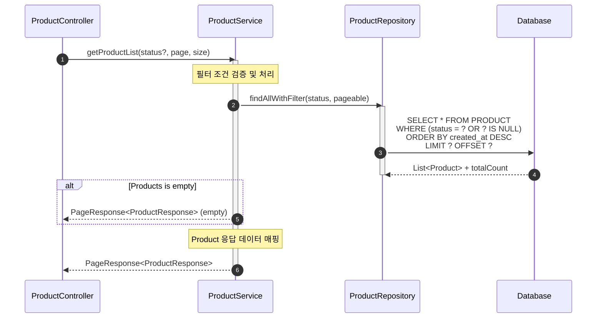
```mermaid
sequenceDiagram
    autonumber
    participant C as ProductController
    participant S as ProductService
    participant PR as ProductRepository
    participant DB as Database

    C->>S: getProductList(status?, page, size)
    activate S

    Note over S: 필터 조건 검증 및 처리

    S->>PR: findAllWithFilter(status, pageable)
    activate PR
    PR->>DB: SELECT * FROM PRODUCT<br/>WHERE (status = ? OR ? IS NULL)<br/>ORDER BY created_at DESC<br/>LIMIT ? OFFSET ?
    DB-->>PR: List<Product> + totalCount
    deactivate PR

    alt Products is empty
        S-->>C: PageResponse<ProductResponse> (empty)
    end

    Note over S: Product 응답 데이터 매핑

    S-->>C: PageResponse<ProductResponse>
    deactivate S
```

#### 1.2 상품 상세 조회

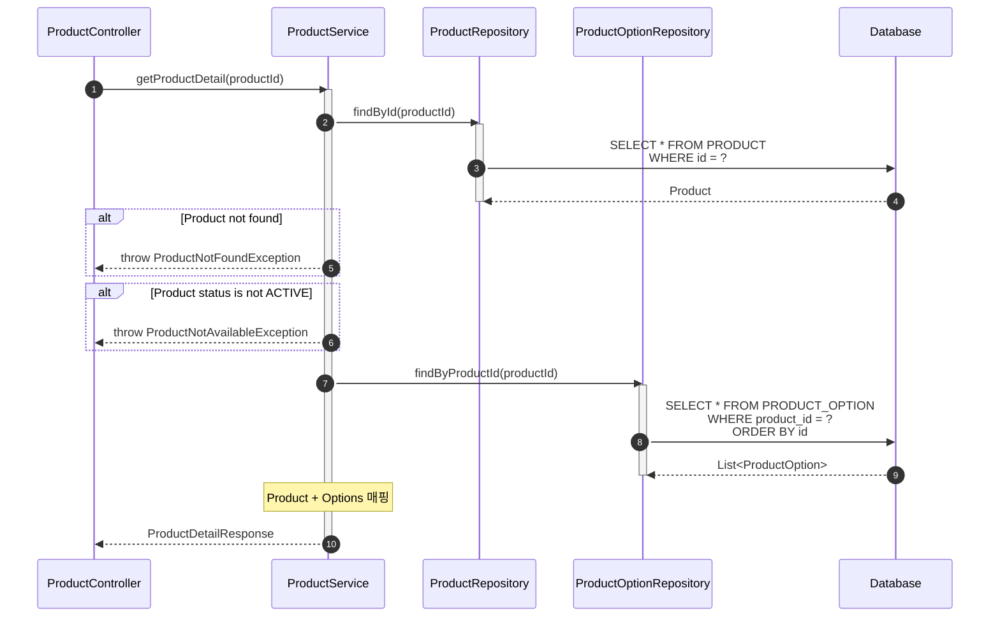
```mermaid
sequenceDiagram
    autonumber
    participant C as ProductController
    participant S as ProductService
    participant PR as ProductRepository
    participant POR as ProductOptionRepository
    participant DB as Database

    C->>S: getProductDetail(productId)
    activate S

    S->>PR: findById(productId)
    activate PR
    PR->>DB: SELECT * FROM PRODUCT<br/>WHERE id = ?
    DB-->>PR: Product
    deactivate PR

    alt Product not found
        S-->>C: throw ProductNotFoundException
    end

    alt Product status is not ACTIVE
        S-->>C: throw ProductNotAvailableException
    end

    S->>POR: findByProductId(productId)
    activate POR
    POR->>DB: SELECT * FROM PRODUCT_OPTION<br/>WHERE product_id = ?<br/>ORDER BY id
    DB-->>POR: List<ProductOption>
    deactivate POR

    Note over S: Product + Options 매핑

    S-->>C: ProductDetailResponse
    deactivate S
```

#### 1.3 인기 상품 조회

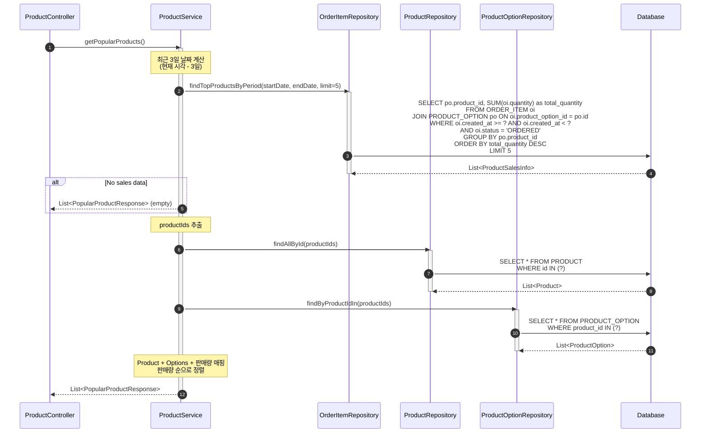
```mermaid
sequenceDiagram
    autonumber
    participant C as ProductController
    participant S as ProductService
    participant OIR as OrderItemRepository
    participant PR as ProductRepository
    participant POR as ProductOptionRepository
    participant DB as Database

    C->>S: getPopularProducts()
    activate S

    Note over S: 최근 3일 날짜 계산<br/>(현재 시각 - 3일)

    S->>OIR: findTopProductsByPeriod(startDate, endDate, limit=5)
    activate OIR
    OIR->>DB: SELECT po.product_id, SUM(oi.quantity) as total_quantity<br/>FROM ORDER_ITEM oi<br/>JOIN PRODUCT_OPTION po ON oi.product_option_id = po.id<br/>WHERE oi.created_at >= ? AND oi.created_at < ?<br/>AND oi.status = 'ORDERED'<br/>GROUP BY po.product_id<br/>ORDER BY total_quantity DESC<br/>LIMIT 5
    DB-->>OIR: List<ProductSalesInfo>
    deactivate OIR

    alt No sales data
        S-->>C: List<PopularProductResponse> (empty)
    end

    Note over S: productIds 추출

    S->>PR: findAllById(productIds)
    activate PR
    PR->>DB: SELECT * FROM PRODUCT<br/>WHERE id IN (?)
    DB-->>PR: List<Product>
    deactivate PR

    S->>POR: findByProductIdIn(productIds)
    activate POR
    POR->>DB: SELECT * FROM PRODUCT_OPTION<br/>WHERE product_id IN (?)
    DB-->>POR: List<ProductOption>
    deactivate POR

    Note over S: Product + Options + 판매량 매핑<br/>판매량 순으로 정렬

    S-->>C: List<PopularProductResponse>
    deactivate S
```

### 2. 장바구니 API

#### 2.1 장바구니 조회

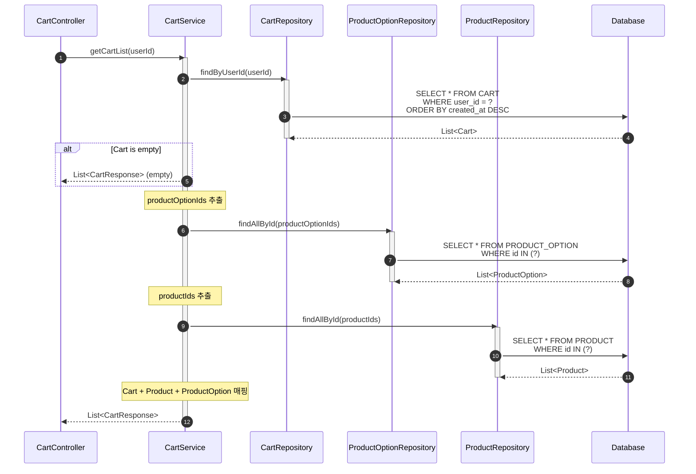
```mermaid
sequenceDiagram
    autonumber
    participant C as CartController
    participant S as CartService
    participant CR as CartRepository
    participant POR as ProductOptionRepository
    participant PR as ProductRepository
    participant DB as Database

    C->>S: getCartList(userId)
    activate S

    S->>CR: findByUserId(userId)
    activate CR
    CR->>DB: SELECT * FROM CART<br/>WHERE user_id = ?<br/>ORDER BY created_at DESC
    DB-->>CR: List<Cart>
    deactivate CR

    alt Cart is empty
        S-->>C: List<CartResponse> (empty)
    end

    Note over S: productOptionIds 추출

    S->>POR: findAllById(productOptionIds)
    activate POR
    POR->>DB: SELECT * FROM PRODUCT_OPTION<br/>WHERE id IN (?)
    DB-->>POR: List<ProductOption>
    deactivate POR

    Note over S: productIds 추출

    S->>PR: findAllById(productIds)
    activate PR
    PR->>DB: SELECT * FROM PRODUCT<br/>WHERE id IN (?)
    DB-->>PR: List<Product>
    deactivate PR

    Note over S: Cart + Product + ProductOption 매핑

    S-->>C: List<CartResponse>
    deactivate S
```

#### 2.2 장바구니 상품 추가

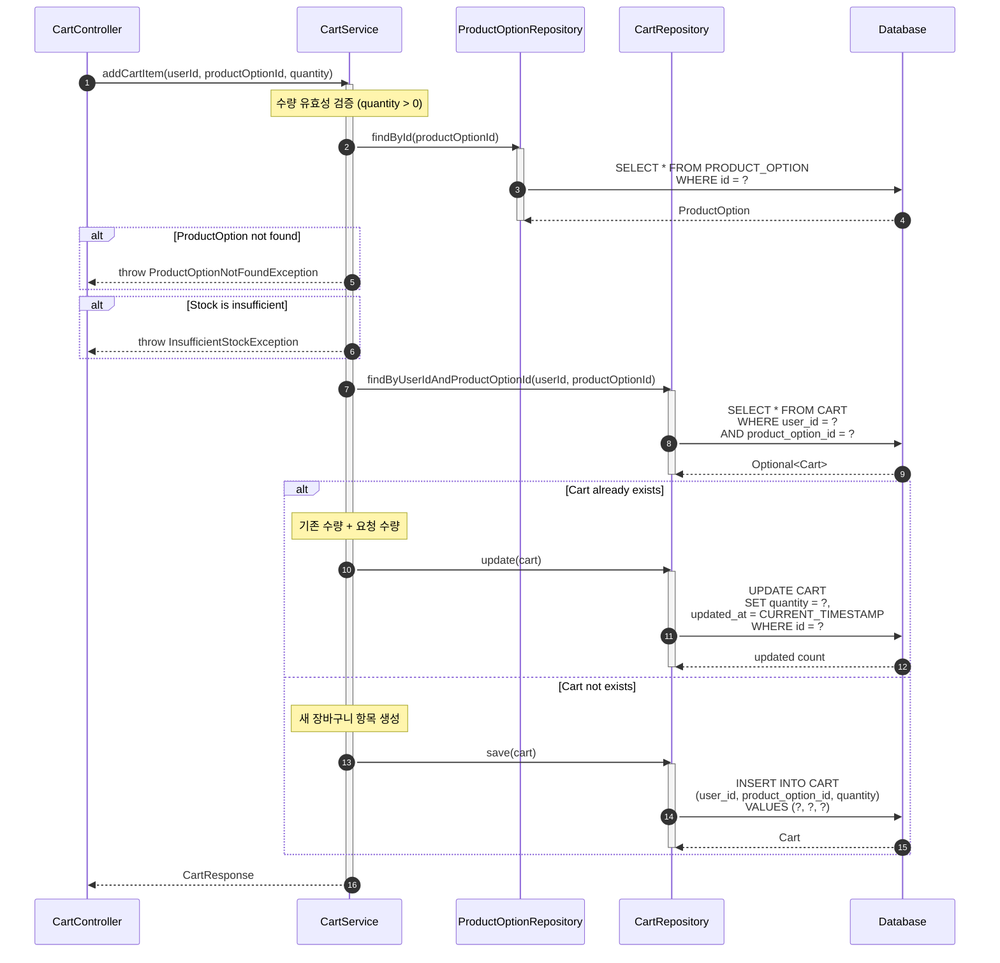
```mermaid
sequenceDiagram
    autonumber
    participant C as CartController
    participant S as CartService
    participant POR as ProductOptionRepository
    participant CR as CartRepository
    participant DB as Database

    C->>S: addCartItem(userId, productOptionId, quantity)
    activate S

    Note over S: 수량 유효성 검증 (quantity > 0)

    S->>POR: findById(productOptionId)
    activate POR
    POR->>DB: SELECT * FROM PRODUCT_OPTION<br/>WHERE id = ?
    DB-->>POR: ProductOption
    deactivate POR

    alt ProductOption not found
        S-->>C: throw ProductOptionNotFoundException
    end

    alt Stock is insufficient
        S-->>C: throw InsufficientStockException
    end

    S->>CR: findByUserIdAndProductOptionId(userId, productOptionId)
    activate CR
    CR->>DB: SELECT * FROM CART<br/>WHERE user_id = ?<br/>AND product_option_id = ?
    DB-->>CR: Optional<Cart>
    deactivate CR

    alt Cart already exists
        Note over S: 기존 수량 + 요청 수량
        S->>CR: update(cart)
        activate CR
        CR->>DB: UPDATE CART<br/>SET quantity = ?,<br/>updated_at = CURRENT_TIMESTAMP<br/>WHERE id = ?
        DB-->>CR: updated count
        deactivate CR
    else Cart not exists
        Note over S: 새 장바구니 항목 생성
        S->>CR: save(cart)
        activate CR
        CR->>DB: INSERT INTO CART<br/>(user_id, product_option_id, quantity)<br/>VALUES (?, ?, ?)
        DB-->>CR: Cart
        deactivate CR
    end

    S-->>C: CartResponse
    deactivate S
```

#### 2.3 장바구니 상품 수량 변경

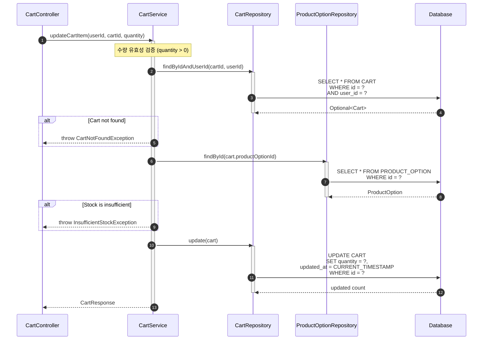
```mermaid
sequenceDiagram
    autonumber
    participant C as CartController
    participant S as CartService
    participant CR as CartRepository
    participant POR as ProductOptionRepository
    participant DB as Database

    C->>S: updateCartItem(userId, cartId, quantity)
    activate S

    Note over S: 수량 유효성 검증 (quantity > 0)

    S->>CR: findByIdAndUserId(cartId, userId)
    activate CR
    CR->>DB: SELECT * FROM CART<br/>WHERE id = ?<br/>AND user_id = ?
    DB-->>CR: Optional<Cart>
    deactivate CR

    alt Cart not found
        S-->>C: throw CartNotFoundException
    end

    S->>POR: findById(cart.productOptionId)
    activate POR
    POR->>DB: SELECT * FROM PRODUCT_OPTION<br/>WHERE id = ?
    DB-->>POR: ProductOption
    deactivate POR

    alt Stock is insufficient
        S-->>C: throw InsufficientStockException
    end

    S->>CR: update(cart)
    activate CR
    CR->>DB: UPDATE CART<br/>SET quantity = ?,<br/>updated_at = CURRENT_TIMESTAMP<br/>WHERE id = ?
    DB-->>CR: updated count
    deactivate CR

    S-->>C: CartResponse
    deactivate S
```

#### 2.4 장바구니 상품 삭제

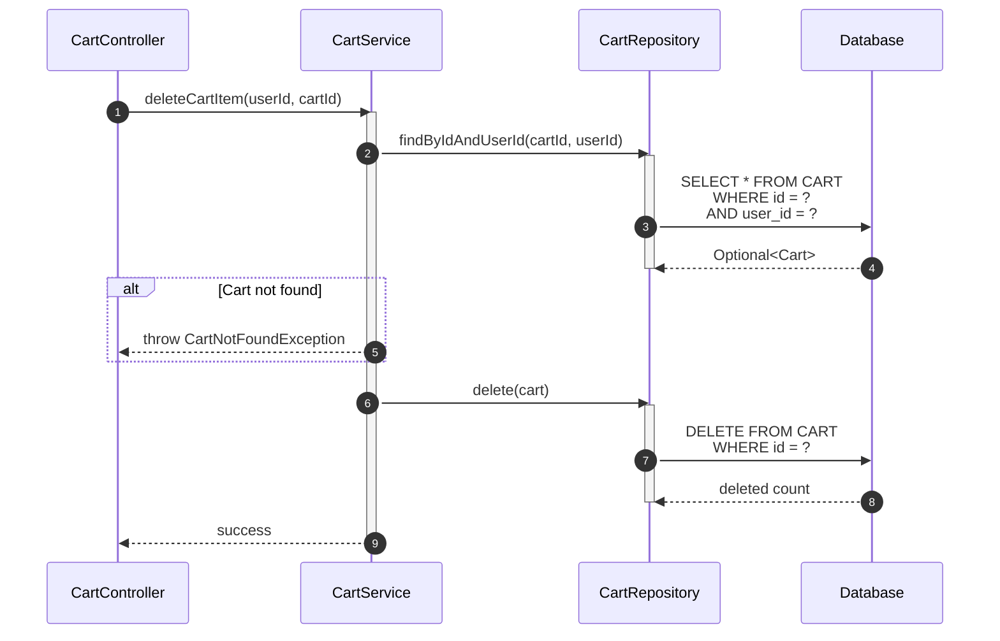
```mermaid
sequenceDiagram
    autonumber
    participant C as CartController
    participant S as CartService
    participant CR as CartRepository
    participant DB as Database

    C->>S: deleteCartItem(userId, cartId)
    activate S

    S->>CR: findByIdAndUserId(cartId, userId)
    activate CR
    CR->>DB: SELECT * FROM CART<br/>WHERE id = ?<br/>AND user_id = ?
    DB-->>CR: Optional<Cart>
    deactivate CR

    alt Cart not found
        S-->>C: throw CartNotFoundException
    end

    S->>CR: delete(cart)
    activate CR
    CR->>DB: DELETE FROM CART<br/>WHERE id = ?
    DB-->>CR: deleted count
    deactivate CR

    S-->>C: success
    deactivate S
```

### 3. 주문/결제 API

#### 3.1 주문 생성

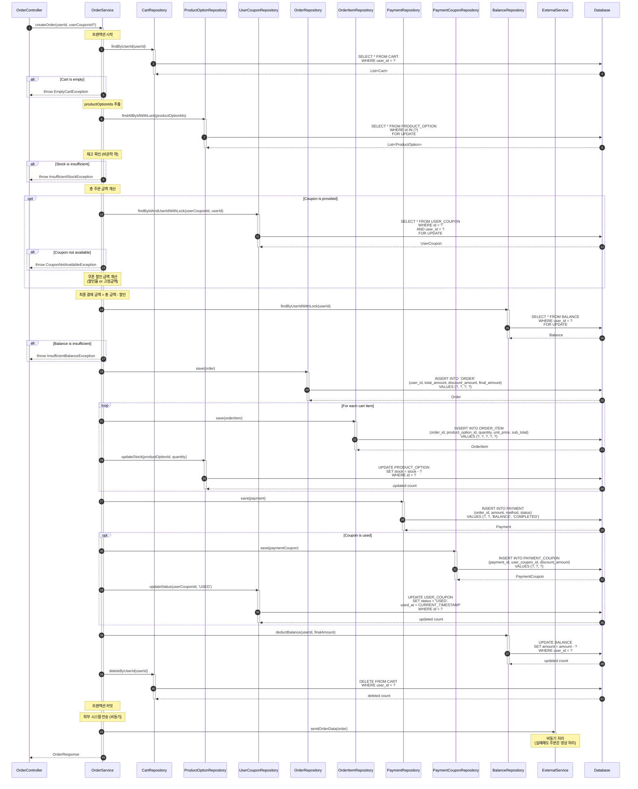
```mermaid
sequenceDiagram
    autonumber
    participant C as OrderController
    participant S as OrderService
    participant CR as CartRepository
    participant POR as ProductOptionRepository
    participant UCR as UserCouponRepository
    participant OR as OrderRepository
    participant OIR as OrderItemRepository
    participant PayR as PaymentRepository
    participant PCR as PaymentCouponRepository
    participant BR as BalanceRepository
    participant ES as ExternalService
    participant DB as Database

    C->>S: createOrder(userId, userCouponId?)
    activate S

    Note over S: 트랜잭션 시작

    S->>CR: findByUserId(userId)
    activate CR
    CR->>DB: SELECT * FROM CART<br/>WHERE user_id = ?
    DB-->>CR: List<Cart>
    deactivate CR

    alt Cart is empty
        S-->>C: throw EmptyCartException
    end

    Note over S: productOptionIds 추출

    S->>POR: findAllByIdWithLock(productOptionIds)
    activate POR
    POR->>DB: SELECT * FROM PRODUCT_OPTION<br/>WHERE id IN (?)<br/>FOR UPDATE
    DB-->>POR: List<ProductOption>
    deactivate POR

    Note over S: 재고 확인 (비관적 락)

    alt Stock is insufficient
        S-->>C: throw InsufficientStockException
    end

    Note over S: 총 주문 금액 계산

    opt Coupon is provided
        S->>UCR: findByIdAndUserIdWithLock(userCouponId, userId)
        activate UCR
        UCR->>DB: SELECT * FROM USER_COUPON<br/>WHERE id = ?<br/>AND user_id = ?<br/>FOR UPDATE
        DB-->>UCR: UserCoupon
        deactivate UCR

        alt Coupon not available
            S-->>C: throw CouponNotAvailableException
        end

        Note over S: 쿠폰 할인 금액 계산<br/>(할인율 or 고정금액)
    end

    Note over S: 최종 결제 금액 = 총 금액 - 할인

    S->>BR: findByUserIdWithLock(userId)
    activate BR
    BR->>DB: SELECT * FROM BALANCE<br/>WHERE user_id = ?<br/>FOR UPDATE
    DB-->>BR: Balance
    deactivate BR

    alt Balance is insufficient
        S-->>C: throw InsufficientBalanceException
    end

    S->>OR: save(order)
    activate OR
    OR->>DB: INSERT INTO `ORDER`<br/>(user_id, total_amount, discount_amount, final_amount)<br/>VALUES (?, ?, ?, ?)
    DB-->>OR: Order
    deactivate OR

    loop For each cart item
        S->>OIR: save(orderItem)
        activate OIR
        OIR->>DB: INSERT INTO ORDER_ITEM<br/>(order_id, product_option_id, quantity, unit_price, sub_total)<br/>VALUES (?, ?, ?, ?, ?)
        DB-->>OIR: OrderItem
        deactivate OIR

        S->>POR: updateStock(productOptionId, quantity)
        activate POR
        POR->>DB: UPDATE PRODUCT_OPTION<br/>SET stock = stock - ?<br/>WHERE id = ?
        DB-->>POR: updated count
        deactivate POR
    end

    S->>PayR: save(payment)
    activate PayR
    PayR->>DB: INSERT INTO PAYMENT<br/>(order_id, amount, method, status)<br/>VALUES (?, ?, 'BALANCE', 'COMPLETED')
    DB-->>PayR: Payment
    deactivate PayR

    opt Coupon is used
        S->>PCR: save(paymentCoupon)
        activate PCR
        PCR->>DB: INSERT INTO PAYMENT_COUPON<br/>(payment_id, user_coupon_id, discount_amount)<br/>VALUES (?, ?, ?)
        DB-->>PCR: PaymentCoupon
        deactivate PCR

        S->>UCR: updateStatus(userCouponId, 'USED')
        activate UCR
        UCR->>DB: UPDATE USER_COUPON<br/>SET status = 'USED',<br/>used_at = CURRENT_TIMESTAMP<br/>WHERE id = ?
        DB-->>UCR: updated count
        deactivate UCR
    end

    S->>BR: deductBalance(userId, finalAmount)
    activate BR
    BR->>DB: UPDATE BALANCE<br/>SET amount = amount - ?<br/>WHERE user_id = ?
    DB-->>BR: updated count
    deactivate BR

    S->>CR: deleteByUserId(userId)
    activate CR
    CR->>DB: DELETE FROM CART<br/>WHERE user_id = ?
    DB-->>CR: deleted count
    deactivate CR

    Note over S: 트랜잭션 커밋

    Note over S: 외부 시스템 전송 (비동기)

    S->>ES: sendOrderData(order)
    activate ES
    Note over ES: 비동기 처리<br/>(실패해도 주문은 정상 처리)
    deactivate ES

    S-->>C: OrderResponse
    deactivate S
```

#### 3.2 주문 목록 조회

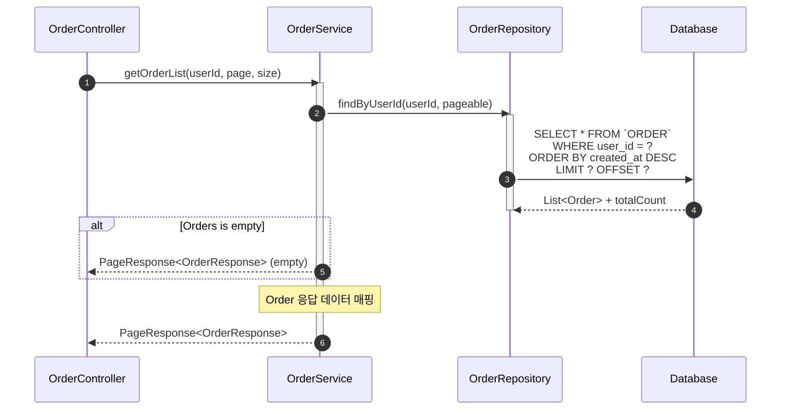
```mermaid
sequenceDiagram
    autonumber
    participant C as OrderController
    participant S as OrderService
    participant OR as OrderRepository
    participant DB as Database

    C->>S: getOrderList(userId, page, size)
    activate S

    S->>OR: findByUserId(userId, pageable)
    activate OR
    OR->>DB: SELECT * FROM `ORDER`<br/>WHERE user_id = ?<br/>ORDER BY created_at DESC<br/>LIMIT ? OFFSET ?
    DB-->>OR: List<Order> + totalCount
    deactivate OR

    alt Orders is empty
        S-->>C: PageResponse<OrderResponse> (empty)
    end

    Note over S: Order 응답 데이터 매핑

    S-->>C: PageResponse<OrderResponse>
    deactivate S
```

#### 3.3 주문 상세 조회

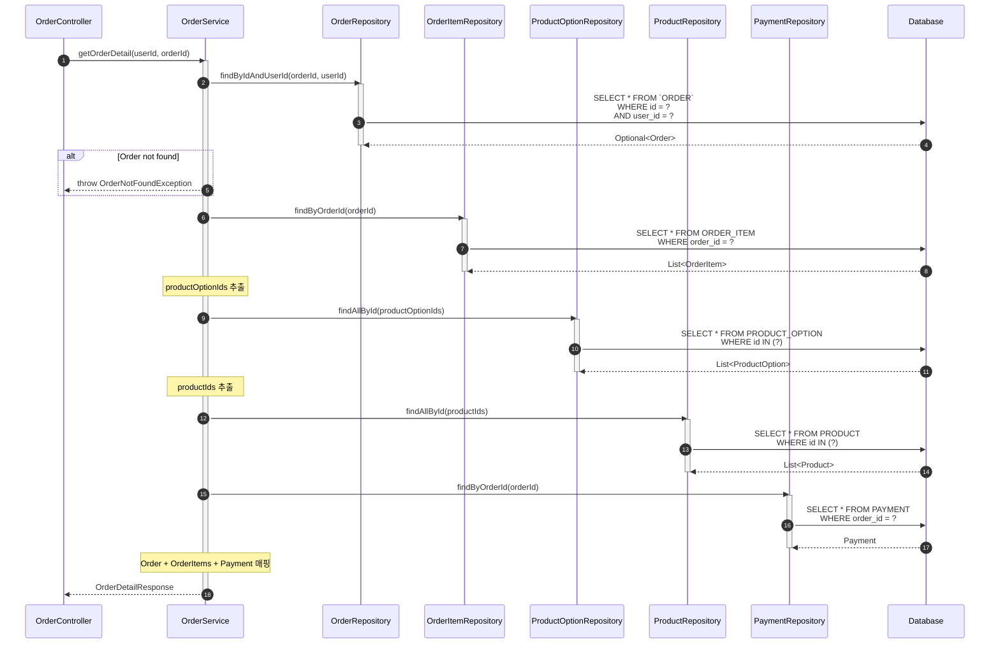
```mermaid
sequenceDiagram
    autonumber
    participant C as OrderController
    participant S as OrderService
    participant OR as OrderRepository
    participant OIR as OrderItemRepository
    participant POR as ProductOptionRepository
    participant PR as ProductRepository
    participant PayR as PaymentRepository
    participant DB as Database

    C->>S: getOrderDetail(userId, orderId)
    activate S

    S->>OR: findByIdAndUserId(orderId, userId)
    activate OR
    OR->>DB: SELECT * FROM `ORDER`<br/>WHERE id = ?<br/>AND user_id = ?
    DB-->>OR: Optional<Order>
    deactivate OR

    alt Order not found
        S-->>C: throw OrderNotFoundException
    end

    S->>OIR: findByOrderId(orderId)
    activate OIR
    OIR->>DB: SELECT * FROM ORDER_ITEM<br/>WHERE order_id = ?
    DB-->>OIR: List<OrderItem>
    deactivate OIR

    Note over S: productOptionIds 추출

    S->>POR: findAllById(productOptionIds)
    activate POR
    POR->>DB: SELECT * FROM PRODUCT_OPTION<br/>WHERE id IN (?)
    DB-->>POR: List<ProductOption>
    deactivate POR

    Note over S: productIds 추출

    S->>PR: findAllById(productIds)
    activate PR
    PR->>DB: SELECT * FROM PRODUCT<br/>WHERE id IN (?)
    DB-->>PR: List<Product>
    deactivate PR

    S->>PayR: findByOrderId(orderId)
    activate PayR
    PayR->>DB: SELECT * FROM PAYMENT<br/>WHERE order_id = ?
    DB-->>PayR: Payment
    deactivate PayR

    Note over S: Order + OrderItems + Payment 매핑

    S-->>C: OrderDetailResponse
    deactivate S
```

### 4. 쿠폰 API

#### 4.1 발급 가능한 쿠폰 목록 조회

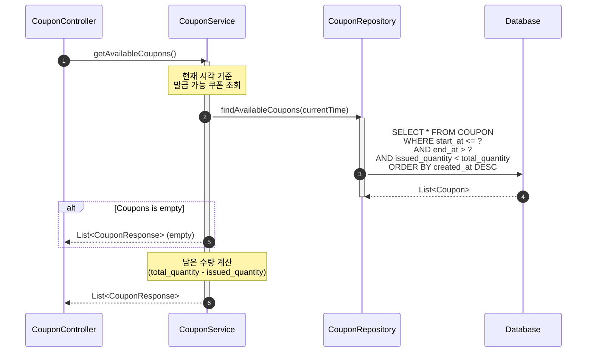
```mermaid
sequenceDiagram
    autonumber
    participant C as CouponController
    participant S as CouponService
    participant CR as CouponRepository
    participant DB as Database

    C->>S: getAvailableCoupons()
    activate S

    Note over S: 현재 시각 기준<br/>발급 가능 쿠폰 조회

    S->>CR: findAvailableCoupons(currentTime)
    activate CR
    CR->>DB: SELECT * FROM COUPON<br/>WHERE start_at <= ?<br/>AND end_at > ?<br/>AND issued_quantity < total_quantity<br/>ORDER BY created_at DESC
    DB-->>CR: List<Coupon>
    deactivate CR

    alt Coupons is empty
        S-->>C: List<CouponResponse> (empty)
    end

    Note over S: 남은 수량 계산<br/>(total_quantity - issued_quantity)

    S-->>C: List<CouponResponse>
    deactivate S
```

#### 4.2 쿠폰 발급

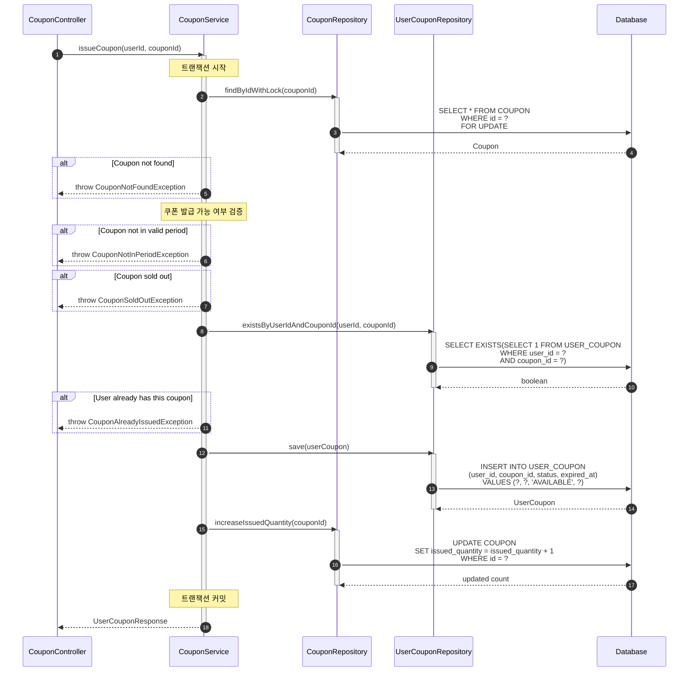
```mermaid
sequenceDiagram
    autonumber
    participant C as CouponController
    participant S as CouponService
    participant CR as CouponRepository
    participant UCR as UserCouponRepository
    participant DB as Database

    C->>S: issueCoupon(userId, couponId)
    activate S

    Note over S: 트랜잭션 시작

    S->>CR: findByIdWithLock(couponId)
    activate CR
    CR->>DB: SELECT * FROM COUPON<br/>WHERE id = ?<br/>FOR UPDATE
    DB-->>CR: Coupon
    deactivate CR

    alt Coupon not found
        S-->>C: throw CouponNotFoundException
    end

    Note over S: 쿠폰 발급 가능 여부 검증

    alt Coupon not in valid period
        S-->>C: throw CouponNotInPeriodException
    end

    alt Coupon sold out
        S-->>C: throw CouponSoldOutException
    end

    S->>UCR: existsByUserIdAndCouponId(userId, couponId)
    activate UCR
    UCR->>DB: SELECT EXISTS(SELECT 1 FROM USER_COUPON<br/>WHERE user_id = ?<br/>AND coupon_id = ?)
    DB-->>UCR: boolean
    deactivate UCR

    alt User already has this coupon
        S-->>C: throw CouponAlreadyIssuedException
    end

    S->>UCR: save(userCoupon)
    activate UCR
    UCR->>DB: INSERT INTO USER_COUPON<br/>(user_id, coupon_id, status, expired_at)<br/>VALUES (?, ?, 'AVAILABLE', ?)
    DB-->>UCR: UserCoupon
    deactivate UCR

    S->>CR: increaseIssuedQuantity(couponId)
    activate CR
    CR->>DB: UPDATE COUPON<br/>SET issued_quantity = issued_quantity + 1<br/>WHERE id = ?
    DB-->>CR: updated count
    deactivate CR

    Note over S: 트랜잭션 커밋

    S-->>C: UserCouponResponse
    deactivate S
```

#### 4.3 보유 쿠폰 조회

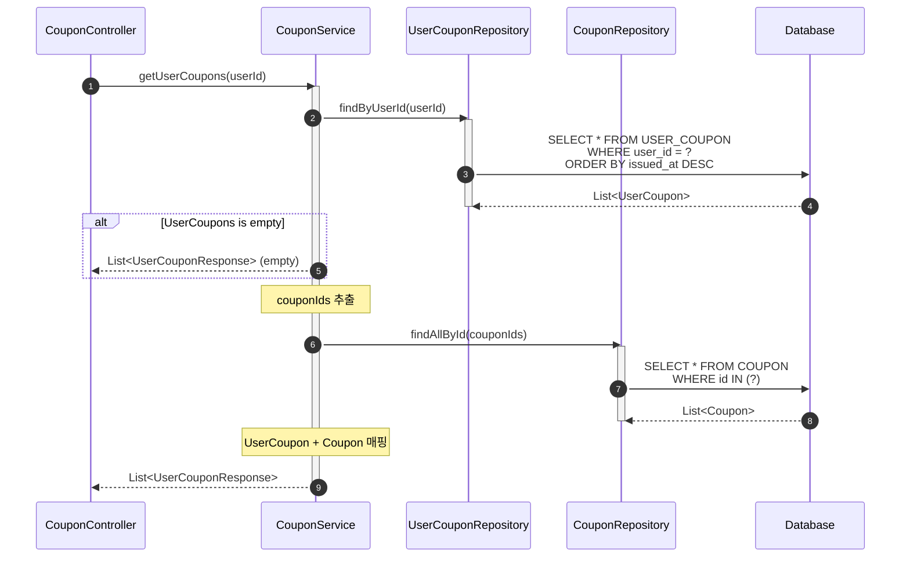
```mermaid
sequenceDiagram
    autonumber
    participant C as CouponController
    participant S as CouponService
    participant UCR as UserCouponRepository
    participant CR as CouponRepository
    participant DB as Database

    C->>S: getUserCoupons(userId)
    activate S

    S->>UCR: findByUserId(userId)
    activate UCR
    UCR->>DB: SELECT * FROM USER_COUPON<br/>WHERE user_id = ?<br/>ORDER BY issued_at DESC
    DB-->>UCR: List<UserCoupon>
    deactivate UCR

    alt UserCoupons is empty
        S-->>C: List<UserCouponResponse> (empty)
    end

    Note over S: couponIds 추출

    S->>CR: findAllById(couponIds)
    activate CR
    CR->>DB: SELECT * FROM COUPON<br/>WHERE id IN (?)
    DB-->>CR: List<Coupon>
    deactivate CR

    Note over S: UserCoupon + Coupon 매핑

    S-->>C: List<UserCouponResponse>
    deactivate S
```

#### 4.4 사용 가능한 쿠폰 조회

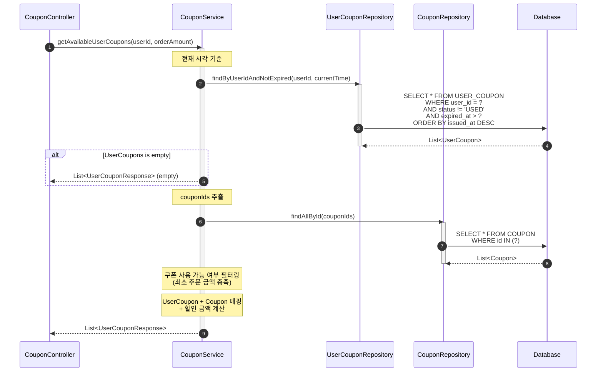
```mermaid
sequenceDiagram
    autonumber
    participant C as CouponController
    participant S as CouponService
    participant UCR as UserCouponRepository
    participant CR as CouponRepository
    participant DB as Database

    C->>S: getAvailableUserCoupons(userId, orderAmount)
    activate S

    Note over S: 현재 시각 기준

    S->>UCR: findByUserIdAndNotExpired(userId, currentTime)
    activate UCR
    UCR->>DB: SELECT * FROM USER_COUPON<br/>WHERE user_id = ?<br/>AND status != 'USED'<br/>AND expired_at > ?<br/>ORDER BY issued_at DESC
    DB-->>UCR: List<UserCoupon>
    deactivate UCR

    alt UserCoupons is empty
        S-->>C: List<UserCouponResponse> (empty)
    end

    Note over S: couponIds 추출

    S->>CR: findAllById(couponIds)
    activate CR
    CR->>DB: SELECT * FROM COUPON<br/>WHERE id IN (?)
    DB-->>CR: List<Coupon>
    deactivate CR

    Note over S: 쿠폰 사용 가능 여부 필터링<br/>(최소 주문 금액 충족)

    Note over S: UserCoupon + Coupon 매핑<br/>+ 할인 금액 계산

    S-->>C: List<UserCouponResponse>
    deactivate S
```

### 5. 잔액 API

#### 5.1 잔액 조회

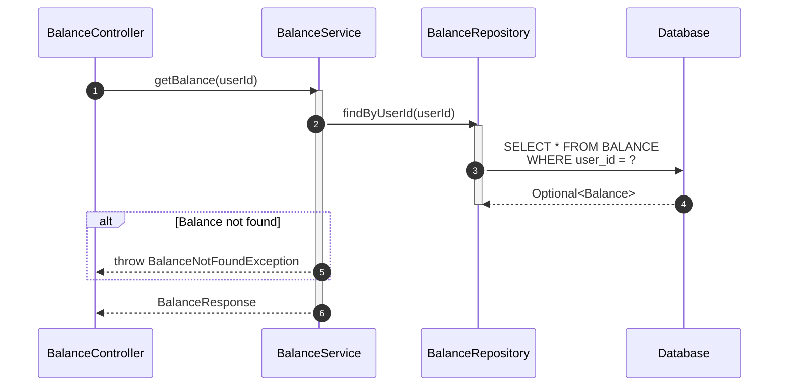
```mermaid
sequenceDiagram
    autonumber
    participant C as BalanceController
    participant S as BalanceService
    participant BR as BalanceRepository
    participant DB as Database

    C->>S: getBalance(userId)
    activate S

    S->>BR: findByUserId(userId)
    activate BR
    BR->>DB: SELECT * FROM BALANCE<br/>WHERE user_id = ?
    DB-->>BR: Optional<Balance>
    deactivate BR

    alt Balance not found
        S-->>C: throw BalanceNotFoundException
    end

    S-->>C: BalanceResponse
    deactivate S
```

#### 5.2 잔액 충전

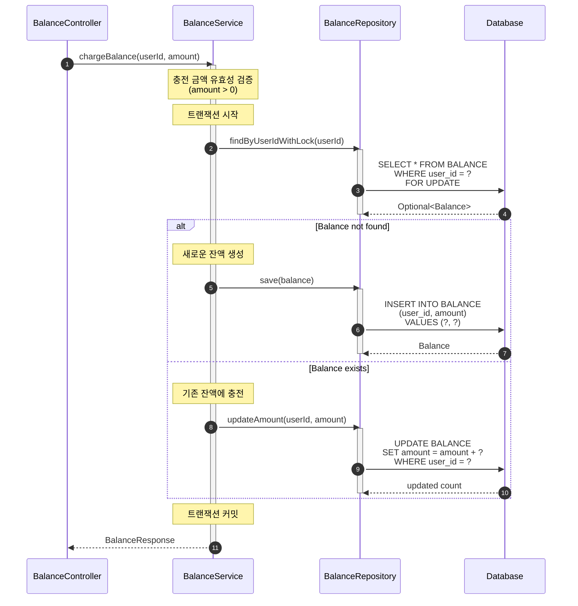
```mermaid
sequenceDiagram
    autonumber
    participant C as BalanceController
    participant S as BalanceService
    participant BR as BalanceRepository
    participant DB as Database

    C->>S: chargeBalance(userId, amount)
    activate S

    Note over S: 충전 금액 유효성 검증<br/>(amount > 0)

    Note over S: 트랜잭션 시작

    S->>BR: findByUserIdWithLock(userId)
    activate BR
    BR->>DB: SELECT * FROM BALANCE<br/>WHERE user_id = ?<br/>FOR UPDATE
    DB-->>BR: Optional<Balance>
    deactivate BR

    alt Balance not found
        Note over S: 새로운 잔액 생성
        S->>BR: save(balance)
        activate BR
        BR->>DB: INSERT INTO BALANCE<br/>(user_id, amount)<br/>VALUES (?, ?)
        DB-->>BR: Balance
        deactivate BR
    else Balance exists
        Note over S: 기존 잔액에 충전
        S->>BR: updateAmount(userId, amount)
        activate BR
        BR->>DB: UPDATE BALANCE<br/>SET amount = amount + ?<br/>WHERE user_id = ?
        DB-->>BR: updated count
        deactivate BR
    end

    Note over S: 트랜잭션 커밋

    S-->>C: BalanceResponse
    deactivate S
```

