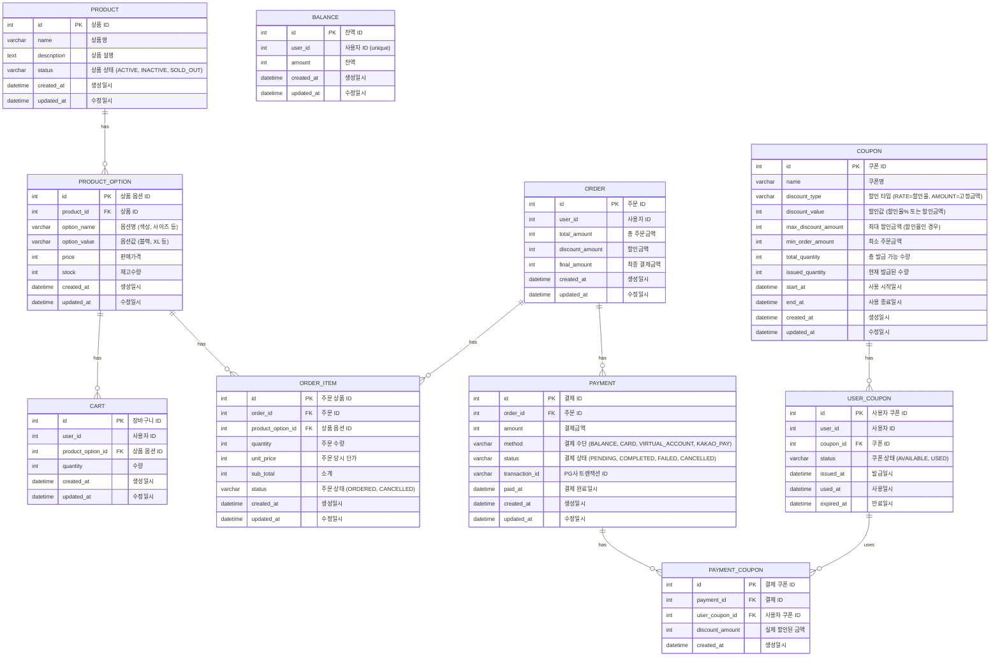

## ERD

### DDL
```sql
-- PRODUCT 테이블
CREATE TABLE PRODUCT (
    id INT PRIMARY KEY AUTO_INCREMENT COMMENT '상품 ID',
    name VARCHAR(255) NOT NULL COMMENT '상품명',
    description TEXT COMMENT '상품 설명',
    status VARCHAR(20) NOT NULL DEFAULT 'ACTIVE' COMMENT '상품 상태 (ACTIVE, INACTIVE)',
    created_at DATETIME NOT NULL DEFAULT CURRENT_TIMESTAMP COMMENT '생성일시',
    updated_at DATETIME NOT NULL DEFAULT CURRENT_TIMESTAMP ON UPDATE CURRENT_TIMESTAMP COMMENT '수정일시',
    INDEX idx_status (status),
    INDEX idx_created_at (created_at)
) ENGINE=InnoDB DEFAULT CHARSET=utf8mb4 COMMENT='상품';

-- PRODUCT_OPTION 테이블
CREATE TABLE PRODUCT_OPTION (
    id INT PRIMARY KEY AUTO_INCREMENT COMMENT '상품 옵션 ID',
    product_id INT NOT NULL COMMENT '상품 ID',
    option_name VARCHAR(100) NOT NULL COMMENT '옵션명 (색상, 사이즈 등)',
    option_value VARCHAR(100) NOT NULL COMMENT '옵션값 (블랙, XL 등)',
    price INT NOT NULL COMMENT '판매가격',
    stock INT NOT NULL DEFAULT 0 COMMENT '재고수량',
    created_at DATETIME NOT NULL DEFAULT CURRENT_TIMESTAMP COMMENT '생성일시',
    updated_at DATETIME NOT NULL DEFAULT CURRENT_TIMESTAMP ON UPDATE CURRENT_TIMESTAMP COMMENT '수정일시',
    INDEX idx_product_id (product_id),
    INDEX idx_stock (stock)
) ENGINE=InnoDB DEFAULT CHARSET=utf8mb4 COMMENT='상품 옵션';

-- CART 테이블
CREATE TABLE CART (
    id INT PRIMARY KEY AUTO_INCREMENT COMMENT '장바구니 ID',
    user_id INT NOT NULL COMMENT '사용자 ID',
    product_option_id INT NOT NULL COMMENT '상품 옵션 ID',
    quantity INT NOT NULL DEFAULT 1 COMMENT '수량',
    created_at DATETIME NOT NULL DEFAULT CURRENT_TIMESTAMP COMMENT '생성일시',
    updated_at DATETIME NOT NULL DEFAULT CURRENT_TIMESTAMP ON UPDATE CURRENT_TIMESTAMP COMMENT '수정일시',
    UNIQUE KEY uk_user_product_option (user_id, product_option_id),
    INDEX idx_user_id (user_id)
) ENGINE=InnoDB DEFAULT CHARSET=utf8mb4 COMMENT='장바구니';

-- ORDER 테이블
CREATE TABLE `ORDER` (
    id INT PRIMARY KEY AUTO_INCREMENT COMMENT '주문 ID',
    user_id INT NOT NULL COMMENT '사용자 ID',
    total_amount INT NOT NULL COMMENT '총 주문금액',
    discount_amount INT NOT NULL DEFAULT 0 COMMENT '할인금액',
    final_amount INT NOT NULL COMMENT '최종 결제금액',
    created_at DATETIME NOT NULL DEFAULT CURRENT_TIMESTAMP COMMENT '생성일시',
    updated_at DATETIME NOT NULL DEFAULT CURRENT_TIMESTAMP ON UPDATE CURRENT_TIMESTAMP COMMENT '수정일시',
    INDEX idx_user_id (user_id),
    INDEX idx_created_at (created_at)
) ENGINE=InnoDB DEFAULT CHARSET=utf8mb4 COMMENT='주문';

-- ORDER_ITEM 테이블
CREATE TABLE ORDER_ITEM (
    id INT PRIMARY KEY AUTO_INCREMENT COMMENT '주문 상품 ID',
    order_id INT NOT NULL COMMENT '주문 ID',
    product_option_id INT NOT NULL COMMENT '상품 옵션 ID',
    quantity INT NOT NULL COMMENT '주문 수량',
    unit_price INT NOT NULL COMMENT '주문 당시 단가',
    sub_total INT NOT NULL COMMENT '소계',
    status VARCHAR(20) NOT NULL DEFAULT 'ORDERED' COMMENT '주문 상태 (ORDERED, CANCELLED)',
    created_at DATETIME NOT NULL DEFAULT CURRENT_TIMESTAMP COMMENT '생성일시',
    updated_at DATETIME NOT NULL DEFAULT CURRENT_TIMESTAMP ON UPDATE CURRENT_TIMESTAMP COMMENT '수정일시',
    INDEX idx_order_id (order_id),
    INDEX idx_product_option_id (product_option_id),
    INDEX idx_status (status),
    INDEX idx_created_at (created_at)
) ENGINE=InnoDB DEFAULT CHARSET=utf8mb4 COMMENT='주문 상품';

-- PAYMENT 테이블
CREATE TABLE PAYMENT (
    id INT PRIMARY KEY AUTO_INCREMENT COMMENT '결제 ID',
    order_id INT NOT NULL COMMENT '주문 ID',
    amount INT NOT NULL COMMENT '결제금액',
    method VARCHAR(20) NOT NULL COMMENT '결제 수단 (BALANCE, CARD, VIRTUAL_ACCOUNT, KAKAO_PAY)',
    status VARCHAR(20) NOT NULL DEFAULT 'PENDING' COMMENT '결제 상태 (PENDING, COMPLETED, FAILED, CANCELLED)',
    transaction_id VARCHAR(255) COMMENT 'PG사 트랜잭션 ID',
    paid_at DATETIME COMMENT '결제 완료일시',
    created_at DATETIME NOT NULL DEFAULT CURRENT_TIMESTAMP COMMENT '생성일시',
    updated_at DATETIME NOT NULL DEFAULT CURRENT_TIMESTAMP ON UPDATE CURRENT_TIMESTAMP COMMENT '수정일시',
    INDEX idx_order_id (order_id),
    INDEX idx_status (status),
    INDEX idx_transaction_id (transaction_id)
) ENGINE=InnoDB DEFAULT CHARSET=utf8mb4 COMMENT='결제';

-- COUPON 테이블
CREATE TABLE COUPON (
    id INT PRIMARY KEY AUTO_INCREMENT COMMENT '쿠폰 ID',
    name VARCHAR(255) NOT NULL COMMENT '쿠폰명',
    discount_type VARCHAR(20) NOT NULL COMMENT '할인 타입 (RATE=할인율, AMOUNT=고정금액)',
    discount_value INT NOT NULL COMMENT '할인값 (할인율% 또는 할인금액)',
    max_discount_amount INT COMMENT '최대 할인금액 (할인율인 경우)',
    min_order_amount INT NOT NULL DEFAULT 0 COMMENT '최소 주문금액',
    total_quantity INT NOT NULL COMMENT '총 발급 가능 수량',
    issued_quantity INT NOT NULL DEFAULT 0 COMMENT '현재 발급된 수량',
    start_at DATETIME NOT NULL COMMENT '사용 시작일시',
    end_at DATETIME NOT NULL COMMENT '사용 종료일시',
    created_at DATETIME NOT NULL DEFAULT CURRENT_TIMESTAMP COMMENT '생성일시',
    updated_at DATETIME NOT NULL DEFAULT CURRENT_TIMESTAMP ON UPDATE CURRENT_TIMESTAMP COMMENT '수정일시',
    INDEX idx_start_end_at (start_at, end_at)
) ENGINE=InnoDB DEFAULT CHARSET=utf8mb4 COMMENT='쿠폰';

-- USER_COUPON 테이블
CREATE TABLE USER_COUPON (
    id INT PRIMARY KEY AUTO_INCREMENT COMMENT '사용자 쿠폰 ID',
    user_id INT NOT NULL COMMENT '사용자 ID',
    coupon_id INT NOT NULL COMMENT '쿠폰 ID',
    status VARCHAR(20) NOT NULL DEFAULT 'AVAILABLE' COMMENT '쿠폰 상태 (AVAILABLE, USED)',
    issued_at DATETIME NOT NULL DEFAULT CURRENT_TIMESTAMP COMMENT '발급일시',
    used_at DATETIME COMMENT '사용일시',
    expired_at DATETIME NOT NULL COMMENT '만료일시',
    INDEX idx_user_id (user_id),
    INDEX idx_coupon_id (coupon_id),
    INDEX idx_status (status),
    INDEX idx_expired_at (expired_at)
) ENGINE=InnoDB DEFAULT CHARSET=utf8mb4 COMMENT='사용자 쿠폰';

-- PAYMENT_COUPON 테이블
CREATE TABLE PAYMENT_COUPON (
    id INT PRIMARY KEY AUTO_INCREMENT COMMENT '결제 쿠폰 ID',
    payment_id INT NOT NULL COMMENT '결제 ID',
    user_coupon_id INT NOT NULL COMMENT '사용자 쿠폰 ID',
    discount_amount INT NOT NULL COMMENT '실제 할인된 금액',
    created_at DATETIME NOT NULL DEFAULT CURRENT_TIMESTAMP COMMENT '생성일시',
    INDEX idx_payment_id (payment_id),
    INDEX idx_user_coupon_id (user_coupon_id)
) ENGINE=InnoDB DEFAULT CHARSET=utf8mb4 COMMENT='결제 쿠폰';

-- BALANCE 테이블
CREATE TABLE BALANCE (
    id INT PRIMARY KEY AUTO_INCREMENT COMMENT '잔액 ID',
    user_id INT NOT NULL COMMENT '사용자 ID',
    amount INT NOT NULL DEFAULT 0 COMMENT '잔액',
    created_at DATETIME NOT NULL DEFAULT CURRENT_TIMESTAMP COMMENT '생성일시',
    updated_at DATETIME NOT NULL DEFAULT CURRENT_TIMESTAMP ON UPDATE CURRENT_TIMESTAMP COMMENT '수정일시',
    UNIQUE KEY uk_user_id (user_id),
    INDEX idx_user_id (user_id)
) ENGINE=InnoDB DEFAULT CHARSET=utf8mb4 COMMENT='사용자 잔액';
```