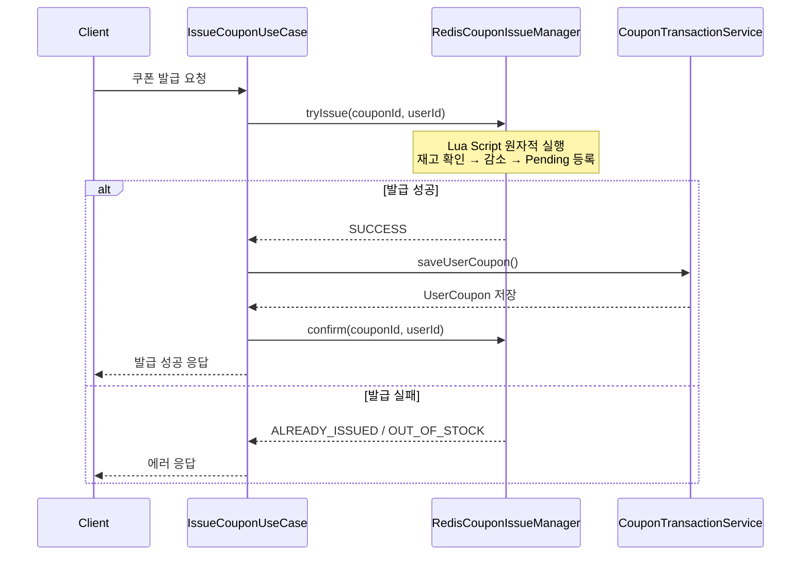
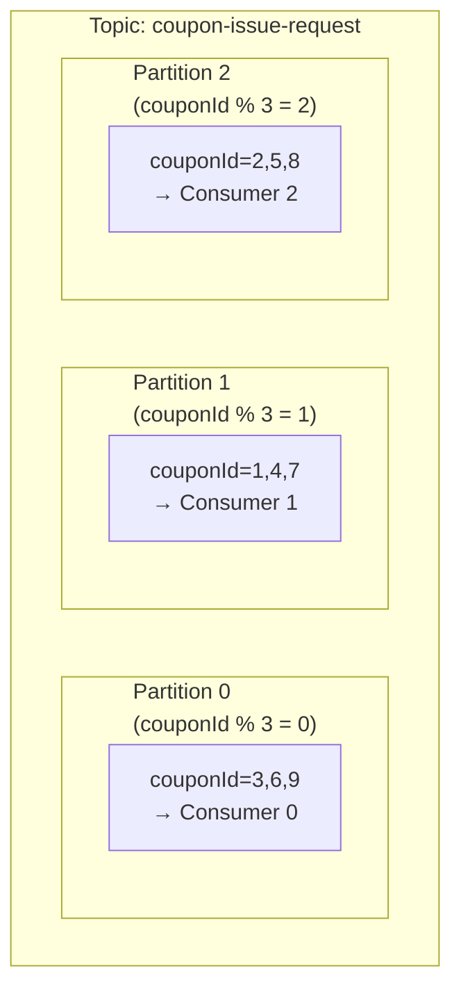
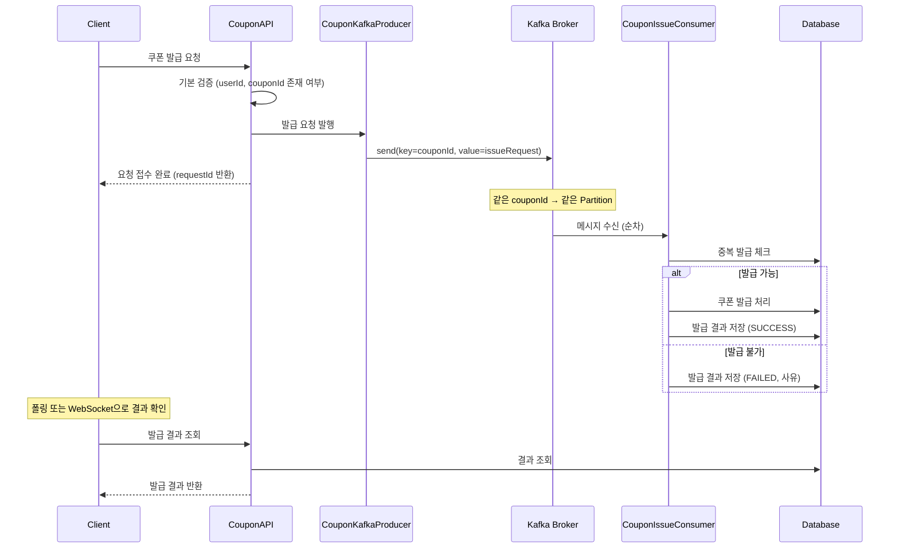
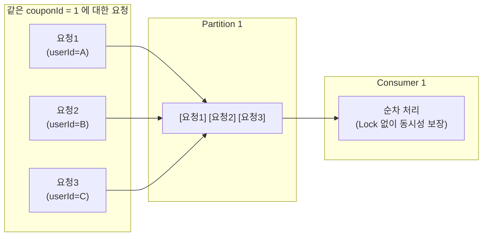
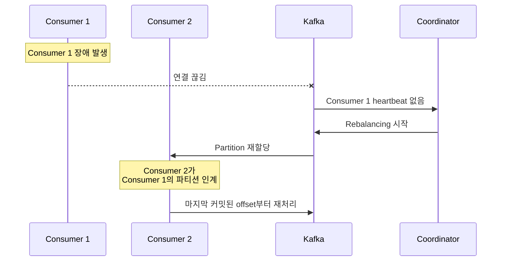
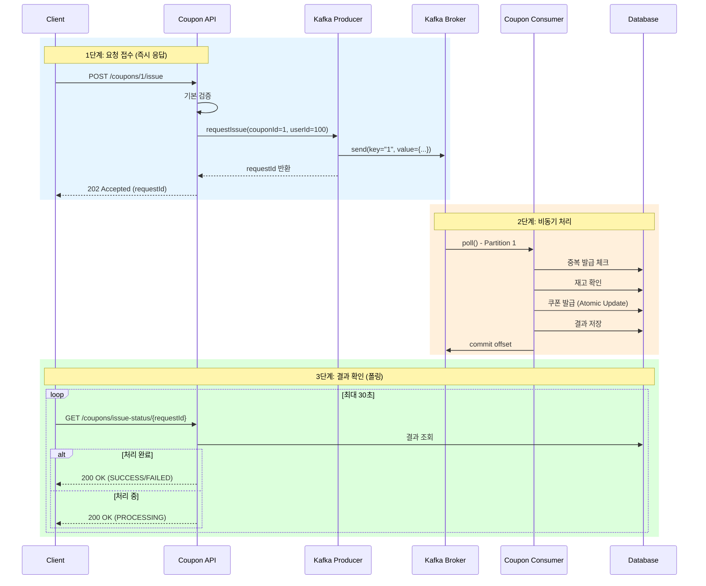

# Kafka 기반 선착순 쿠폰 발급 설계

이 문서에서는 기존 Redis 기반 선착순 쿠폰 발급 시스템을 Kafka 기반으로 전환하는 설계를 다룬다.

---

## 1. 현재 구조 분석 (Redis 기반)

### 1.1 현재 아키텍처



### 1.2 현재 동시성 제어 방식

| 메커니즘 | 설명 |
|:--------|:----|
| **Redis Lua Script** | 재고 확인-감소-발급 기록을 원자적으로 처리 |
| **Pending 상태** | 2단계 커밋 (Reserve → Confirm/Rollback) |
| **분산 락** | 초기화 시점에만 사용 |

### 1.3 현재 구조의 한계

| 문제 | 설명 |
|:----|:----|
| **Redis 장애** | Redis 장애 시 전체 쿠폰 발급 불가 |
| **DB 부하** | 동시 요청 시 DB에 직접 쓰기 부하 집중 |
| **복구 어려움** | 실패한 요청의 재처리 로직 복잡 |
| **확장성** | 스케일 아웃 시 Redis 동기화 문제 |

---

## 2. Kafka 기반 설계

### 2.1 목표

1. **순서 보장**: 같은 쿠폰에 대한 발급 요청은 순차 처리
2. **병렬 처리**: 다른 쿠폰 간에는 병렬 처리로 처리량 향상
3. **장애 격리**: 메시지 브로커로 장애 전파 차단
4. **재처리 가능**: 실패한 요청의 자동 재처리

### 2.2 핵심 설계: 파티셔닝 전략



**메시지 키 = couponId**
- 같은 쿠폰은 항상 같은 파티션 → 순차 처리 보장
- 다른 쿠폰은 다른 파티션 → 병렬 처리 가능

**핵심 포인트:**
- `메시지 키 = couponId` 로 설정
- 같은 couponId → 같은 파티션 → **순차 처리** (동시성 이슈 없음)
- 다른 couponId → 다른 파티션 → **병렬 처리** (처리량 향상)

### 2.3 전체 아키텍처



### 2.4 메시지 스키마

```java
// 쿠폰 발급 요청 메시지
public record CouponIssueRequest(
    String requestId,      // 멱등성 보장을 위한 요청 ID
    Long couponId,         // 파티션 키로 사용
    Long userId,
    LocalDateTime requestedAt
) {}

// 쿠폰 발급 결과 (DB 저장용)
public record CouponIssueResultRecord(
    String requestId,
    Long couponId,
    Long userId,
    CouponIssueStatus status,  // SUCCESS, FAILED, ALREADY_ISSUED, OUT_OF_STOCK
    String message,
    LocalDateTime processedAt
) {}
```

---

## 3. 상세 설계

### 3.1 Producer 설계

```java
@Component
public class CouponKafkaProducer {

    private final KafkaTemplate<String, CouponIssueRequest> kafkaTemplate;

    public String requestIssue(Long couponId, Long userId) {
        String requestId = UUID.randomUUID().toString();

        CouponIssueRequest request = new CouponIssueRequest(
            requestId,
            couponId,
            userId,
            LocalDateTime.now()
        );

        // 핵심: couponId를 키로 사용 → 같은 쿠폰은 같은 파티션
        kafkaTemplate.send("coupon-issue-request",
                          String.valueOf(couponId),  // key
                          request);                   // value

        return requestId;
    }
}
```

### 3.2 Consumer 설계

```java
@Component
public class CouponIssueConsumer {

    @KafkaListener(
        topics = "coupon-issue-request",
        groupId = "coupon-issue-group",
        concurrency = "3"  // 파티션 수와 동일
    )
    public void consume(
        @Payload CouponIssueRequest request,
        @Header(KafkaHeaders.RECEIVED_PARTITION) int partition
    ) {
        log.info("쿠폰 발급 요청 수신 - partition: {}, couponId: {}, userId: {}",
                partition, request.couponId(), request.userId());

        // 1. 멱등성 체크 (requestId 기반)
        if (isAlreadyProcessed(request.requestId())) {
            log.info("이미 처리된 요청 - requestId: {}", request.requestId());
            return;
        }

        // 2. 중복 발급 체크
        if (hasAlreadyIssued(request.couponId(), request.userId())) {
            saveResult(request, CouponIssueStatus.ALREADY_ISSUED);
            return;
        }

        // 3. 재고 확인 및 발급
        try {
            issueCoupon(request);
            saveResult(request, CouponIssueStatus.SUCCESS);
        } catch (OutOfStockException e) {
            saveResult(request, CouponIssueStatus.OUT_OF_STOCK);
        }
    }
}
```

### 3.3 토픽 설정

```java
@Configuration
public class KafkaTopicConfig {

    @Bean
    public NewTopic couponIssueRequestTopic() {
        return TopicBuilder.name("coupon-issue-request")
                .partitions(3)      // 병렬 처리 단위
                .replicas(1)        // 개발 환경
                .config(TopicConfig.RETENTION_MS_CONFIG, "604800000")  // 7일
                .build();
    }
}
```

---

## 4. 동시성 제어 비교

### 4.1 Redis vs Kafka 비교

| 항목 | Redis (현재) | Kafka (개선) |
|:----|:------------|:------------|
| **동시성 제어** | Lua Script 원자성 | 파티션 내 순차 처리 |
| **순서 보장** | 단일 키 기준 보장 | 파티션 내 보장 |
| **처리량** | 높음 (메모리 기반) | 매우 높음 (파티션 병렬) |
| **장애 복구** | 수동 복구 필요 | 자동 재처리 (offset) |
| **확장성** | 클러스터 구성 복잡 | 파티션/컨슈머 추가 용이 |
| **메시지 영속성** | 휘발성 (설정 필요) | 기본 디스크 저장 |

### 4.2 Lock 없는 동시성 제어

**Kafka의 파티션 특성을 활용한 동시성 제어:**



- **파티션 내 메시지는 순차적으로 처리됨**
- Consumer가 한 번에 하나의 메시지만 처리
- Lock 없이도 동시성 이슈 발생하지 않음

---

## 5. 처리량 향상 전략

### 5.1 파티션/컨슈머 확장

```
처리량 = 파티션 수 × 단일 컨슈머 처리량

예시:
- 파티션 3개, 컨슈머 3개 → 초당 3,000 TPS
- 파티션 6개, 컨슈머 6개 → 초당 6,000 TPS
```

**확장 시 주의사항:**
- 파티션 수 증가 시 기존 메시지의 파티션 재배치 발생
- 파티션 수 > 컨슈머 수: 일부 컨슈머가 여러 파티션 담당
- 파티션 수 < 컨슈머 수: 일부 컨슈머 유휴 상태

### 5.2 배치 처리 최적화

```java
@KafkaListener(...)
@Transactional
public void consumeBatch(List<CouponIssueRequest> requests) {
    // 배치로 DB 조회/저장하여 I/O 최적화
    Set<Long> couponIds = requests.stream()
            .map(CouponIssueRequest::couponId)
            .collect(Collectors.toSet());

    Map<Long, Coupon> coupons = couponRepository.findAllById(couponIds);

    // 배치 처리...
}
```

---

## 6. 장애 처리

### 6.1 Consumer 장애 시



### 6.2 메시지 처리 실패 시

```java
@KafkaListener(...)
public void consume(CouponIssueRequest request) {
    try {
        processRequest(request);
    } catch (RetryableException e) {
        // 재시도 가능한 에러 → DLT로 전송 또는 재시도
        throw e;  // Spring Kafka가 재시도 처리
    } catch (NonRetryableException e) {
        // 재시도 불가 에러 → 결과 저장 후 skip
        saveFailedResult(request, e);
    }
}

// Dead Letter Topic 설정
@Bean
public DefaultErrorHandler errorHandler(KafkaTemplate<?, ?> template) {
    DeadLetterPublishingRecoverer recoverer =
        new DeadLetterPublishingRecoverer(template);
    return new DefaultErrorHandler(recoverer,
        new FixedBackOff(1000L, 3));  // 1초 간격, 3회 재시도
}
```

---

## 7. API 응답 방식

### 7.1 비동기 처리 + 폴링

```java
// 1. 발급 요청 (즉시 응답)
@PostMapping("/coupons/{couponId}/issue")
public ResponseEntity<CouponIssueAcceptedResponse> requestIssue(
        @PathVariable Long couponId,
        @RequestBody IssueCouponRequest request) {

    String requestId = couponKafkaProducer.requestIssue(couponId, request.getUserId());

    return ResponseEntity.accepted()
            .body(new CouponIssueAcceptedResponse(
                requestId,
                "쿠폰 발급 요청이 접수되었습니다."
            ));
}

// 2. 결과 조회 (폴링)
@GetMapping("/coupons/issue-status/{requestId}")
public ResponseEntity<CouponIssueStatusResponse> getIssueStatus(
        @PathVariable String requestId) {

    return couponIssueResultRepository.findByRequestId(requestId)
            .map(result -> ResponseEntity.ok(toResponse(result)))
            .orElse(ResponseEntity.ok(new CouponIssueStatusResponse(
                requestId, "PROCESSING", "처리 중입니다."
            )));
}
```

---

## 8. 시퀀스 다이어그램 (전체 흐름)

