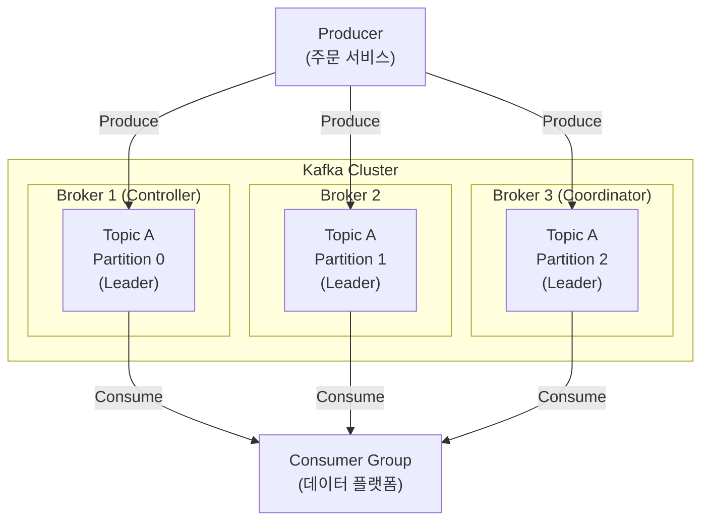
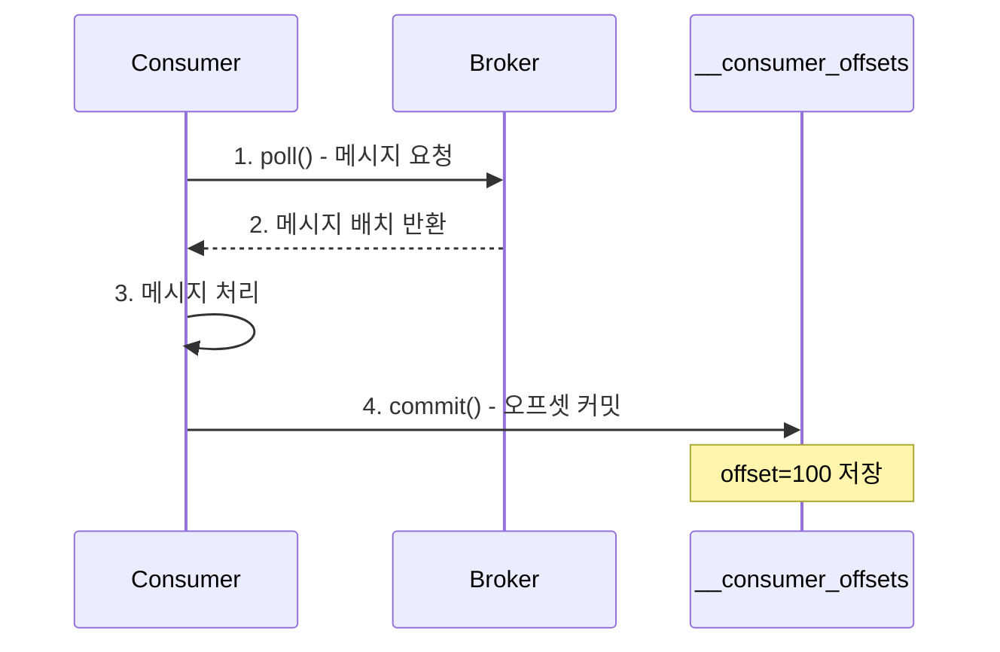
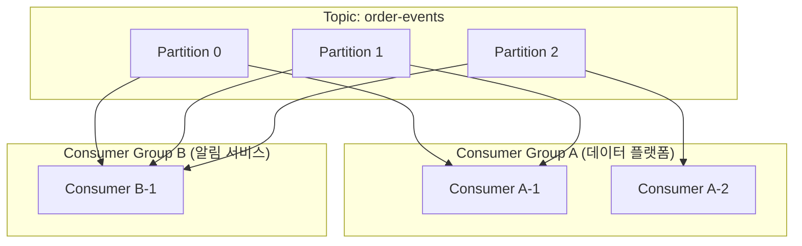
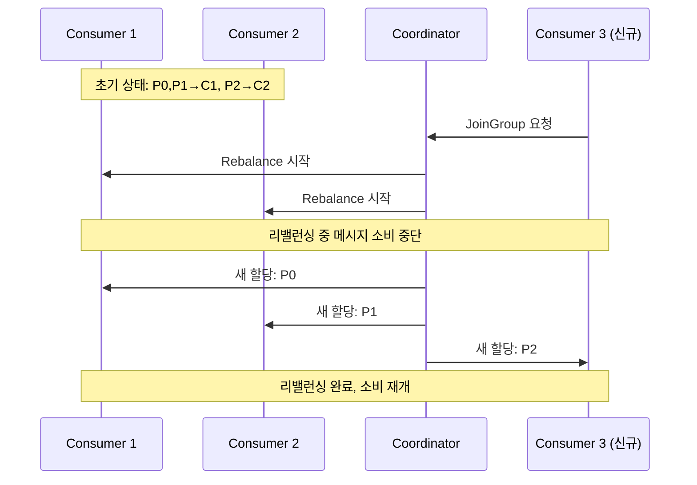
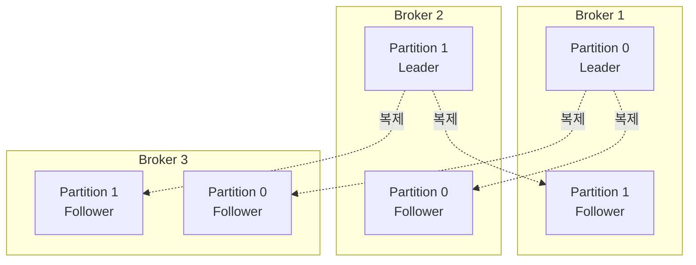
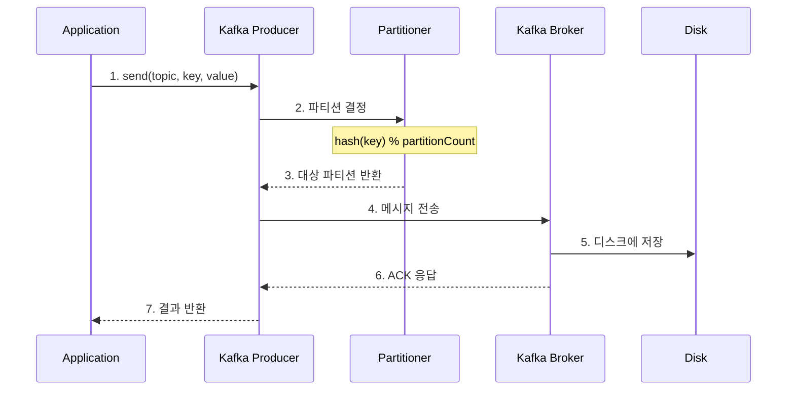
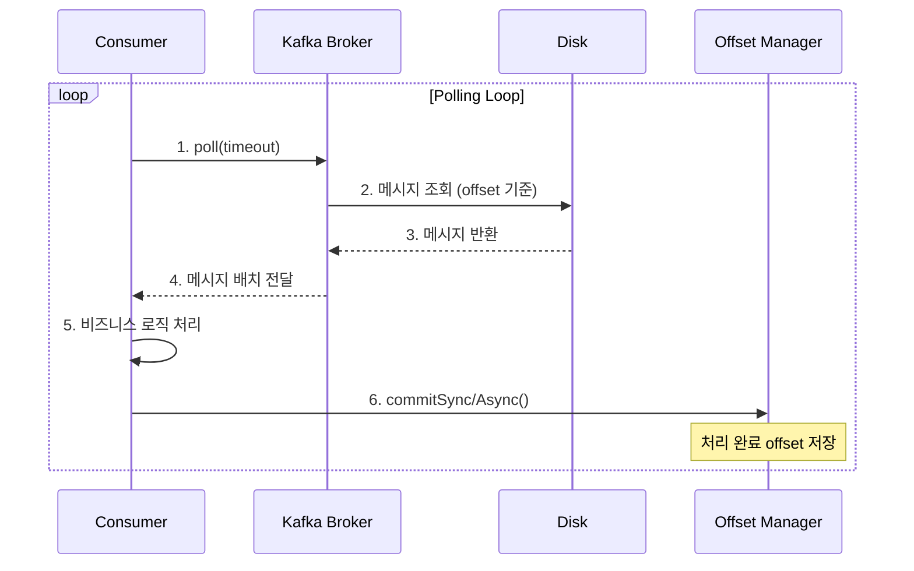
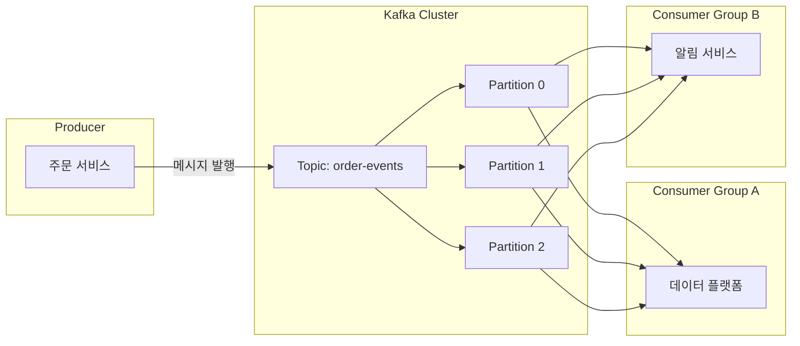
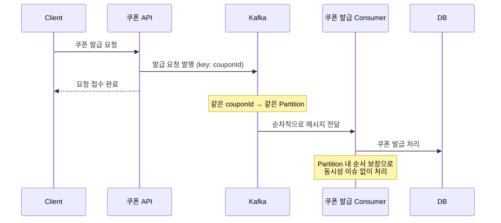
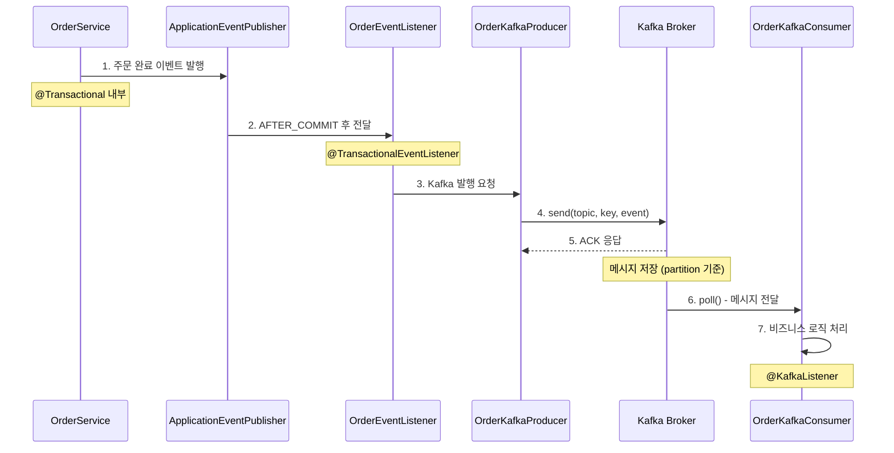

# Kafka 구조 및 동작 정리

이 문서에서는 Apache Kafka의 핵심 개념, 구성요소 간 데이터 흐름, 장단점을 정리한다.

---

## 1. Kafka란?

Apache Kafka는 LinkedIn에서 개발하고 Apache Software Foundation에 기부한 **분산 스트리밍 플랫폼**이다. 대규모 실시간 데이터 스트리밍을 위한 **분산 메시징 시스템**으로, 높은 처리량과 내결함성을 제공한다.

### 1.1 왜 Kafka를 사용하는가?

기존 메시지 큐 시스템(RabbitMQ 등)과 비교했을 때 Kafka가 대용량 트래픽 환경에서 선호되는 이유:

| 특성 | 설명 |
|:----|:----|
| **고처리량** | 초당 수백만 건의 메시지 처리 가능 |
| **분산 아키텍처** | 수평 확장이 용이하여 트래픽 증가에 유연하게 대응 |
| **내구성** | 디스크 기반 저장으로 메시지 유실 방지 |
| **리플레이** | 과거 메시지를 다시 읽을 수 있어 장애 복구에 유리 |
| **다중 소비자** | 여러 Consumer Group이 동일 메시지를 독립적으로 소비 |

### 1.2 사용 사례

- **이벤트 소싱**: 상태 변경을 이벤트로 저장
- **로그 수집**: 대규모 로그 데이터 중앙화
- **실시간 분석**: 스트리밍 데이터 처리
- **시스템 연동**: 마이크로서비스 간 비동기 통신
- **메시지 버퍼링**: 트래픽 급증 시 부하 분산

---

## 2. 핵심 구성요소

### 2.1 전체 아키텍처 개요



### 2.2 Producer (생산자)

메시지를 Kafka 브로커에 **발행(Publish)**하는 클라이언트 애플리케이션이다.

**핵심 특성:**
- 메시지를 특정 Topic에 발행
- 메시지 키를 기반으로 Partition 결정 (Partitioner)
- 동기/비동기 방식으로 발행 가능
- ACK 레벨 설정으로 신뢰성 조절

**Partitioner 동작 원리:**
```
메시지 키가 있는 경우:
  targetPartition = hash(key) % partitionCount
  → 같은 키는 항상 같은 파티션에 저장 (순서 보장)

메시지 키가 없는 경우:
  → Round-Robin 또는 Sticky Partitioner로 분배
```

**예시 - 쿠폰 발급 이벤트:**
```java
// 쿠폰 ID를 키로 사용하면 같은 쿠폰의 발급 요청은 순차 처리됨
kafkaTemplate.send("coupon-issue-request",
    String.valueOf(couponId),  // key: 쿠폰 ID
    couponIssueRequest         // value: 발급 요청 데이터
);
```

### 2.3 Consumer (소비자)

Kafka 브로커에서 메시지를 **읽어오는(Subscribe)** 클라이언트 애플리케이션이다.

**핵심 특성:**
- 특정 Topic을 구독하여 메시지 소비
- Offset을 통해 읽은 위치를 추적
- Consumer Group 단위로 병렬 처리

**Offset 관리:**

| 용어 | 설명 |
|:----|:----|
| **CURRENT-OFFSET** | Consumer가 마지막으로 처리한 메시지 위치 |
| **LOG-END-OFFSET** | 파티션에 기록된 마지막 메시지 위치 |
| **LAG** | LOG-END-OFFSET - CURRENT-OFFSET (처리 지연량) |



**Offset 리셋 옵션:**
- `earliest`: 가장 오래된 메시지부터 다시 읽음
- `latest`: 최신 메시지부터 읽음
- `--reset-offsets`: CLI로 특정 시점으로 오프셋 되돌리기

### 2.4 Broker (브로커)

Kafka 서버의 단위이다. 메시지를 저장하고 전달하는 역할을 수행한다.

**핵심 역할:**
- Producer의 메시지를 받아 디스크에 저장
- Consumer의 요청에 응답하여 메시지 전송
- Partition의 Leader/Follower 관리

**특수 역할 브로커 (Cluster 내 각 1개씩):**

| 역할 | 설명 |
|:----|:----|
| **Controller** | 다른 브로커를 모니터링하고, 장애 발생 시 Leader 파티션 재분배 |
| **Coordinator** | Consumer Group을 모니터링하고, 장애 발생 시 파티션 리밸런싱 수행 |

### 2.5 Topic & Partition

**Topic**: 메시지를 분류하는 논리적 채널. 우편함의 이름과 같다.

**Partition**: Topic을 물리적으로 분할한 단위. 병렬 처리와 순서 보장의 핵심이다.

```
Topic: order-events (3 Partitions)
┌─────────────────────────────────────────────────────────────────┐
│ Partition 0: [msg0] [msg3] [msg6] [msg9]  → offset 0,1,2,3...   │
│ Partition 1: [msg1] [msg4] [msg7] [msg10] → offset 0,1,2,3...   │
│ Partition 2: [msg2] [msg5] [msg8] [msg11] → offset 0,1,2,3...   │
└─────────────────────────────────────────────────────────────────┘
```

**핵심 특성:**

| 특성 | 설명 |
|:----|:----|
| **파티션 내 순서 보장** | 같은 파티션의 메시지는 발행 순서대로 처리 |
| **전체 순서 미보장** | 다른 파티션 간에는 순서 보장 안 됨 |
| **병렬 처리** | 파티션 수만큼 Consumer 병렬 처리 가능 |
| **키 기반 라우팅** | 같은 키는 항상 같은 파티션으로 전송 |

**파티셔닝 전략 예시 (쿠폰 발급):**
```
쿠폰 ID를 메시지 키로 설정하면:
- 같은 쿠폰 ID의 발급 요청 → 같은 파티션 → 순차 처리 (동시성 이슈 없음)
- 다른 쿠폰 ID의 발급 요청 → 다른 파티션 → 병렬 처리 (처리량 향상)

→ Lock 없이 동시성 제어 + 높은 처리량 달성
```

### 2.6 Consumer Group

여러 Consumer가 하나의 논리적 그룹을 구성하여 Topic을 분담하여 소비한다.

**핵심 규칙:**
- 하나의 파티션은 그룹 내 **하나의 Consumer만** 소비 가능
- 다른 Consumer Group은 동일 메시지를 **독립적으로** 소비 가능



**Partition과 Consumer 수에 따른 분배:**

| 시나리오 | 결과 |
|:--------|:----|
| Partition 3, Consumer 1 | Consumer 1개가 모든 파티션 담당 |
| Partition 3, Consumer 2 | Consumer 1: P0,P1 / Consumer 2: P2 |
| Partition 3, Consumer 3 | 각 Consumer가 1개 파티션 담당 (최적) |
| Partition 3, Consumer 4 | 1개 Consumer는 유휴 상태 (낭비) |

> **주의**: Consumer 수가 Partition 수보다 많으면 잉여 Consumer는 메시지를 소비하지 못한다.

### 2.7 Rebalancing (리밸런싱)

Consumer Group의 **가용성과 확장성**을 확보하기 위해, 파티션 소유권을 Consumer 간에 재분배하는 과정이다.

**발생 조건:**
1. Consumer Group에 새로운 Consumer 추가
2. 기존 Consumer 장애로 소비 중단
3. Topic에 새로운 Partition 추가



> **주의**: 리밸런싱 중에는 해당 Consumer Group의 **모든 Consumer가 메시지를 읽을 수 없다**.

### 2.8 Cluster (클러스터)

여러 Broker를 묶어 **고가용성(HA)**을 확보한 구성이다.

**특징:**
- 특정 Broker 장애 시에도 다른 Broker가 서비스 지속
- Broker 추가로 처리량 확장 가능 (동작 중인 Broker에 영향 없음)
- 일반적으로 3개 이상의 Broker로 구성 권장

### 2.9 Replication (복제)

Cluster의 가용성을 보장하기 위해 각 Partition의 복제본을 유지한다.

**Leader와 Follower:**

| 역할 | 설명 |
|:----|:----|
| **Leader Replica** | 모든 읽기/쓰기 요청 처리. 파티션당 1개 |
| **Follower Replica** | Leader의 데이터를 복제하여 백업. Leader 장애 시 새 Leader로 승격 |



**ISR (In-Sync Replicas):**
- Leader와 동기화된 Follower 목록
- ISR에 포함되지 않은 Follower는 Leader로 선출될 수 없음
- `min.insync.replicas` 설정으로 최소 동기화 수 지정

---

## 3. 데이터 흐름

### 3.1 메시지 발행 흐름 (Producer → Broker)



**ACK 설정 옵션:**

| acks | 설명 | 성능 | 신뢰성 |
|:-----|:----|:----:|:-----:|
| `0` | ACK 대기 안 함 | 높음 | 낮음 |
| `1` | Leader만 확인 | 중간 | 중간 |
| `all` | 모든 ISR 확인 | 낮음 | 높음 |

### 3.2 메시지 소비 흐름 (Broker → Consumer)



### 3.3 전체 메시지 흐름 (End-to-End)



---

## 4. Kafka의 장단점

### 4.1 장점

| 장점 | 설명 |
|:----|:----|
| **고처리량** | 배치 처리, 압축, Zero-Copy 등으로 초당 수백만 메시지 처리 |
| **확장성** | Broker/Partition 추가로 수평 확장 용이 |
| **내구성** | 디스크 기반 저장 + Replication으로 데이터 유실 방지 |
| **순서 보장** | 파티션 내 메시지 순서 보장 |
| **메시지 리플레이** | Offset 조정으로 과거 메시지 재처리 가능 |
| **다중 소비자** | 여러 Consumer Group이 독립적으로 동일 메시지 소비 |
| **장애 격리** | Consumer 장애가 Producer에 영향 없음 |
| **백프레셔** | Consumer 속도에 맞춰 메시지 소비 (부하 분산) |

### 4.2 단점

| 단점 | 설명 |
|:----|:----|
| **운영 복잡성** | Zookeeper(또는 KRaft) 관리, 파티션/리플리카 설정 필요 |
| **실시간 보장 어려움** | 배치 처리 특성상 밀리초 단위 지연 발생 |
| **메시지 순서** | 전체 토픽 기준 순서 보장 안 됨 (파티션 내만 보장) |
| **학습 곡선** | Consumer Group, Rebalancing, Offset 등 개념 이해 필요 |
| **리소스 사용량** | 디스크 I/O 및 네트워크 대역폭 사용량 높음 |
| **단순 큐 용도** | 단순 작업 큐 용도로는 RabbitMQ가 더 적합할 수 있음 |

### 4.3 Kafka vs RabbitMQ 비교

| 항목 | Kafka | RabbitMQ |
|:----|:------|:---------|
| **메시지 모델** | Pub/Sub (Log 기반) | Queue (AMQP) |
| **처리량** | 매우 높음 (수백만 TPS) | 높음 (수만 TPS) |
| **메시지 영속성** | 디스크 기반, 설정 기간 보관 | 메모리 기반 (영속성 옵션) |
| **메시지 리플레이** | 가능 | 불가 (ACK 후 삭제) |
| **순서 보장** | 파티션 내 보장 | 큐 내 보장 |
| **라우팅** | 토픽/파티션 | Exchange/Binding (유연함) |
| **적합 사례** | 이벤트 스트리밍, 대용량 처리 | 작업 큐, 복잡한 라우팅 |

---

## 5. 이커머스 프로젝트 적용 방안

### 5.1 현재 구조 (ApplicationEvent)

```java
class OrderPaymentService {
    @Transactional
    public void pay() {
        deductUserPoint();      // 유저 포인트 차감
        savePaymentInfo();      // 결제 정보 저장
        updateOrderStatus();    // 주문 상태 변경

        eventPublisher.publish(new OrderCompletedEvent());
    }
}

class OrderCompletedEventListener {
    @TransactionalEventListener(phase = AFTER_COMMIT)
    @Async
    public void sendOrderInfo(OrderCompletedEvent event) {
        externalDataPlatformClient.send(event);  // 외부 API 호출
    }
}
```

**문제점:**
- 외부 API 장애 시 재전송 로직이 복잡해짐
- 여러 서비스가 같은 이벤트를 구독하기 어려움
- 이벤트 유실 시 복구 어려움

### 5.2 Kafka 적용 후 구조

```java
class OrderPaymentService {
    @Transactional
    public void pay() {
        deductUserPoint();      // 유저 포인트 차감
        savePaymentInfo();      // 결제 정보 저장
        updateOrderStatus();    // 주문 상태 변경

        eventPublisher.publish(new OrderCompletedEvent());
    }
}

class OrderCompletedEventListener {
    @TransactionalEventListener(phase = AFTER_COMMIT)
    public void publishToKafka(OrderCompletedEvent event) {
        kafkaTemplate.send("order-completed", event);  // Kafka 발행
    }
}

// 데이터 플랫폼 (별도 Consumer Group)
@KafkaListener(topics = "order-completed", groupId = "data-platform")
public void handleForDataPlatform(OrderCompletedEvent event) {
    externalDataPlatformClient.send(event);
}

// 알림 서비스 (별도 Consumer Group)
@KafkaListener(topics = "order-completed", groupId = "notification")
public void handleForNotification(OrderCompletedEvent event) {
    notificationClient.send(event);
}
```

**장점:**
- 외부 시스템 장애 시에도 Kafka에 메시지 보관 → 복구 후 재처리
- 여러 서비스가 독립적으로 같은 이벤트 구독
- 주문 서비스는 이벤트 발행만 책임 → 관심사 완전 분리

### 5.3 선착순 쿠폰 발급 시나리오



---

## 6. 실습 환경 구축 및 실행 흐름

### 6.1 Docker 환경 구성

프로젝트 루트의 `docker-compose.yml`로 Kafka 환경을 구성한다.

```bash
# 전체 인프라 실행 (MySQL, Redis, Zookeeper, Kafka, Kafka-UI)
docker-compose up -d

# 상태 확인
docker-compose ps

# 로그 확인
docker-compose logs -f kafka
```

**구성 서비스:**

| 서비스 | 포트 | 설명 |
|:------|:----|:----|
| MySQL | 3306 | 데이터베이스 |
| Redis | 6379 | 캐시/세션 |
| Zookeeper | 2181 | Kafka 메타데이터 관리 |
| Kafka | 9092 | 메시지 브로커 |
| Kafka-UI | 8090 | Kafka 모니터링 UI |

### 6.2 CLI로 메시지 송수신 실습

```bash
# Kafka 컨테이너 접속
docker exec -it ecommerce-kafka bash

# 토픽 목록 조회
kafka-topics --bootstrap-server localhost:9092 --list

# 토픽 생성
kafka-topics --bootstrap-server localhost:9092 \
  --create --topic test-topic \
  --partitions 3 --replication-factor 1

# 토픽 상세 정보
kafka-topics --bootstrap-server localhost:9092 \
  --describe --topic test-topic

# Producer 실행 (메시지 발행)
kafka-console-producer --bootstrap-server localhost:9092 \
  --topic test-topic

# Consumer 실행 (메시지 수신, 다른 터미널에서)
kafka-console-consumer --bootstrap-server localhost:9092 \
  --topic test-topic --from-beginning
```

### 6.3 Spring Boot 연동 구조

**프로젝트 구성 파일:**

```
src/main/java/org/hhplus/hhecommerce/infrastructure/
├── config/
│   ├── KafkaConfig.java           # Kafka 설정 (토픽 생성, Consumer Factory)
│   └── KafkaTopicProperties.java  # 토픽명 설정
└── kafka/
    ├── OrderKafkaProducer.java    # 메시지 발행
    └── OrderKafkaConsumer.java    # 메시지 수신
```

### 6.4 메시지 발행 → 수신 흐름



### 6.5 실행 로그 예시

**Producer 로그:**
```
[Kafka] 주문 완료 이벤트 발행 성공 - topic: order-completed, key: 123, partition: 1, offset: 42
```

**Consumer 로그:**
```
[Kafka Consumer] 주문 완료 이벤트 수신 - topic: order-completed, partition: 1, offset: 42, key: 123
[Kafka Consumer] 주문 정보 - orderId: 123, products: {1=2, 3=1}
[Data Platform] 주문 데이터 전송 완료 - orderId: 123
```

### 6.6 Kafka-UI 모니터링

브라우저에서 `http://localhost:8090` 접속하여 다음을 확인할 수 있다:

- 토픽 목록 및 파티션 상태
- 메시지 내용 조회
- Consumer Group의 Lag 모니터링
- Broker 상태 확인

---

## 7. 참고 자료

- [Apache Kafka Documentation](https://kafka.apache.org/documentation/)
- [Kafka: The Definitive Guide](https://www.confluent.io/resources/kafka-the-definitive-guide/)
- [Spring for Apache Kafka](https://docs.spring.io/spring-kafka/reference/)
