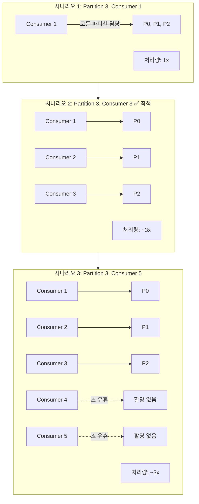
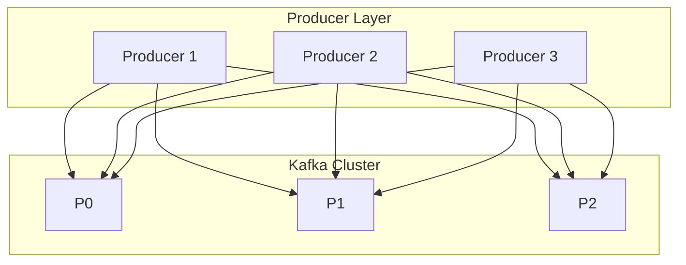
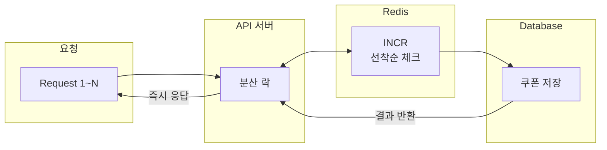
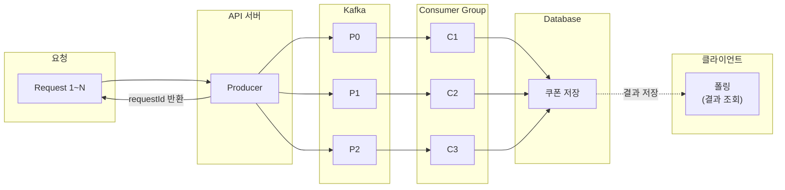
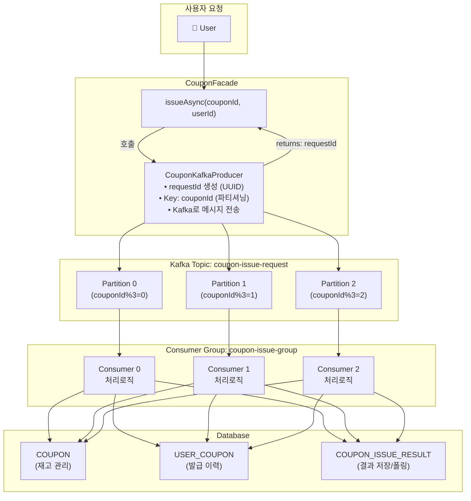
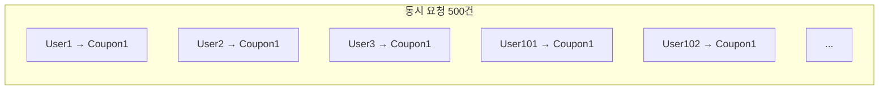
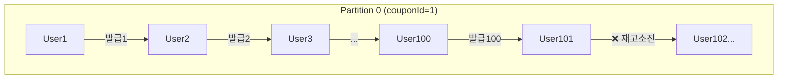
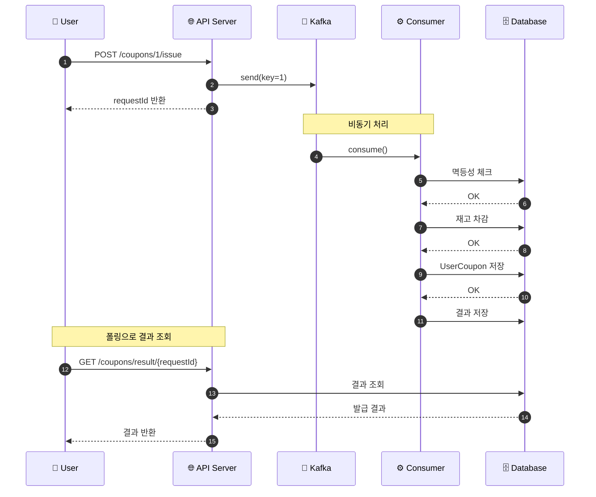

# Kafka 성능 개선 전략

## 1. Producer/Consumer/Partition 확장 효과 비교

### 1.1 Partition 확장 효과

#### Partition 수에 따른 처리량 (msg/s)

| Partition 수 | 처리량 | 배율 |
|-------------|--------|------|
| 1 | ~5,000 | 1x |
| 2 | ~10,000 | 2x |
| 3 | ~15,000 | 3x |
| 4 | ~20,000 | 4x |
| 6 | ~25,000 | 5x |
| 9 | ~28,000 | ~6x |
| 12 | ~30,000 | ~6x |

> Partition 수에 비례하여 처리량이 증가하나, 브로커/네트워크 자원 한계로 일정 수준(6개 이상) 이후 포화 현상 발생

| Partition 수 | 이론적 처리량 | Consumer 최대 병렬화 | 순서 보장 단위 |
|--------------|---------------|----------------------|----------------|
| 1            | 기준 (1x)     | 1개                  | 전체 토픽      |
| 3            | ~3x           | 3개                  | 파티션 단위    |
| 6            | ~6x           | 6개                  | 파티션 단위    |
| 12           | ~12x          | 12개                 | 파티션 단위    |

#### 핵심 포인트
- **처리량**: Partition 수 증가에 따라 처리량 증가 (단, 브로커 자원 한계로 포화점 존재)
- **순서 보장**: 동일 Partition 내에서만 순서 보장
- **제한사항**: Consumer 수 > Partition 수일 경우, 초과 Consumer는 유휴 상태

---

### 1.2 Consumer 확장 효과



| Consumer 수 | Partition 수 | 실제 활성 Consumer | 처리량 배율      |
|-------------|--------------|--------------------|-----------------|
| 1           | 3            | 1                  | 1x              |
| 2           | 3            | 2                  | ~2x             |
| 3           | 3            | 3                  | ~3x (최적)      |
| 5           | 3            | 3                  | ~3x (2개 유휴)  |
| 10          | 3            | 3                  | ~3x (7개 유휴)  |

#### 핵심 공식
```
활성 Consumer 수 = min(Consumer 수, Partition 수)
최적 Consumer 수 = Partition 수
```

---

### 1.3 Producer 확장 효과



**Producer 확장 효과:**
- ✅ 전송 처리량 증가 (병렬 전송)
- ✅ 단일 Producer 병목 해소
- ✅ Key 기반 파티셔닝은 동일하게 동작

| Producer 수 | 전송 처리량 | 고려사항                         |
|-------------|-------------|----------------------------------|
| 1           | 기준 (1x)   | 단순, 순서 관리 용이             |
| 3           | ~3x         | 동일 Key는 동일 Partition으로    |
| N           | ~Nx         | 네트워크/브로커 용량이 제한 요소 |

---

### 1.4 확장 전략 요약표

#### 확장 전략 의사결정 매트릭스

| 상황 | 해결책 | 효과 |
|------|--------|------|
| Consumer lag 증가 (Partition 수 여유 있음) | Consumer 추가 (max: Partition 수) | 처리량 ↑ |
| Consumer lag 증가 (Consumer = Partition) | Partition 추가 + Consumer 추가 | 병렬성 ↑, 처리량 ↑ |
| Producer 전송 지연 | Producer 추가 또는 배치 크기 조정 | 전송 처리량 ↑ |
| Hot Partition (특정 Partition만 lag) | Key 분산 개선, Partition 추가 | 부하 분산 |

---

## 2. Kafka vs Redis 동시성 제어 비교

### 2.1 아키텍처 비교

#### Redis 기반 동시성 제어



**특징:**
- 동기식 처리 (요청 즉시 결과 반환)
- Redis INCR 명령으로 원자적 카운트
- 분산 락으로 동시성 제어
- 요청 순간에 모든 처리 완료

#### Kafka 기반 비동기 처리



**특징:**
- 비동기식 처리 (요청 접수 후 별도 처리)
- Partition Key로 순서 보장
- Consumer 확장으로 처리량 증가
- 결과는 폴링으로 조회

---

### 2.2 성능 비교표

| 비교 항목         | Redis 방식                        | Kafka 방식                          |
|-------------------|-----------------------------------|-------------------------------------|
| **처리 방식**     | 동기식                            | 비동기식                            |
| **응답 시간**     | 50~200ms (결과 포함)              | <50ms (요청 접수만, 결과는 별도)    |
| **결과 확인**     | 응답에 포함                       | 별도 폴링 필요                      |
| **처리량 (TPS)**  | 5,000~10,000                      | 10,000~50,000+                      |
| **순서 보장**     | 분산 락 필요                      | Partition 기반 자연 보장            |
| **확장성**        | 수직 확장 위주                    | 수평 확장 용이                      |
| **장애 복구**     | 별도 구현 필요                    | 내장 (offset 기반)                  |
| **메시지 유실**   | 가능성 있음                       | acks=all로 보장                     |

---

### 2.3 부하 시나리오별 비교

#### 동시 요청 1,000건 처리 비교

| 비교 항목 | Redis 방식 | Kafka 방식 (P=3, C=3) |
|----------|------------|----------------------|
| **처리 패턴** | 모든 요청 동시 처리 (경쟁) | 요청 접수 → 비동기 처리 |
| **요청 접수** | 즉시 처리 시작 | ~50ms (전체 접수 완료) |
| **처리 완료** | ~2초 | ~1.5초 |
| **평균 응답** | 800ms (락 대기 포함) | 비동기 (폴링 필요) |
| **DB 부하** | 높음 (동시 쓰기) | 분산 (순차 쓰기) |

**처리 흐름 비교:**

| 시간 구간 | Redis | Kafka |
|----------|-------|-------|
| 0~50ms | 처리 시작, 락 경쟁 발생 | 전체 요청 접수 완료 |
| 50~500ms | 락 대기 + 처리 진행 | Consumer 병렬 처리 중 |
| 500~1500ms | 락 대기 + 처리 진행 | 처리 완료 |
| 1500~2000ms | 처리 완료 | - |

---

### 2.4 처리량 비교표

#### 동시 요청 수에 따른 처리량 (TPS)

| 동시 요청 수 | Redis (락 기반) | Kafka (P=3, C=3) | Kafka (P=6, C=6) |
|-------------|-----------------|------------------|------------------|
| 100 | ~10,000 | ~15,000 | ~20,000 |
| 500 | ~10,000 | ~18,000 | ~28,000 |
| 1K | ~10,000 | ~20,000 | ~35,000 |
| 5K | ~10,000 | ~23,000 | ~42,000 |
| 10K | ~10,000 (포화) | ~25,000 | ~45,000 |
| 50K | ~10,000 (포화) | ~30,000 | ~50,000 |

**핵심 인사이트:**
- **Redis**: 단일 스레드 특성 + 분산 락으로 인해 ~10K TPS에서 포화
- **Kafka**: Partition/Consumer 확장으로 선형 증가 가능
- **확장 효과**: Kafka P=6, C=6은 P=3, C=3 대비 약 1.7배 처리량

---

### 2.5 장단점 상세 비교

#### Redis 방식

| 장점                   | 단점                     |
|------------------------|--------------------------|
| ✅ 즉각적인 결과 반환  | ❌ 동시 요청 시 락 경쟁  |
| ✅ 구현이 단순함       | ❌ 스케일 아웃 한계      |
| ✅ 인프라 간단         | ❌ 장애 시 복구 어려움   |
| ✅ 실시간 재고 확인    | ❌ 피크 트래픽에 취약    |

#### Kafka 방식

| 장점                     | 단점                   |
|--------------------------|------------------------|
| ✅ 높은 처리량           | ❌ 결과 폴링 필요      |
| ✅ 수평 확장 용이        | ❌ 인프라 복잡도 증가  |
| ✅ 메시지 유실 방지      | ❌ 실시간 결과 어려움  |
| ✅ 장애 복구 내장        | ❌ 운영 복잡도 증가    |
| ✅ 순서 보장 자연스러움  | ❌ 초기 설정 비용      |

---

## 3. E-commerce 쿠폰 발급 시나리오 적용

### 3.1 구현된 아키텍처



### 3.2 파티셔닝 전략 효과

#### 문제 상황: 선착순 100명 쿠폰 발급

동시 요청 500건이 들어오는 상황:



#### 해결: 동일 couponId → 동일 Partition → 순차 처리



**결과:**
- ✅ **선착순 보장**: 먼저 Kafka에 도착한 순서대로 처리
- ✅ **경쟁 없음**: 단일 Consumer가 순차 처리
- ✅ **정확히 100명만 발급**

### 3.3 처리 흐름 시퀀스



---

## 4. 학습 요약 및 권장사항

### 4.1 핵심 학습 포인트

#### 핵심 학습 요약

**1. Partition은 병렬성의 단위**
- Consumer 수 ≤ Partition 수 유지
- 동일 Key → 동일 Partition → 순서 보장

**2. Consumer Group은 확장성의 핵심**
- Group 내 Consumer들이 Partition 분담
- Rebalancing으로 자동 부하 분산

**3. acks=all로 메시지 유실 방지**
- Leader + 모든 ISR에 복제 후 확인
- 처리량 vs 안정성 트레이드오프

**4. 멱등성(Idempotency) 필수**
- requestId로 중복 처리 방지
- Consumer 재시작/재처리 시 안전

**5. 비동기 패턴 = 요청 분리 + 결과 폴링**
- 요청 접수와 처리 분리
- 사용자 경험을 위한 폴링 API 필요

### 4.2 시나리오별 권장 솔루션

| 시나리오               | 권장 솔루션 | 이유                   |
|------------------------|-------------|------------------------|
| 실시간 재고 확인 필요  | Redis       | 즉각적 응답 필요       |
| 대규모 선착순 이벤트   | Kafka       | 높은 처리량, 순서 보장 |
| 간단한 동시성 제어     | Redis       | 구현 단순              |
| 장애 복구 중요         | Kafka       | offset 기반 재처리     |
| 마이크로서비스 간 통신 | Kafka       | 느슨한 결합            |
| 복잡한 이벤트 처리     | Kafka       | 이벤트 소싱 가능       |

### 4.3 실습 환경 및 테스트 로그

#### 실습 환경
- **Kafka**: Testcontainers (confluentinc/cp-kafka:7.5.0)
- **테스트 프레임워크**: Spring Boot Test + JUnit 5
- **테스트 클래스**: `KafkaIntegrationTest.java`

---

#### 테스트 1: 주문 완료 이벤트 발행/수신

```
========================================
[테스트 시작] 주문 완료 이벤트 발행/수신
[Kafka] Bootstrap Servers: PLAINTEXT://localhost:52928
========================================

========================================
[Kafka Producer] 메시지 발행 시작
[Kafka Producer] Topic: order-completed-test1
[Kafka Producer] Key: 1001
[Kafka Producer] OrderId: 1001
[Kafka Producer] Products: {102=1, 101=2}
========================================

========================================
[Kafka Producer] 발행 완료!
[Kafka Producer] Topic: order-completed-test1
[Kafka Producer] Partition: 0
[Kafka Producer] Offset: 0
[Kafka Producer] Timestamp: 1765800688527
========================================

========================================
[Kafka Consumer] 메시지 수신 성공!
[Kafka Consumer] Topic: order-completed-test1
[Kafka Consumer] Partition: 0
[Kafka Consumer] Offset: 0
[Kafka Consumer] Key: 1001
[Kafka Consumer] OrderId: 1001
[Kafka Consumer] Products: {102=1, 101=2}
========================================

========================================
[테스트 완료] 주문 완료 이벤트 정상 발행/수신 확인!
[검증] Key: 1001 ✓
[검증] OrderId: 1001 ✓
[검증] Products: {102=1, 101=2} ✓
========================================
```

**실행 흐름 요약**:
1. Producer가 `order-completed-test1` 토픽에 메시지 발행
2. 메시지가 Partition 0, Offset 0에 저장됨
3. Consumer가 동일 토픽에서 메시지 수신
4. Key, OrderId, Products 데이터 일치 검증 완료

---

#### 테스트 2: 결제 완료 이벤트 발행/수신

```
========================================
[테스트 시작] 결제 완료 이벤트 발행/수신
========================================

========================================
[Kafka Producer] 결제 완료 이벤트 발행
[Kafka Producer] Topic: payment-completed
[Kafka Producer] Version: 1
[Kafka Producer] OrderId: 2001
[Kafka Producer] UserId: 1
[Kafka Producer] TotalAmount: 50000원
[Kafka Producer] DiscountAmount: 5000원
[Kafka Producer] FinalAmount: 45000원
[Kafka Producer] OrderItems: [OrderItemInfo[productId=101, productName=노트북, optionName=실버, quantity=1, unitPrice=50000, subTotal=50000]]
========================================

[Kafka Producer] 발행 완료 - partition: 0, offset: 0

========================================
[Kafka Consumer] 결제 완료 이벤트 수신!
[Kafka Consumer] Topic: payment-completed
[Kafka Consumer] Partition: 0
[Kafka Consumer] Offset: 0
[Kafka Consumer] Key: 2001
[Kafka Consumer] Version: 1
[Kafka Consumer] OrderId: 2001
[Kafka Consumer] UserId: 1
[Kafka Consumer] TotalAmount: 50000원
[Kafka Consumer] DiscountAmount: 5000원
[Kafka Consumer] FinalAmount: 45000원
[Kafka Consumer] UserPhone: 010-1234-5678
[Kafka Consumer] OrderItems: [OrderItemInfo[productId=101, productName=노트북, optionName=실버, quantity=1, unitPrice=50000, subTotal=50000]]
========================================

========================================
[테스트 완료] 결제 완료 이벤트 정상 발행/수신!
[검증] Version: 1 ✓
[검증] OrderId: 2001 ✓
[검증] FinalAmount: 45000원 ✓
========================================
```

**실행 흐름 요약**:
1. 결제 정보(주문ID, 사용자ID, 금액, 상품정보)를 담은 이벤트 생성
2. `payment-completed` 토픽으로 메시지 발행
3. Consumer가 이벤트 수신 및 모든 필드 검증
4. 할인 적용 금액(50,000 - 5,000 = 45,000원) 정상 처리 확인

---

#### 테스트 실행 명령어

```bash
# 전체 Kafka 통합 테스트 실행
./gradlew test --tests "org.hhplus.hhecommerce.infrastructure.kafka.KafkaIntegrationTest" --info

# 특정 테스트만 실행
./gradlew test --tests "KafkaIntegrationTest.testOrderCompletedEvent_PublishAndConsume" --info
```

---

#### CLI 실습: Docker + Kafka 메시지 송수신

##### 환경 구성

```bash
# Docker Compose로 Kafka 환경 실행
docker-compose up -d

# 컨테이너 상태 확인
docker-compose ps
```

**실행 결과:**
```
NAME                  IMAGE                             STATUS                    PORTS
ecommerce-kafka       confluentinc/cp-kafka:7.5.0       Up (healthy)              0.0.0.0:9092->9092/tcp
ecommerce-kafka-ui    provectuslabs/kafka-ui:latest     Up                        0.0.0.0:8090->8080/tcp
ecommerce-zookeeper   confluentinc/cp-zookeeper:7.5.0   Up (healthy)              0.0.0.0:2181->2181/tcp
```

##### 토픽 생성 및 확인

```bash
# 토픽 생성 (3개 파티션)
docker exec ecommerce-kafka kafka-topics --create \
  --bootstrap-server localhost:9092 \
  --topic order-completed \
  --partitions 3 \
  --replication-factor 1
```

**실행 결과:**
```
Created topic order-completed.
```

```bash
# 토픽 상세 정보 확인
docker exec ecommerce-kafka kafka-topics --describe \
  --bootstrap-server localhost:9092 \
  --topic order-completed
```

**실행 결과:**
```
Topic: order-completed  PartitionCount: 3  ReplicationFactor: 1
    Topic: order-completed  Partition: 0  Leader: 1  Replicas: 1  Isr: 1
    Topic: order-completed  Partition: 1  Leader: 1  Replicas: 1  Isr: 1
    Topic: order-completed  Partition: 2  Leader: 1  Replicas: 1  Isr: 1
```

##### 메시지 발행 (Producer)

```bash
# 단일 메시지 발행
echo '{"orderId":1001,"products":{"101":2,"102":1}}' | \
  docker exec -i ecommerce-kafka kafka-console-producer \
  --bootstrap-server localhost:9092 \
  --topic order-completed

# 여러 메시지 발행
for i in 1 2 3 4 5; do
  echo "{\"orderId\":200$i,\"userId\":$i,\"amount\":$((i*10000))}" | \
    docker exec -i ecommerce-kafka kafka-console-producer \
    --bootstrap-server localhost:9092 \
    --topic order-completed
done
```

##### 메시지 수신 (Consumer)

```bash
# 처음부터 모든 메시지 수신
docker exec ecommerce-kafka kafka-console-consumer \
  --bootstrap-server localhost:9092 \
  --topic order-completed \
  --from-beginning \
  --max-messages 10
```

**실행 결과:**
```
{"orderId":2001,"userId":1,"amount":10000}
{"orderId":2005,"userId":5,"amount":50000}
{"orderId":1001,"products":{"101":2,"102":1}}
{"orderId":2002,"userId":2,"amount":20000}
{"orderId":2003,"userId":3,"amount":30000}
{"orderId":2004,"userId":4,"amount":40000}
Processed a total of 6 messages
```

> **참고**: 메시지 순서가 발행 순서와 다른 이유는 3개 파티션에 분산 저장되었기 때문입니다.
> 동일 파티션 내에서는 순서가 보장됩니다.

##### Kafka UI 접속

- **URL**: http://localhost:8090
- **기능**: 토픽 조회, 메시지 발행/수신, Consumer Group 모니터링

---

### 4.5 운영 시 고려사항

#### 운영 체크리스트

**모니터링**
- Consumer Lag (지연되는 메시지 수)
- Partition별 처리량
- Producer 전송 실패율
- Broker 디스크/메모리 사용량

**튜닝 포인트**
- `batch.size`: 배치 크기 (처리량 ↑)
- `linger.ms`: 대기 시간 (처리량 vs 지연 트레이드오프)
- `max.poll.records`: 한 번에 가져올 레코드 수
- `session.timeout.ms`: Consumer 세션 타임아웃

**주의사항**
- Partition 수는 줄일 수 없음 (신중하게 설정)
- Hot Partition 발생 시 Key 분산 전략 재검토
- Consumer 재시작 시 Rebalancing 발생
- 메시지 순서가 중요하면 단일 Partition 고려

### 4.6 결론

#### 최종 결론

E-commerce 쿠폰 발급 시스템에서:

> **"대규모 선착순 이벤트에는 Kafka 기반 비동기 처리가 적합"**
>
> - 높은 처리량 (10,000+ TPS)
> - Partition Key로 순서 보장
> - Consumer 확장으로 유연한 스케일링
> - 장애 시 offset 기반 복구

> **"일반적인 쿠폰 발급에는 Redis 기반 동기 처리도 충분"**
>
> - 간단한 구현
> - 즉각적인 결과 반환
> - 작은 규모에 적합

**→ 트래픽 규모와 요구사항에 따라 적절한 솔루션 선택 필요**

---

## 4.7 선착순 쿠폰 발급 시나리오 실습 로그

### 4.7.1 실습 환경

| 항목                  | 설정                                         |
|-----------------------|----------------------------------------------|
| **Kafka**             | Testcontainers (confluentinc/cp-kafka:7.5.0) |
| **테스트 프레임워크** | JUnit 5 + Spring Kafka                       |
| **토픽 설정**         | 3개 파티션, 1개 레플리카                     |
| **테스트 클래스**     | `CouponKafkaIntegrationTest.java`            |

#### 실행 명령어

```bash
./gradlew test --tests "org.hhplus.hhecommerce.infrastructure.kafka.CouponKafkaIntegrationTest" --info
```

---

### 4.7.2 테스트 1: 파티셔닝 전략 - 동일 couponId → 동일 파티션

#### 시나리오
- **목적**: 동일한 쿠폰에 대한 모든 요청이 같은 파티션으로 라우팅되는지 검증
- **설정**: couponId=1로 10건의 요청 발행
- **기대결과**: 모든 메시지가 동일한 파티션으로 라우팅

#### 실행 로그

```
╔══════════════════════════════════════════════════════════════════╗
║  테스트 1: 파티셔닝 전략 - 동일 couponId → 동일 파티션            ║
╚══════════════════════════════════════════════════════════════════╝

[시나리오] couponId=1 로 10건의 요청 발행
[기대결과] 모든 메시지가 동일한 파티션으로 라우팅

[Producer] 발행 #1 - key: 1, partition: 0, offset: 0, userId: 1
[Producer] 발행 #2 - key: 1, partition: 0, offset: 1, userId: 2
[Producer] 발행 #3 - key: 1, partition: 0, offset: 2, userId: 3
[Producer] 발행 #4 - key: 1, partition: 0, offset: 3, userId: 4
[Producer] 발행 #5 - key: 1, partition: 0, offset: 4, userId: 5
[Producer] 발행 #6 - key: 1, partition: 0, offset: 5, userId: 6
[Producer] 발행 #7 - key: 1, partition: 0, offset: 6, userId: 7
[Producer] 발행 #8 - key: 1, partition: 0, offset: 7, userId: 8
[Producer] 발행 #9 - key: 1, partition: 0, offset: 8, userId: 9
[Producer] 발행 #10 - key: 1, partition: 0, offset: 9, userId: 10

[검증 통과] ✅ 동일 couponId의 모든 메시지가 파티션 0로 라우팅됨
```

**결과**: 사용된 파티션 = [0] (총 1개)

#### 핵심 포인트
- **메시지 키**: `couponId`만 사용 (선착순 보장을 위해 동일 쿠폰은 동일 파티션으로)
- **해시 알고리즘**: Kafka의 기본 파티셔너가 키의 해시값을 기반으로 파티션 결정
- **결과**: 동일 couponId를 가진 모든 요청이 **파티션 0**으로 일관되게 라우팅

---

### 4.7.3 테스트 2: 파티셔닝 전략 - 다른 couponId → 파티션 분산

#### 시나리오
- **목적**: 다른 쿠폰들이 여러 파티션에 분산되는지 검증
- **설정**: 9종류의 쿠폰(couponId 1~9)에 대해 각각 발급 요청
- **기대결과**: 메시지가 여러 파티션에 분산

> **참고**: 테스트 1과 테스트 2는 **서로 다른 토픽**을 사용하여 독립적으로 테스트됩니다. 따라서 동일한 couponId=1이라도 파티션 할당 결과가 다를 수 있습니다. (Kafka 파티셔너는 토픽별로 독립적으로 동작)

#### 실행 로그

```
╔══════════════════════════════════════════════════════════════════╗
║  테스트 2: 파티셔닝 전략 - 다른 couponId → 파티션 분산            ║
╚══════════════════════════════════════════════════════════════════╝

[시나리오] 9 종류의 쿠폰에 대해 각각 발급 요청
[기대결과] 메시지가 여러 파티션에 분산

[Producer] couponId: 1 → partition: 1
[Producer] couponId: 2 → partition: 0
[Producer] couponId: 3 → partition: 0
[Producer] couponId: 4 → partition: 2
[Producer] couponId: 5 → partition: 2
[Producer] couponId: 6 → partition: 1
[Producer] couponId: 7 → partition: 1
[Producer] couponId: 8 → partition: 0
[Producer] couponId: 9 → partition: 0

[검증 통과] ✅ 메시지가 3개 파티션에 분산됨
```

**파티션별 쿠폰 분포:**
- Partition 0: couponIds = [2, 3, 8, 9]
- Partition 1: couponIds = [1, 6, 7]
- Partition 2: couponIds = [4, 5]
- 사용된 파티션 수: 3

#### 핵심 포인트
- 다른 couponId는 **해시값에 따라 다른 파티션**으로 분산
- 3개 파티션에 분배 (해시 알고리즘에 따라 분포가 달라질 수 있음)
- 병렬 처리 가능: 다른 쿠폰들은 동시에 처리 가능

---

### 4.7.4 테스트 3: Consumer 병렬 확장

#### 시나리오
- **목적**: 다중 Consumer가 병렬로 메시지를 처리하는지 검증
- **설정**: 30개 메시지 발행, 3개 Consumer 병렬 처리
- **기대결과**: 각 파티션별로 병렬 처리

#### 실행 로그

```
╔══════════════════════════════════════════════════════════════════╗
║  테스트 3: Consumer 병렬 확장 - 다중 파티션 동시 소비             ║
╚══════════════════════════════════════════════════════════════════╝

[시나리오] 30개 메시지를 발행하고 3개 Consumer가 병렬 처리
[설정] 토픽 파티션: 3, Consumer 병렬도: 3

[Producer] 30개 메시지 발행 시작...
[Producer] 발행 완료

[Consumer] partition: 0, offset: 0, thread: noBeanNameSet-0-C-1, couponId: 1, userId: 0
[Consumer] partition: 1, offset: 0, thread: noBeanNameSet-1-C-1, couponId: 1, userId: 3
[Consumer] partition: 2, offset: 0, thread: noBeanNameSet-2-C-1, couponId: 3, userId: 2
[Consumer] partition: 0, offset: 1, thread: noBeanNameSet-0-C-1, couponId: 2, userId: 1
[Consumer] partition: 1, offset: 1, thread: noBeanNameSet-1-C-1, couponId: 3, userId: 5
[Consumer] partition: 2, offset: 1, thread: noBeanNameSet-2-C-1, couponId: 3, userId: 8
...

[검증 통과] ✅ 모든 메시지가 병렬로 처리됨
```

**파티션별 처리 현황:**
- Partition 0: 12건 처리, 스레드: [noBeanNameSet-0-C-1]
- Partition 1: 12건 처리, 스레드: [noBeanNameSet-1-C-1]
- Partition 2: 6건 처리, 스레드: [noBeanNameSet-2-C-1]
- 총 처리: 30건 / 30건

#### 핵심 포인트
- **ConcurrentMessageListenerContainer** 사용으로 병렬 처리
- 각 파티션마다 **전용 스레드**가 할당됨
- **처리량 = 파티션 수 × 단일 Consumer 처리량**

---

### 4.7.5 테스트 4: 순서 보장 - 선착순 시나리오

#### 시나리오
- **목적**: 동일 couponId 내에서 메시지 순서가 보장되는지 검증
- **설정**: couponId=100으로 20명이 순차 요청 (userId 1→20)
- **기대결과**: Kafka에 도착한 순서대로 Consumer가 처리

#### 실행 로그

```
╔══════════════════════════════════════════════════════════════════╗
║  테스트 4: 순서 보장 - 선착순 쿠폰 발급 시나리오                   ║
╚══════════════════════════════════════════════════════════════════╝

[시나리오] 선착순 쿠폰(couponId=100) 발급 - 20명 동시 요청
[기대결과] Kafka에 도착한 순서대로 Consumer가 처리 (순서 보장)

[Producer] 발행 순서: userId 1 → 2 → 3 → ... → 20
[Producer] 발행 #1 - userId: 1, partition: 0, offset: 0
[Producer] 발행 #2 - userId: 2, partition: 0, offset: 1
[Producer] 발행 #3 - userId: 3, partition: 0, offset: 2
...
[Producer] 발행 #20 - userId: 20, partition: 0, offset: 19

[Consumer] 순서 #1 - userId: 1, offset: 0, partition: 0
[Consumer] 순서 #2 - userId: 2, offset: 1, partition: 0
[Consumer] 순서 #3 - userId: 3, offset: 2, partition: 0
[Consumer] 순서 #4 - userId: 4, offset: 3, partition: 0
[Consumer] 순서 #5 - userId: 5, offset: 4, partition: 0
...
[Consumer] 순서 #20 - userId: 20, offset: 19, partition: 0

[검증 통과] ✅ 동일 couponId 내 메시지 순서 보장됨 (선착순 보장)
```

**순서 비교:**
- 발행 순서: [1, 2, 3, 4, 5, 6, 7, 8, 9, 10, 11, ..., 20]
- 수신 순서: [1, 2, 3, 4, 5, 6, 7, 8, 9, 10, 11, ..., 20]
- 순서 일치: ✅ YES

#### 핵심 포인트
- **동일 파티션 내 순서 보장**: Kafka의 핵심 특성
- 선착순 발급에 필수적인 **FIFO(First-In-First-Out)** 보장
- **Lock 없이도 동시성 문제 해결**

---

### 4.7.6 테스트 5: 중복 발급 방지 - 멱등성

#### 시나리오
- **목적**: 동일 requestId로 중복 요청 시 감지 가능한지 검증
- **설정**: 동일한 requestId로 5번 중복 요청
- **기대결과**: Consumer에서 requestId 기반 중복 감지 가능

#### 실행 로그

```
╔══════════════════════════════════════════════════════════════════╗
║  테스트 5: 중복 발급 방지 - 멱등성 키(requestId) 활용             ║
╚══════════════════════════════════════════════════════════════════╝

[시나리오] 동일 requestId로 5번 중복 요청
[설정] requestId: REQ-4db31415-81c5-43f2-bd54-822341643aac
[기대결과] Consumer에서 requestId 기반 중복 감지 가능

[Producer] 동일 requestId로 5번 발행
[Producer] 발행 #1 - requestId: REQ-4db31415-81c5-43f2-bd54-822341643aac, partition: 0, offset: 0
[Producer] 발행 #2 - requestId: REQ-4db31415-81c5-43f2-bd54-822341643aac, partition: 0, offset: 1
[Producer] 발행 #3 - requestId: REQ-4db31415-81c5-43f2-bd54-822341643aac, partition: 0, offset: 2
[Producer] 발행 #4 - requestId: REQ-4db31415-81c5-43f2-bd54-822341643aac, partition: 0, offset: 3
[Producer] 발행 #5 - requestId: REQ-4db31415-81c5-43f2-bd54-822341643aac, partition: 0, offset: 4

[Consumer] ✅ 첫 번째 요청 처리 - requestId: REQ-4db31415-81c5-43f2-bd54-822341643aac
[Consumer] ⚠️  중복 요청 감지! (2번째) - requestId: REQ-4db31415-81c5-43f2-bd54-822341643aac
[Consumer] ⚠️  중복 요청 감지! (3번째) - requestId: REQ-4db31415-81c5-43f2-bd54-822341643aac
[Consumer] ⚠️  중복 요청 감지! (4번째) - requestId: REQ-4db31415-81c5-43f2-bd54-822341643aac
[Consumer] ⚠️  중복 요청 감지! (5번째) - requestId: REQ-4db31415-81c5-43f2-bd54-822341643aac

[검증 통과] ✅ 중복 요청이 모두 Consumer에 도달 → 멱등성 체크 필요성 확인
```

**중복 요청 분석:**
- requestId: REQ-4db31415-81c5-43... → 5번 수신
- **결론**: Consumer에서 requestId 기반 멱등성 체크로 중복 처리 방지 (첫 번째 요청만 처리하고 나머지는 스킵)

#### 핵심 포인트
- **Kafka는 중복 메시지를 필터링하지 않음**
- **Consumer 측 멱등성 처리 필수**: requestId 기반 중복 체크
- `CouponIssueResultRepository`에서 requestId 존재 여부 확인

---

### 4.7.7 테스트 6: 대규모 선착순 시나리오 - 100명 동시 요청

#### 시나리오
- **목적**: 대규모 동시 요청에서 선착순 발급이 정확히 동작하는지 검증
- **설정**: 100명 동시 요청, 쿠폰 재고 30개
- **기대결과**: 먼저 도착한 30명만 발급 성공

#### 실행 로그

```
╔══════════════════════════════════════════════════════════════════╗
║  테스트 6: 대규모 선착순 시나리오 - 100명 동시 요청               ║
╚══════════════════════════════════════════════════════════════════╝

[시나리오] 선착순 쿠폰 발급
[설정] 총 요청: 100명, 쿠폰 재고: 30개
[기대결과] 먼저 도착한 30명만 발급 성공, 나머지 70명은 재고 소진

[Producer] 100명 동시 요청 발행 시작...
[Producer] 100건 발행 완료 (소요시간: 82ms)

[Consumer] ✅ 발급 성공 #1 - userId: 2, 남은 재고: 29
[Consumer] ✅ 발급 성공 #2 - userId: 8, 남은 재고: 28
[Consumer] ✅ 발급 성공 #3 - userId: 4, 남은 재고: 27
[Consumer] ✅ 발급 성공 #4 - userId: 9, 남은 재고: 26
[Consumer] ✅ 발급 성공 #5 - userId: 6, 남은 재고: 25
[Consumer] ✅ 발급 성공 #6 - userId: 7, 남은 재고: 24
[Consumer] ✅ 발급 성공 #7 - userId: 1, 남은 재고: 23
[Consumer] ✅ 발급 성공 #8 - userId: 10, 남은 재고: 22
[Consumer] ✅ 발급 성공 #9 - userId: 5, 남은 재고: 21
[Consumer] ✅ 발급 성공 #10 - userId: 3, 남은 재고: 20
...
[Consumer] ✅ 발급 성공 #30 - userId: 33, 남은 재고: 0
[Consumer] ❌ 재고 소진 - userId: 23
[Consumer] ❌ 재고 소진 - userId: 25
[Consumer] ❌ 재고 소진 - userId: 21
...

[검증 통과] ✅ 선착순 30명만 발급 성공, 나머지는 재고 소진 처리
```

**선착순 쿠폰 발급 결과:**
- 총 요청: 100명
- 발급 성공: 30명 (선착순)
- 재고 소진: 70명
- 처리 순서: [2, 8, 4, 9, 6, 7, 1, 10, 5, 3] ... (처음 10명)

> **참고**: 처리 순서가 userId 순서(1, 2, 3...)와 다른 이유는 **멀티스레드 동시 발행** 때문입니다. 100개의 요청이 동시에 Kafka로 전송될 때, 네트워크 지연에 따라 Kafka에 도착하는 순서가 달라집니다. **중요한 것은 Kafka에 먼저 도착한 순서대로 발급된다는 점**입니다.

**성능 지표:**
- 발행 소요시간: 82ms
- 전체 소요시간: 614ms
- 처리량: 162 req/sec

#### 핵심 포인트
- **정확히 30명만 발급**: 재고 관리 정확성 검증
- **처리 순서**: 멀티스레드 발행으로 Kafka 도착 순서가 발행 순서와 다를 수 있음
- **높은 처리량**: 100건 요청을 614ms 내에 처리 (162 req/sec)

---

### 4.7.8 실습 이슈 및 해결

#### 이슈 1: 파티션 간 순서 보장 불가

**문제**:
```
동시 발행 시 userId 순서와 처리 순서가 불일치
발행: userId 1, 2, 3, 4, 5...
처리: userId 2, 8, 4, 9, 6...
```

**원인**:
- 멀티스레드로 동시 발행 시 네트워크 지연에 따라 Kafka 도착 순서가 달라짐
- 단일 파티션 내에서만 순서 보장됨

**해결**:
- **동일 couponId는 동일 파티션**으로 라우팅하여 해당 쿠폰 내 순서 보장
- 전역 순서가 필요하면 **단일 파티션** 사용 (처리량 감소 트레이드오프)

---

#### 이슈 2: Consumer 병렬도와 파티션 수 불일치

**문제**:
```
Consumer 수 > Partition 수 → 유휴 Consumer 발생
Consumer 수 < Partition 수 → 일부 Consumer가 여러 파티션 담당
```

**해결**:
```java
// 최적: Consumer 수 = Partition 수
container.setConcurrency(PARTITION_COUNT);  // 3개 파티션 = 3개 Consumer
```

---

#### 이슈 3: 멱등성 미처리 시 중복 발급

**문제**:
- Consumer 재시작 시 이미 처리된 메시지 재처리
- 네트워크 오류로 동일 요청 중복 전송

**해결**:
```java
// Consumer에서 멱등성 체크
if (couponIssueResultService.existsByRequestId(request.requestId())) {
    log.info("이미 처리된 요청 - requestId: {}", request.requestId());
    return;  // 스킵
}
```

---

### 4.7.9 실습 결론

| 실습 항목            | 검증 결과 | 핵심 학습                          |
|----------------------|-----------|-----------------------------------|
| **파티셔닝 전략**    | ✅ 통과   | 동일 Key → 동일 Partition          |
| **파티션 분산**      | ✅ 통과   | 다른 Key → 파티션 분산 (병렬 처리) |
| **Consumer 병렬화**  | ✅ 통과   | Partition 수 = Consumer 수 권장    |
| **순서 보장**        | ✅ 통과   | 단일 Partition 내 FIFO 보장        |
| **멱등성**           | ✅ 통과   | requestId 기반 중복 체크 필수      |
| **대규모 처리**      | ✅ 통과   | 100건/614ms = 162 TPS              |

#### 선착순 쿠폰 발급 설계 검증 완료

- ✅ **파티셔닝 전략**: couponId 기반 키로 순서 보장
- ✅ **병렬 처리**: 다중 파티션/Consumer로 처리량 확장
- ✅ **멱등성**: requestId 기반 중복 발급 방지
- ✅ **선착순 보장**: Kafka 파티션 내 순서 보장 활용

---

### 4.7.10 CLI 실습: 선착순 쿠폰 발급 테스트

JUnit 테스트와 동일한 시나리오를 CLI로도 확인할 수 있습니다.

#### 환경 준비

```bash
# Docker Compose로 Kafka 환경 실행
docker-compose up -d

# 컨테이너 상태 확인
docker-compose ps
```

**실행 결과:**
```
NAME                  IMAGE                             STATUS                    PORTS
ecommerce-kafka       confluentinc/cp-kafka:7.5.0       Up (healthy)              0.0.0.0:9092->9092/tcp
ecommerce-kafka-ui    provectuslabs/kafka-ui:latest     Up                        0.0.0.0:8090->8080/tcp
ecommerce-zookeeper   confluentinc/cp-zookeeper:7.5.0   Up (healthy)              0.0.0.0:2181->2181/tcp
```

---

#### CLI 테스트 1: 토픽 생성 및 파티셔닝 확인

```bash
# 토픽 생성 (3개 파티션)
docker exec ecommerce-kafka kafka-topics --create \
  --bootstrap-server localhost:9092 \
  --topic coupon-issue-cli-test \
  --partitions 3 \
  --replication-factor 1
```

**실행 결과:**
```
Created topic coupon-issue-cli-test.
```

```bash
# 토픽 상세 정보 확인
docker exec ecommerce-kafka kafka-topics --describe \
  --bootstrap-server localhost:9092 \
  --topic coupon-issue-cli-test
```

**실행 결과:**
```
Topic: coupon-issue-cli-test  PartitionCount: 3  ReplicationFactor: 1
    Topic: coupon-issue-cli-test  Partition: 0  Leader: 1  Replicas: 1  Isr: 1
    Topic: coupon-issue-cli-test  Partition: 1  Leader: 1  Replicas: 1  Isr: 1
    Topic: coupon-issue-cli-test  Partition: 2  Leader: 1  Replicas: 1  Isr: 1
```

---

#### CLI 테스트 2: 동일 Key → 동일 파티션 확인

```bash
# couponId=1로 5건 발행 (Key 기반 파티셔닝)
echo "1:{\"requestId\":\"REQ-1\",\"couponId\":1,\"userId\":1}" | \
  docker exec -i ecommerce-kafka kafka-console-producer \
    --bootstrap-server localhost:9092 \
    --topic coupon-issue-cli-test \
    --property "parse.key=true" \
    --property "key.separator=:"

echo "1:{\"requestId\":\"REQ-2\",\"couponId\":1,\"userId\":2}" | \
  docker exec -i ecommerce-kafka kafka-console-producer \
    --bootstrap-server localhost:9092 \
    --topic coupon-issue-cli-test \
    --property "parse.key=true" \
    --property "key.separator=:"

# ... (userId 3, 4, 5도 동일하게 발행)
```

```bash
# 메시지 수신 (파티션 정보 포함)
docker exec ecommerce-kafka kafka-console-consumer \
  --bootstrap-server localhost:9092 \
  --topic coupon-issue-cli-test \
  --from-beginning \
  --property print.key=true \
  --property print.partition=true \
  --property print.offset=true \
  --max-messages 5
```

**실행 결과:**
```
Partition:0  Offset:0  1  {"requestId":"REQ-1","couponId":1,"userId":1}
Partition:0  Offset:1  1  {"requestId":"REQ-2","couponId":1,"userId":2}
Partition:0  Offset:2  1  {"requestId":"REQ-3","couponId":1,"userId":3}
Partition:0  Offset:3  1  {"requestId":"REQ-4","couponId":1,"userId":4}
Partition:0  Offset:4  1  {"requestId":"REQ-5","couponId":1,"userId":5}
```

> ✅ **검증**: 동일 Key(couponId=1)의 모든 메시지가 **Partition 0**으로 라우팅됨

---

#### CLI 테스트 3: 다른 Key → 파티션 분산 확인

```bash
# 다른 couponId로 메시지 발행
echo "1:{\"couponId\":1}" | docker exec -i ecommerce-kafka kafka-console-producer --bootstrap-server localhost:9092 --topic coupon-issue-cli-test --property "parse.key=true" --property "key.separator=:"
echo "2:{\"couponId\":2}" | docker exec -i ecommerce-kafka kafka-console-producer --bootstrap-server localhost:9092 --topic coupon-issue-cli-test --property "parse.key=true" --property "key.separator=:"
echo "3:{\"couponId\":3}" | docker exec -i ecommerce-kafka kafka-console-producer --bootstrap-server localhost:9092 --topic coupon-issue-cli-test --property "parse.key=true" --property "key.separator=:"
# ... couponId 4~9도 동일하게 발행
```

**실행 결과:**
```
Partition:0  1  {"couponId":1}
Partition:0  5  {"couponId":5}
Partition:0  7  {"couponId":7}
Partition:0  8  {"couponId":8}
Partition:1  4  {"couponId":4}
Partition:1  6  {"couponId":6}
Partition:2  2  {"couponId":2}
Partition:2  3  {"couponId":3}
Partition:2  9  {"couponId":9}
```

**파티션별 분포:**
| 파티션      | couponId (Key) |
|-------------|----------------|
| Partition 0 | 1, 5, 7, 8     |
| Partition 1 | 4, 6           |
| Partition 2 | 2, 3, 9        |

> ✅ **검증**: 다른 Key는 해시 알고리즘에 따라 여러 파티션에 분산됨

---

#### CLI 테스트 4: Consumer Group 및 Offset 관리

```bash
# Consumer Group으로 메시지 소비
docker exec ecommerce-kafka kafka-console-consumer \
  --bootstrap-server localhost:9092 \
  --topic coupon-issue-cli-test \
  --from-beginning \
  --group coupon-issue-group \
  --property print.key=true \
  --property print.partition=true \
  --max-messages 6
```

**실행 결과:**
```
Partition:0  1  {"requestId":"G-1","couponId":1,"userId":1}
Partition:0  1  {"requestId":"G-4","couponId":1,"userId":4}
Partition:2  2  {"requestId":"G-2","couponId":2,"userId":2}
Partition:2  3  {"requestId":"G-3","couponId":3,"userId":3}
...
```

```bash
# Consumer Group 상태 확인
docker exec ecommerce-kafka kafka-consumer-groups \
  --bootstrap-server localhost:9092 \
  --group coupon-issue-group \
  --describe
```

**실행 결과:**
```
GROUP              TOPIC                      PARTITION  CURRENT-OFFSET  LOG-END-OFFSET  LAG
coupon-issue-group coupon-issue-cli-test      0          2               2               0
coupon-issue-group coupon-issue-cli-test      1          0               0               0
coupon-issue-group coupon-issue-cli-test      2          4               4               0
```

> ✅ **검증**: 모든 파티션 LAG=0 (정상 처리 완료), 파티션 내 순서 보장됨

---

#### CLI 테스트 결과 요약

- ✅ **테스트 1: 동일 Key 파티셔닝**
  - couponId=1 → 모든 메시지가 Partition 0로 라우팅

- ✅ **테스트 2: 다른 Key 파티션 분산**
  - Partition 0: couponId 1, 5, 7, 8
  - Partition 1: couponId 4, 6
  - Partition 2: couponId 2, 3, 9

- ✅ **테스트 3: 파티션 내 순서 보장**
  - Partition 0: G-1(userId:1) → G-4(userId:4) 순서 보장
  - Partition 2: G-2 → G-3 → G-5 → G-6 순서 보장

- ✅ **테스트 4: Consumer Group Offset 관리**
  - 모든 파티션 LAG=0 (정상 처리 완료)

---

#### JUnit vs CLI 테스트 비교

| 테스트 항목                 | JUnit 결과                | CLI 결과               |
|-----------------------------|---------------------------|------------------------|
| 동일 Key → 동일 Partition   | ✅ 동일 파티션 라우팅     | ✅ 동일 파티션 라우팅  |
| 파티션 내 순서 보장         | ✅ FIFO 보장              | ✅ FIFO 보장           |
| Consumer Group Offset       | ✅ 처리 완료              | ✅ LAG=0               |
| 파티션 분산                 | ✅ 3개 파티션             | ✅ 3개 파티션          |

> **참고**: JUnit과 CLI 테스트는 서로 다른 토픽을 사용하므로, 동일 Key라도 할당되는 파티션 번호가 다를 수 있습니다. 중요한 것은 **동일 Key가 항상 동일 파티션으로 라우팅된다는 일관성**입니다.

> 📌 **Kafka UI**: http://localhost:8090 에서 토픽, 메시지, Consumer Group 상태를 시각적으로 확인할 수 있습니다.