# MSA 전환 대비 트랜잭션 분산 설계

이 문서에서는 서비스 확장에 따라 애플리케이션 서버와 DB를 도메인별로 분리했을 때 발생하는 트랜잭션 처리의 한계와 대응 방안을 다룬다.

---

## 1. 현재 아키텍처 분석

### 1.1 모놀리식 구조 현황

현재 시스템은 단일 애플리케이션 내에서 모든 도메인을 관리하는 모놀리식 아키텍처로 구성되어 있다.

```
hh-e-commerce/
├── domain/
│   ├── user/          # 사용자 관리
│   ├── product/       # 상품 관리
│   ├── order/         # 주문 관리
│   ├── point/         # 포인트 관리
│   ├── coupon/        # 쿠폰 관리
│   ├── cart/          # 장바구니 관리
│   └── ranking/       # 랭킹 관리
├── application/       # 유스케이스 레이어
├── infrastructure/    # 인프라 레이어
└── api/              # API 레이어
```

### 1.2 현재 트랜잭션 처리 방식

주문 생성은 시스템에서 가장 복잡한 트랜잭션을 수행한다. 여러 도메인에 걸쳐 데이터를 변경하며, 모든 작업이 하나의 트랜잭션 내에서 원자적으로 처리된다.

#### 주문 생성 트랜잭션 (OrderTransactionService)

```java
@Retryable(
    retryFor = OptimisticLockException.class,
    maxAttempts = 3,
    backoff = @Backoff(delay = 100, maxDelay = 500, multiplier = 2)
)
@Transactional
public OrderProcessResult executeOrderLogic(Long userId, CreateOrderRequest request) {
    // 1. 사용자 검증
    // 2. 장바구니 검증
    // 3. 재고 차감 (ProductOption) - Atomic Update
    // 4. 쿠폰 사용 (UserCoupon) - 선택적, Atomic Update
    // 5. 주문 저장 (Order, OrderItem)
    // 6. 포인트 차감 (Point) - Atomic Update
    // 7. 장바구니 삭제 (Cart)
    // 8. 이벤트 발행 (OrderCompletedEvent, PaymentCompletedEvent)
}
```

하나의 `@Transactional` 내에서 5개 도메인(Product, Coupon, Order, Point, Cart)의 데이터를 변경한다. 현재는 단일 DB를 사용하기 때문에 문제가 없으나, MSA 전환 시 이 구조가 가장 큰 장애물이 된다.

**현재 트랜잭션 흐름:**

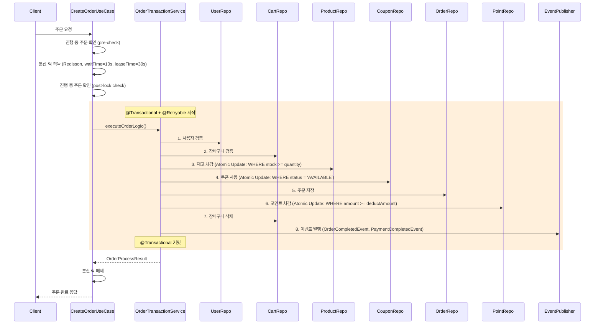

**현재 동시성 제어 메커니즘:**

동시성 문제를 해결하기 위해 여러 계층에서 제어 메커니즘을 적용하고 있다. 핵심은 **분산 락**과 **Atomic Update**의 조합이다.

| 영역 | 메커니즘 | 구현 위치 | 설명 |
|:----|:---------|:---------|:----|
| 사용자별 동시 주문 | Redisson 분산 락 | `CreateOrderUseCase.execute()` | 같은 사용자의 동시 주문 방지 (waitTime=10s, leaseTime=30s) |
| 진행 중 주문 방지 | DB 상태 체크 | `orderRepository.existsByUserIdAndStatus()` | pre-check + post-lock check 이중 검증 |
| 재고 차감 | Atomic Update | `productOptionRepository.decreaseStock()` | `WHERE p.stock >= :quantity` |
| 포인트 차감 | Atomic Update + @Retryable | `pointRepository.deductPoint()` | `WHERE p.amount >= :deductAmount` + OptimisticLockException 재시도 (3회) |
| 쿠폰 사용 | Atomic Update | `userCouponRepository.useCoupon()` | `WHERE uc.status = 'AVAILABLE'` |

Atomic Update 패턴을 선택한 이유는 Lock 없이도 데이터 정합성을 보장할 수 있기 때문이다. `WHERE` 조건에 비즈니스 규칙을 포함시켜 조건을 만족하는 경우에만 업데이트가 수행되도록 한다. 업데이트된 행 수가 0이면 조건 불충족으로 판단하여 예외를 발생시킨다.

**현재 적용된 장애 대응 패턴 (Circuit Breaker):**

외부 시스템 연동 및 Redis 장애에 대비하여 Resilience4j 기반 Circuit Breaker 패턴을 적용하고 있다.

| 대상 | 구현 클래스 | Circuit Breaker 설정 | Fallback 전략 |
|:----|:-----------|:--------------------|:-------------|
| Redis 쿠폰 발급 | `ResilientCouponIssueManager` | slidingWindowSize=10, failureRateThreshold=50%, waitDurationInOpenState=30s | 즉시 거부 (LOCK_ACQUISITION_FAILED) |
| 외부 데이터 플랫폼 | `ResilientExternalDataPlatformClient` | 동일 | 실패 이벤트 DB 저장 후 재시도 |
| 알림 발송 | `ResilientNotificationClient` | 동일 | 로깅 후 생략 (비핵심 기능) |

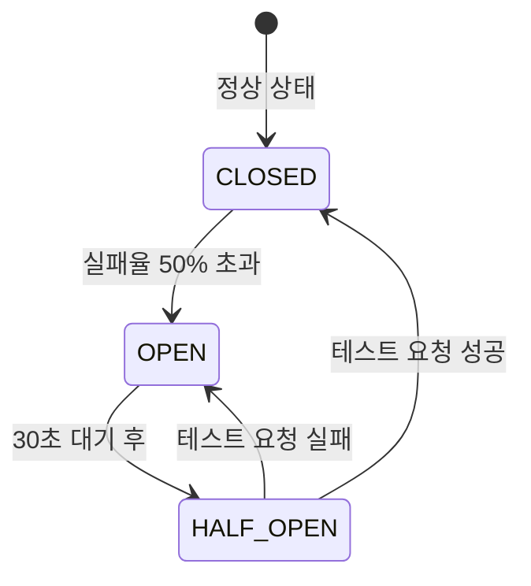

각 Circuit Breaker는 상태 변경 시 로그를 남기며, `getCircuitBreakerStatus()` 메서드를 통해 모니터링 메트릭을 제공한다.

---

## 2. MSA 전환 시 도메인별 배포 단위 설계

서비스 규모가 커지면 도메인별로 애플리케이션과 DB를 분리하는 것이 일반적이다. 각 도메인이 독립적으로 배포되고 확장될 수 있도록 설계한다.

### 2.1 서비스 분리 전략

현재 모놀리식 구조에서 7개의 독립적인 서비스로 분리하는 것을 목표로 한다.

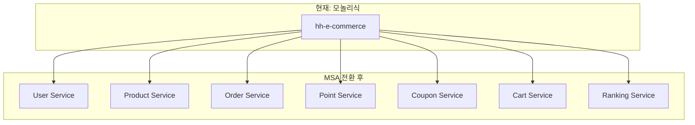

### 2.2 서비스별 책임 및 데이터 소유권

MSA의 핵심 원칙 중 하나는 **각 서비스가 자신의 데이터를 독점적으로 소유**하는 것이다. 다른 서비스는 해당 데이터에 직접 접근할 수 없고, 반드시 API를 통해서만 접근해야 한다.

| 서비스 | 책임 | 소유 데이터 | 의존 서비스 |
|:------|:----|:-----------|:-----------|
| **User Service** | 사용자 인증/인가, 프로필 관리 | users | - |
| **Product Service** | 상품 정보, 재고 관리 | products, product_options | - |
| **Order Service** | 주문 생성, 상태 관리 | orders, order_items | Product, Point, Coupon, Cart |
| **Point Service** | 포인트 충전/차감/조회 | points | User |
| **Coupon Service** | 쿠폰 발급/사용/관리 | coupons, user_coupons | User |
| **Cart Service** | 장바구니 관리 | carts | User, Product |
| **Ranking Service** | 실시간 랭킹 집계 | (Redis) | Product |

Order Service가 가장 많은 의존성을 가지고 있다. 주문 생성 시 Product(재고), Coupon(할인), Point(결제), Cart(장바구니) 서비스를 모두 호출해야 하기 때문이다. 이 복잡한 의존성이 분산 트랜잭션 문제의 핵심이다.

### 2.3 서비스 의존성 그래프

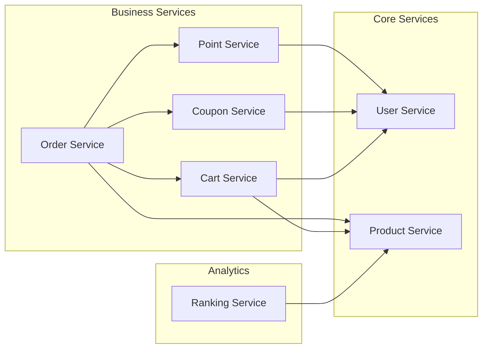

---

## 3. MSA 전환 시 트랜잭션 문제 진단

### 3.1 분산 트랜잭션 문제

현재 `OrderTransactionService`의 단일 트랜잭션이 MSA 전환 시 여러 서비스에 걸친 분산 트랜잭션으로 변환된다. 이것이 가장 큰 문제다.

모놀리식에서는 단일 DB의 ACID 트랜잭션으로 원자성을 보장했다. 하지만 각 서비스가 별도의 DB를 가지면 `@Transactional`은 더 이상 여러 서비스를 묶을 수 없다. 서비스 간 호출은 HTTP나 메시지를 통해 이루어지며, 중간에 네트워크 장애가 발생하면 **부분 실패** 상태가 된다.

**문제 시나리오 (현재 코드 순서 기준):**

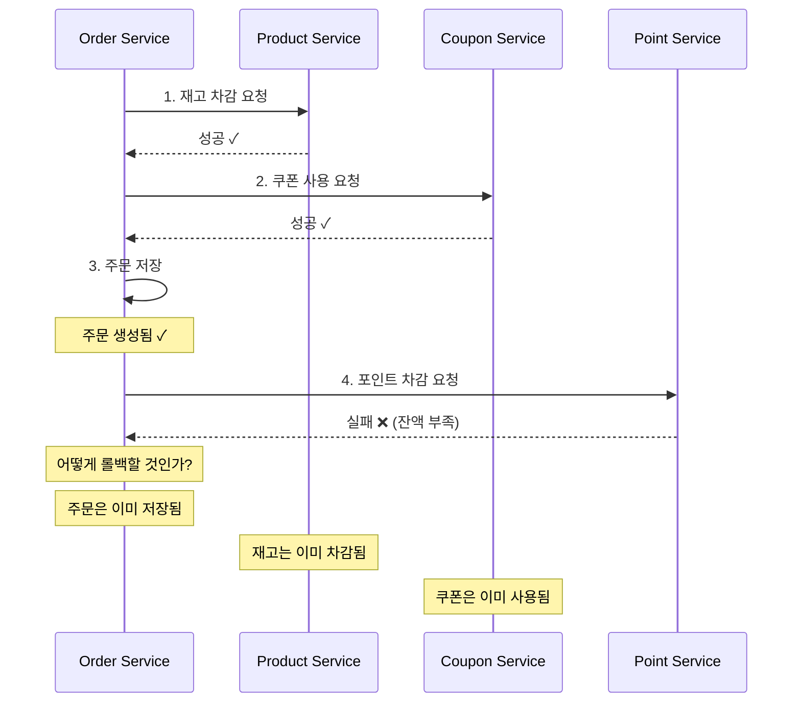

**핵심 문제점:**

위 시나리오에서 포인트 차감이 실패했을 때, 이미 성공한 재고 차감과 쿠폰 사용을 어떻게 되돌릴 것인가? 단일 트랜잭션이었다면 자동으로 롤백되었겠지만, 분산 환경에서는 불가능하다.

1. **원자성 상실**: 여러 서비스의 작업이 하나의 트랜잭션으로 묶이지 않음
2. **네트워크 장애**: 서비스 간 호출 중 네트워크 장애 발생 가능
3. **부분 실패**: 일부 서비스만 성공하고 나머지는 실패하는 상황
4. **데이터 일관성**: 강한 일관성 대신 최종 일관성(Eventual Consistency)을 수용해야 함

### 3.2 트랜잭션 경계 식별

현재 시스템에서 MSA 전환 시 영향받는 트랜잭션 경계를 파악해야 한다. 모든 기능이 영향받는 것은 아니며, 여러 도메인에 걸쳐 데이터를 변경하는 기능만 해당된다.

| 기능 | 현재 경계 | MSA 전환 후 경계 | 복잡도 |
|:----|:---------|:---------------|:------|
| 주문 생성 | 단일 @Transactional | Product + Coupon + Point + Order + Cart | 높음 |
| 쿠폰 발급 | Redis + DB 2단계 커밋 | Coupon 서비스 내부 | 중간 |
| 포인트 충전 | 단일 @Transactional | Point 서비스 내부 | 낮음 |
| 장바구니 추가 | 단일 @Transactional | Cart 서비스 내부 | 낮음 |

---

## 4. 분산 트랜잭션 해결 전략: SAGA 패턴

분산 트랜잭션 문제를 해결하기 위한 대표적인 패턴이 SAGA다. SAGA는 각 서비스의 로컬 트랜잭션을 순차적으로 실행하고, 실패 시 **보상 트랜잭션(Compensating Transaction)**을 실행하여 이전 상태로 복구하는 방식이다.

기존의 2PC(Two-Phase Commit)는 분산 환경에서 강한 일관성을 제공하지만, 락 점유 시간이 길고 단일 장애점이 될 수 있어 마이크로서비스 환경에는 적합하지 않다. SAGA는 최종 일관성을 수용하는 대신 더 높은 가용성과 확장성을 제공한다.

### 4.1 SAGA 패턴 유형 비교

SAGA 패턴은 Choreography와 Orchestration 두 가지 방식으로 구현할 수 있다.

| 구분 | Choreography | Orchestration |
|:----|:-------------|:--------------|
| **정의** | 각 서비스가 이벤트를 발행하고 다음 서비스가 구독 | 중앙 오케스트레이터가 트랜잭션 흐름 제어 |
| **결합도** | 느슨한 결합 | 오케스트레이터에 의존 |
| **가시성** | 흐름 파악 어려움 | 흐름이 한 곳에 집중되어 파악 용이 |
| **복잡도** | 서비스 수 증가 시 이벤트 추적 복잡 | 오케스트레이터 로직 복잡 |
| **장애 처리** | 각 서비스에서 개별 처리 | 오케스트레이터에서 중앙 처리 |
| **적합 케이스** | 단순한 흐름, 독립적 서비스 | 복잡한 흐름, 다단계 트랜잭션 |

### 4.2 주문 생성 SAGA 설계

현재 주문 생성 로직을 SAGA로 전환하면 어떻게 되는지 두 가지 방식 모두 설계해 본다.

#### 4.2.1 Choreography 방식 (이벤트 기반)

각 서비스가 자신의 작업을 완료한 후 이벤트를 발행하고, 다음 서비스가 해당 이벤트를 구독하여 작업을 수행한다.

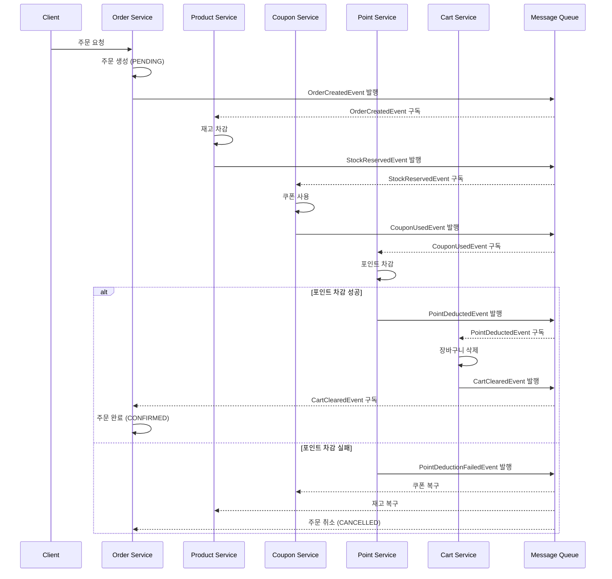

#### 4.2.2 Orchestration 방식 (중앙 제어)

중앙의 오케스트레이터가 각 서비스를 순차적으로 호출하고, 실패 시 보상 트랜잭션을 직접 실행한다.

> **참고: 현재 코드와의 차이점**
>
> 현재 모놀리식 구조(`OrderTransactionService`)에서는 **재고 → 쿠폰 → 주문 저장 → 포인트 → 장바구니** 순서로 처리한다. 아래 다이어그램은 MSA 전환 후 예상되는 SAGA 흐름으로, 주문을 먼저 PENDING 상태로 생성한 뒤 각 단계를 진행하고 최종적으로 CONFIRMED로 변경하는 방식이다. 이렇게 하면 SAGA 상태 추적이 용이하고, 실패 시 어느 단계까지 진행되었는지 명확히 알 수 있다.

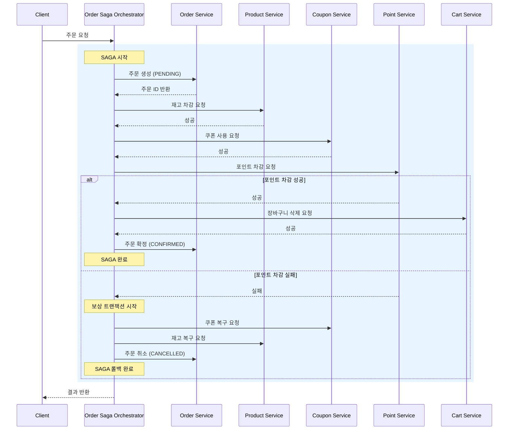

### 4.3 권장 방식: Orchestration SAGA

주문 생성 SAGA는 **Orchestration 방식**을 선택한다.

**선택 이유:**

1. **주문 프로세스의 복잡성**: 5개 서비스가 관여하는 복잡한 흐름이다. Choreography로 구현하면 이벤트 체인이 너무 길어져 디버깅이 어려워진다.
2. **일관된 에러 처리**: 중앙에서 보상 트랜잭션을 관리할 수 있어, 어느 단계에서 실패해도 일관된 방식으로 롤백을 수행할 수 있다.
3. **디버깅 용이성**: 오케스트레이터의 로그와 상태만 확인하면 전체 트랜잭션 흐름을 추적할 수 있다.
4. **현재 구조와의 유사성**: 현재 `CreateOrderUseCase`가 이미 오케스트레이터 역할을 수행하고 있다. MSA 전환 시 이 구조를 그대로 활용하면 된다.

Choreography 방식은 각 서비스의 독립성이 높아지지만, 5개 서비스에 걸친 이벤트 흐름을 추적하기 어렵다. 특히 보상 트랜잭션이 실패했을 때 원인을 파악하기가 매우 어려워진다. 따라서 주문과 같이 복잡한 비즈니스 로직에는 Orchestration이 더 적합하다고 판단한다.

---

## 5. 보상 트랜잭션 전략

SAGA에서 가장 중요한 것은 **보상 트랜잭션**이다. 정방향 트랜잭션을 설계하기 전에 반드시 보상 트랜잭션을 먼저 정의해야 한다. 보상이 불가능한 작업이 있다면 SAGA 설계 자체를 다시 검토해야 한다.

### 5.1 각 단계별 보상 액션 정의

정방향 트랜잭션의 각 단계에 대해 역순으로 보상 트랜잭션을 정의한다.

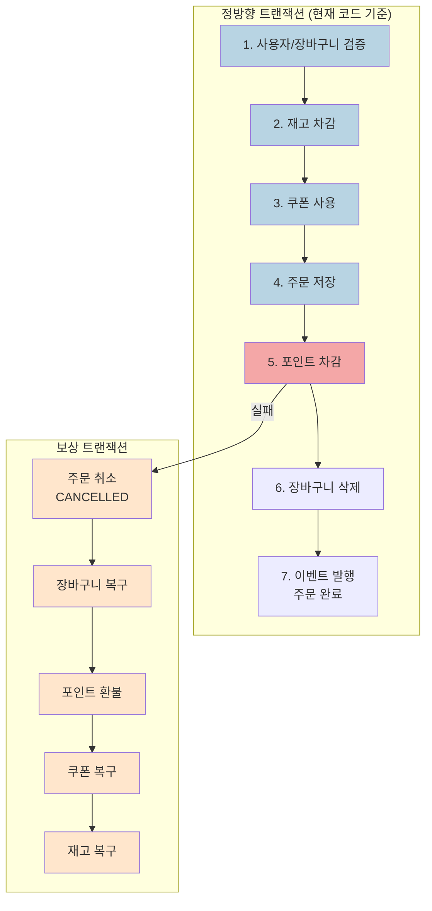

### 5.2 보상 트랜잭션 상세 설계

보상 트랜잭션 설계 시 핵심은 **멱등성(Idempotency)** 보장이다. 네트워크 장애로 인해 보상 요청이 중복 전송될 수 있으므로, 같은 요청이 여러 번 와도 결과가 동일해야 한다.

| 순서 | 정방향 트랜잭션 | 보상 트랜잭션 | 멱등성 보장 방법 |
|:---:|:--------------|:-------------|:---------------|
| 1 | 사용자/장바구니 검증 | - | 조회만 수행 |
| 2 | 재고 차감 | 재고 복구 | 주문 ID 기반 중복 체크 |
| 3 | 쿠폰 사용 (USED) | 쿠폰 복구 (AVAILABLE) | 상태 체크 후 변경 |
| 4 | 주문 저장 (CONFIRMED) | 주문 취소 (CANCELLED) | 상태 체크 후 변경 |
| 5 | 포인트 차감 | 포인트 환불 | 트랜잭션 ID 기반 중복 체크 |
| 6 | 장바구니 삭제 | 장바구니 복구 | 스냅샷 기반 복원 |
| 7 | 이벤트 발행 | - | 이벤트 발행은 트랜잭션 커밋 후 처리 |

멱등성을 보장하기 위해 각 보상 API는 "이미 보상된 상태"를 에러로 처리하지 않고 성공으로 처리해야 한다. 예를 들어, 쿠폰 복구 API가 호출되었을 때 이미 AVAILABLE 상태라면 그대로 성공을 반환한다.

### 5.3 SAGA 상태 관리

SAGA의 진행 상태를 추적하기 위해 별도의 상태 테이블이 필요하다. 오케스트레이터가 어느 단계까지 진행했는지 기록해야 장애 복구 시 적절한 보상을 수행할 수 있다.

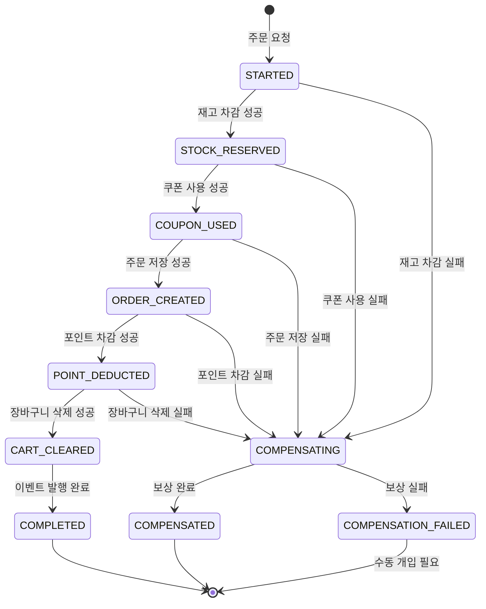

### 5.4 보상 트랜잭션 구현 예시

현재 `CreateOrderUseCase`와 `OrderTransactionService`의 구조를 MSA 환경으로 전환하면 다음과 같은 형태가 된다. 핵심은 각 단계의 성공 여부를 `SagaState`에 기록하고, 실패 시 역순으로 보상을 실행하는 것이다.

```java
// Order Saga Orchestrator (MSA 전환 후 예상 구조)
@Service
@RequiredArgsConstructor
public class OrderSagaOrchestrator {

    private final OrderServiceClient orderClient;
    private final ProductServiceClient productClient;
    private final CouponServiceClient couponClient;
    private final PointServiceClient pointClient;
    private final CartServiceClient cartClient;
    private final SagaStateRepository sagaStateRepository;

    public OrderResult executeOrderSaga(CreateOrderCommand command) {
        String sagaId = UUID.randomUUID().toString();
        SagaState saga = SagaState.create(sagaId, command);

        try {
            // Step 1: 재고 차감 (현재 코드: productOptionRepository.decreaseStock)
            productClient.reserveStock(command.getItems());
            saga.stockReserved();

            // Step 2: 쿠폰 사용 (현재 코드: userCouponRepository.useCoupon)
            if (command.getCouponId() != null) {
                couponClient.useCoupon(command.getCouponId());
                saga.couponUsed();
            }

            // Step 3: 주문 저장 (현재 코드: orderRepository.save)
            OrderResponse order = orderClient.createOrder(command);
            saga.orderCreated(order.getOrderId());

            // Step 4: 포인트 차감 (현재 코드: pointRepository.deductPoint)
            pointClient.deductPoint(command.getUserId(), order.getFinalAmount());
            saga.pointDeducted();

            // Step 5: 장바구니 삭제 (현재 코드: cartRepository.deleteAllByUserId)
            cartClient.clearCart(command.getUserId());
            saga.cartCleared();

            // Step 6: 이벤트 발행 (현재 코드: eventPublisher.publishEvent)
            orderClient.publishOrderCompletedEvent(order.getOrderId());
            saga.completed();

            return OrderResult.success(order);

        } catch (Exception e) {
            // 보상 트랜잭션 실행
            executeCompensation(saga);
            return OrderResult.failed(e.getMessage());
        } finally {
            sagaStateRepository.save(saga);
        }
    }

    private void executeCompensation(SagaState saga) {
        saga.startCompensation();

        // 역순으로 보상 실행 (현재 트랜잭션 순서의 역순)
        if (saga.isCartCleared()) {
            try {
                cartClient.restoreCart(saga.getUserId(), saga.getCartSnapshot());
            } catch (Exception e) {
                log.error("Cart restoration failed", e);
            }
        }

        if (saga.isPointDeducted()) {
            try {
                pointClient.refundPoint(saga.getUserId(), saga.getDeductedAmount());
            } catch (Exception e) {
                log.error("Point refund failed", e);
            }
        }

        if (saga.isOrderCreated()) {
            try {
                orderClient.cancelOrder(saga.getOrderId());
            } catch (Exception e) {
                log.error("Order cancellation failed", e);
            }
        }

        if (saga.isCouponUsed()) {
            try {
                couponClient.restoreCoupon(saga.getCouponId());
            } catch (Exception e) {
                log.error("Coupon restoration failed", e);
            }
        }

        if (saga.isStockReserved()) {
            try {
                productClient.restoreStock(saga.getReservedItems());
            } catch (Exception e) {
                log.error("Stock restoration failed", e);
            }
        }

        saga.compensated();
    }
}
```

---

## 6. 도메인 간 메시징 전략

MSA 환경에서 서비스 간 통신은 동기(Sync)와 비동기(Async) 방식을 적절히 조합해야 한다. 현재 시스템에서 사용 중인 `ApplicationEventPublisher`는 단일 애플리케이션 내에서만 동작하므로, 외부 메시지 브로커로 대체해야 한다.

### 6.1 메시지 브로커 선택

| 항목 | Apache Kafka | RabbitMQ |
|:----|:-------------|:---------|
| **처리량** | 매우 높음 (수백만 TPS) | 높음 (수만 TPS) |
| **메시지 영속성** | 디스크 기반, 리플레이 가능 | 메모리 기반, 영속성 옵션 |
| **순서 보장** | 파티션 내 순서 보장 | 큐 내 순서 보장 |
| **적합 사례** | 이벤트 소싱, 대용량 처리 | 복잡한 라우팅, RPC 패턴 |

Kafka를 선택하는 이유:
- 주문 이벤트는 높은 처리량이 필요하다. 특히 이벤트 기간에는 순간적으로 트래픽이 급증한다.
- 이벤트 리플레이 기능이 있어, 컨슈머 장애 시 메시지를 다시 처리할 수 있다.
- 랭킹, 알림, 분석 등 다수의 컨슈머가 동일한 주문 이벤트를 각자의 목적에 맞게 처리해야 한다.

### 6.2 이벤트 토픽 설계

토픽은 도메인별로 분리하고, SAGA 조정용 토픽은 별도로 관리한다.

```
# 도메인 이벤트 토픽
order.events              # 주문 관련 이벤트 (OrderCreated, OrderCancelled, ...)
product.events            # 상품/재고 관련 이벤트 (StockReserved, StockReleased, ...)
coupon.events             # 쿠폰 관련 이벤트 (CouponUsed, CouponRestored, ...)
point.events              # 포인트 관련 이벤트 (PointDeducted, PointRefunded, ...)
cart.events               # 장바구니 관련 이벤트 (CartCleared, CartRestored, ...)

# SAGA 조정 토픽
saga.order.commands       # Order SAGA 커맨드 (오케스트레이터 → 각 서비스)
saga.order.replies        # Order SAGA 응답 (각 서비스 → 오케스트레이터)
```

도메인 이벤트 토픽은 해당 도메인에서 발생하는 비즈니스 이벤트를 발행한다. 랭킹 서비스, 알림 서비스 등 여러 컨슈머가 이를 구독할 수 있다. SAGA 조정 토픽은 오케스트레이터와 각 서비스 간의 요청/응답에 사용한다.

### 6.3 이벤트 기반 MSA 흐름도

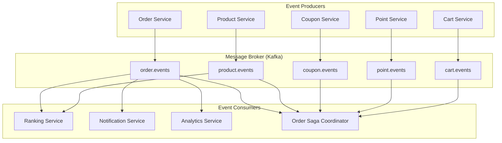

### 6.4 이벤트 스키마 정의

모든 이벤트는 공통 필드를 가지며, 추적과 디버깅을 위한 메타데이터를 포함한다. `correlationId`는 SAGA 전체를 추적하는 데 사용한다.

```java
// 기본 이벤트 인터페이스
public interface DomainEvent {
    String eventId();
    String eventType();
    String aggregateId();
    String aggregateType();
    Instant occurredAt();
    String correlationId();
}

// 주문 생성 이벤트
public record OrderCreatedEvent(
    String eventId,
    String eventType,
    String aggregateId,
    String aggregateType,
    Instant occurredAt,
    String correlationId,
    Long userId,
    List<OrderItemInfo> items,
    Long couponId,
    int totalAmount
) implements DomainEvent {}

// 재고 예약 이벤트
public record StockReservedEvent(
    String eventId,
    String eventType,
    String aggregateId,
    String aggregateType,
    Instant occurredAt,
    String correlationId,
    Map<Long, Integer> reservedItems  // productOptionId -> quantity
) implements DomainEvent {}

// 재고 예약 실패 이벤트
public record StockReservationFailedEvent(
    String eventId,
    String eventType,
    String aggregateId,
    String aggregateType,
    Instant occurredAt,
    String correlationId,
    String reason,
    List<Long> failedProductOptionIds
) implements DomainEvent {}
```

---

## 7. 서비스 간 통신 패턴

### 7.1 동기 vs 비동기 통신 구분

모든 통신을 비동기로 처리하면 좋겠지만, 사용자 응답이 필요한 경우에는 동기 통신이 불가피하다. 각 상황에 맞는 통신 방식을 선택해야 한다.

| 통신 유형 | 사용 사례 | 패턴 |
|:---------|:---------|:-----|
| **동기 (Sync)** | 실시간 응답 필요, 데이터 조회 | REST API, gRPC |
| **비동기 (Async)** | 작업 위임, 이벤트 전파 | Kafka, RabbitMQ |

**주문 프로세스에서의 적용:**

주문 생성 API는 사용자에게 즉시 결과를 반환해야 하므로 SAGA 자체는 동기로 실행된다. 반면 주문 완료 후의 랭킹 업데이트, 알림 발송 등은 비동기로 처리한다.

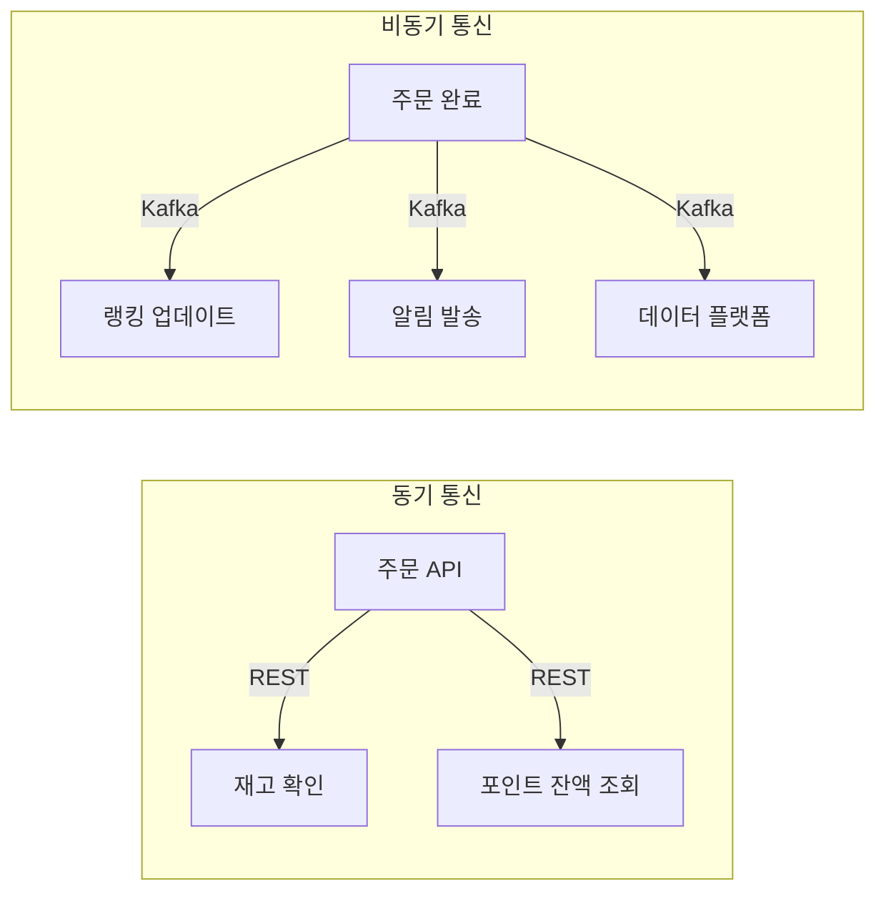

### 7.2 서비스 간 통신 장애 대응

분산 시스템에서 네트워크 장애는 필연적으로 발생한다. 장애 발생 시 시스템 전체가 마비되지 않도록 적절한 패턴을 적용해야 한다. 현재 시스템에서도 쿠폰 발급에 Circuit Breaker를 적용한 경험이 있다.

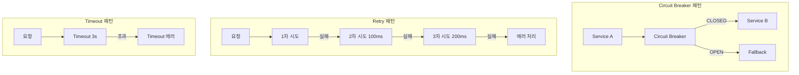

---

## 8. 데이터 일관성 전략

### 8.1 일관성 모델 비교

MSA 환경에서는 모든 데이터에 강한 일관성을 적용하기 어렵다. 비즈니스 요구사항에 따라 적절한 일관성 모델을 선택해야 한다.

| 모델 | 설명 | 적용 사례 |
|:----|:----|:---------|
| **강한 일관성 (Strong)** | 모든 노드가 동일한 데이터 | 결제, 재고 (임계 영역) |
| **최종 일관성 (Eventual)** | 시간이 지나면 일관성 달성 | 랭킹, 통계, 알림 |

재고와 결제는 강한 일관성이 필요하다. 음수 재고나 중복 결제는 비즈니스에 직접적인 손실을 초래하기 때문이다. 반면 랭킹이나 통계는 약간의 지연이 허용되므로 최종 일관성으로 충분하다.

### 8.2 Outbox 패턴

데이터베이스 변경과 이벤트 발행의 원자성을 보장하기 위한 패턴이다. 현재 시스템에서 `@TransactionalEventListener`를 사용하는 것과 유사한 목적이지만, 외부 메시지 브로커를 사용할 때는 Outbox 패턴이 더 안전하다.

**문제 상황**: DB에 데이터를 저장한 후 Kafka에 이벤트를 발행하는 과정에서, DB 커밋은 성공했지만 Kafka 발행이 실패하면 데이터 불일치가 발생한다.

**해결**: 이벤트를 Outbox 테이블에 저장하고, 별도의 프로세스가 폴링하여 Kafka로 발행한다. DB 저장과 Outbox 저장이 같은 트랜잭션이므로 원자성이 보장된다.

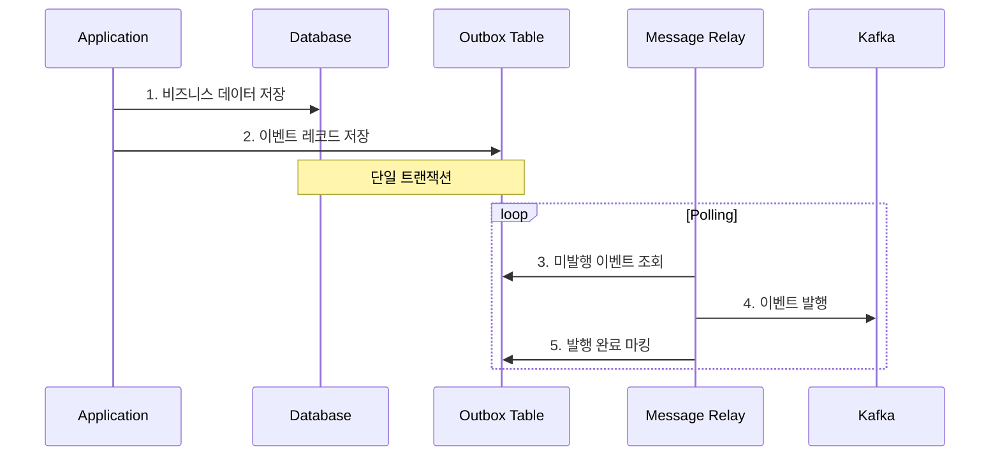

```java
// Outbox 테이블 엔티티
@Entity
@Table(name = "outbox_events")
public class OutboxEvent {
    @Id
    private String eventId;
    private String aggregateType;
    private String aggregateId;
    private String eventType;
    private String payload;
    private LocalDateTime createdAt;
    private LocalDateTime publishedAt;
    private EventStatus status; // PENDING, PUBLISHED, FAILED
}

// 비즈니스 로직 + Outbox 저장
@Transactional
public Order createOrder(CreateOrderCommand command) {
    Order order = orderRepository.save(new Order(command));

    OutboxEvent event = OutboxEvent.builder()
        .eventId(UUID.randomUUID().toString())
        .aggregateType("Order")
        .aggregateId(order.getId())
        .eventType("OrderCreated")
        .payload(objectMapper.writeValueAsString(order))
        .status(EventStatus.PENDING)
        .build();

    outboxRepository.save(event);

    return order;
}
```

---

## 9. SAGA 비동기 처리 및 응답 최적화

### 9.1 동기식 Orchestration의 문제점

현재 설계된 Orchestration SAGA는 모든 단계를 동기식으로 처리한다. 이는 다음과 같은 문제를 야기할 수 있다.

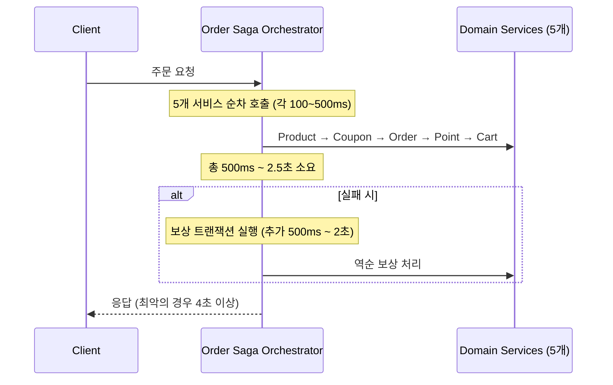

**핵심 문제점:**

| 문제 | 설명 | 영향 |
|:----|:----|:----|
| **긴 응답 시간** | 5개 서비스 순차 호출 + 실패 시 보상까지 완료 후 응답 | 사용자 경험 저하 |
| **SPOF (Single Point of Failure)** | 모든 요청이 Orchestrator에 집중 | 장애 시 전체 시스템 마비 |
| **커넥션 풀 고갈** | 장시간 대기하는 요청들이 커넥션 점유 | 시스템 처리량 급감 |
| **타임아웃 리스크** | 처리 시간이 길어져 클라이언트 타임아웃 발생 | 중복 요청, 데이터 불일치 |

### 9.2 해결책: 비동기 SAGA + 즉시 응답 패턴

사용자에게 "주문 접수됨(PENDING)"을 즉시 반환하고, 실제 SAGA 처리는 비동기로 진행한다.

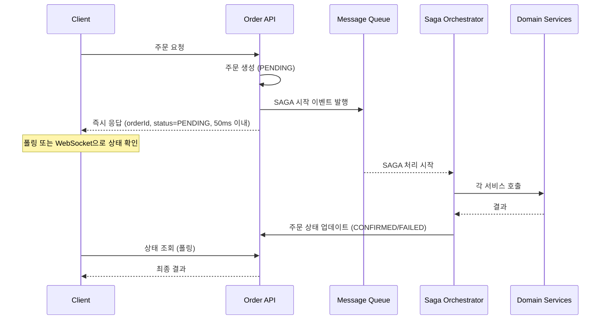

**구현 예시:**

```java
// 주문 API - 즉시 응답
@RestController
@RequiredArgsConstructor
public class OrderController {

    private final OrderService orderService;
    private final DomainEventPublisher eventPublisher;

    @PostMapping("/orders")
    public ResponseEntity<OrderAcceptedResponse> createOrder(
            @RequestBody CreateOrderRequest request) {

        // 1. 기본 검증 (동기, 빠른 처리)
        orderService.validateOrderRequest(request);

        // 2. 주문을 PENDING 상태로 즉시 생성
        Order order = orderService.createPendingOrder(request);

        // 3. SAGA 시작 이벤트 발행 (비동기 처리 트리거)
        eventPublisher.publish(new OrderSagaStartEvent(
            order.getId(),
            request.getUserId(),
            request.getItems(),
            request.getUserCouponId()
        ));

        // 4. 즉시 응답 (50ms 이내)
        return ResponseEntity.accepted()
            .body(new OrderAcceptedResponse(
                order.getId(),
                OrderStatus.PENDING,
                "주문이 접수되었습니다. 처리 중입니다."
            ));
    }

    @GetMapping("/orders/{orderId}/status")
    public OrderStatusResponse getOrderStatus(@PathVariable Long orderId) {
        return orderService.getOrderStatus(orderId);
    }
}

// 비동기 SAGA Orchestrator
@Component
@RequiredArgsConstructor
@Slf4j
public class AsyncOrderSagaOrchestrator {

    private final SagaStateRepository sagaStateRepository;
    private final ProductServiceClient productClient;
    private final CouponServiceClient couponClient;
    private final PointServiceClient pointClient;
    private final CartServiceClient cartClient;
    private final OrderService orderService;

    @TransactionalEventListener(phase = TransactionPhase.AFTER_COMMIT)
    @Async("sagaExecutor")
    public void handleOrderSagaStart(OrderSagaStartEvent event) {
        String sagaId = UUID.randomUUID().toString();
        SagaState saga = SagaState.create(sagaId, event);

        try {
            executeSaga(saga, event);
            saga.complete();
            orderService.confirmOrder(event.getOrderId());
            log.info("SAGA 완료 - orderId: {}, sagaId: {}", event.getOrderId(), sagaId);

        } catch (Exception e) {
            log.error("SAGA 실패 - orderId: {}, sagaId: {}, error: {}",
                event.getOrderId(), sagaId, e.getMessage());
            executeCompensation(saga);
            orderService.cancelOrder(event.getOrderId(), e.getMessage());

        } finally {
            sagaStateRepository.save(saga);
        }
    }

    private void executeSaga(SagaState saga, OrderSagaStartEvent event) {
        // Step 1: 재고 차감
        productClient.reserveStock(event.getItems());
        saga.stockReserved();

        // Step 2: 쿠폰 사용
        if (event.getCouponId() != null) {
            couponClient.useCoupon(event.getCouponId());
            saga.couponUsed();
        }

        // Step 3: 포인트 차감
        pointClient.deductPoint(event.getUserId(), event.getTotalAmount());
        saga.pointDeducted();

        // Step 4: 장바구니 삭제
        cartClient.clearCart(event.getUserId());
        saga.cartCleared();
    }

    private void executeCompensation(SagaState saga) {
        // 역순으로 보상 실행 (각 단계는 try-catch로 개별 처리)
        // ... 보상 로직
    }
}
```

### 9.3 사용자 상태 표현 전략

SAGA의 세부적인 상태를 모두 사용자에게 노출할 필요는 없다. 내부 상태와 사용자 노출 상태를 분리하여 관리한다.

**상태 매핑:**

| 내부 SAGA 상태 | 사용자 노출 상태 | 설명 |
|:-------------|:--------------|:----|
| `STARTED` | `PROCESSING` | 주문 처리 시작 |
| `STOCK_RESERVED` | `PROCESSING` | 재고 확보됨 |
| `COUPON_USED` | `PROCESSING` | 쿠폰 적용됨 |
| `ORDER_CREATED` | `PROCESSING` | 주문 생성됨 |
| `POINT_DEDUCTED` | `PROCESSING` | 결제 완료 |
| `CART_CLEARED` | `PROCESSING` | 장바구니 정리됨 |
| `COMPLETED` | `CONFIRMED` | 주문 확정 |
| `COMPENSATING` | `FAILED` | 주문 실패 (처리 중) |
| `COMPENSATED` | `FAILED` | 주문 실패 (복구 완료) |
| `COMPENSATION_FAILED` | `FAILED` | 주문 실패 (수동 조치 필요) |

```java
@Entity
public class Order {

    @Enumerated(EnumType.STRING)
    private SagaState sagaState;  // 내부 상태 (7단계)

    @Enumerated(EnumType.STRING)
    private OrderStatus status;   // 사용자 노출 상태 (3단계)

    // 상태 변환 메서드
    public UserOrderStatus getUserStatus() {
        return switch (sagaState) {
            case STARTED, STOCK_RESERVED, COUPON_USED,
                 ORDER_CREATED, POINT_DEDUCTED, CART_CLEARED
                -> UserOrderStatus.PROCESSING;
            case COMPLETED
                -> UserOrderStatus.CONFIRMED;
            case COMPENSATING, COMPENSATED, COMPENSATION_FAILED
                -> UserOrderStatus.FAILED;
        };
    }
}

// 사용자 응답 DTO
public record OrderStatusResponse(
    Long orderId,
    UserOrderStatus status,        // PROCESSING, CONFIRMED, FAILED
    String message,
    LocalDateTime updatedAt
) {
    public static OrderStatusResponse of(Order order) {
        String message = switch (order.getUserStatus()) {
            case PROCESSING -> "주문을 처리하고 있습니다.";
            case CONFIRMED -> "주문이 확정되었습니다.";
            case FAILED -> "주문 처리에 실패했습니다. " + order.getFailureReason();
        };

        return new OrderStatusResponse(
            order.getId(),
            order.getUserStatus(),
            message,
            order.getUpdatedAt()
        );
    }
}
```

### 9.4 Orchestrator SPOF 방지

Orchestrator를 Stateless로 설계하고, SAGA 상태는 DB에 저장하여 어느 인스턴스에서든 처리할 수 있도록 한다.

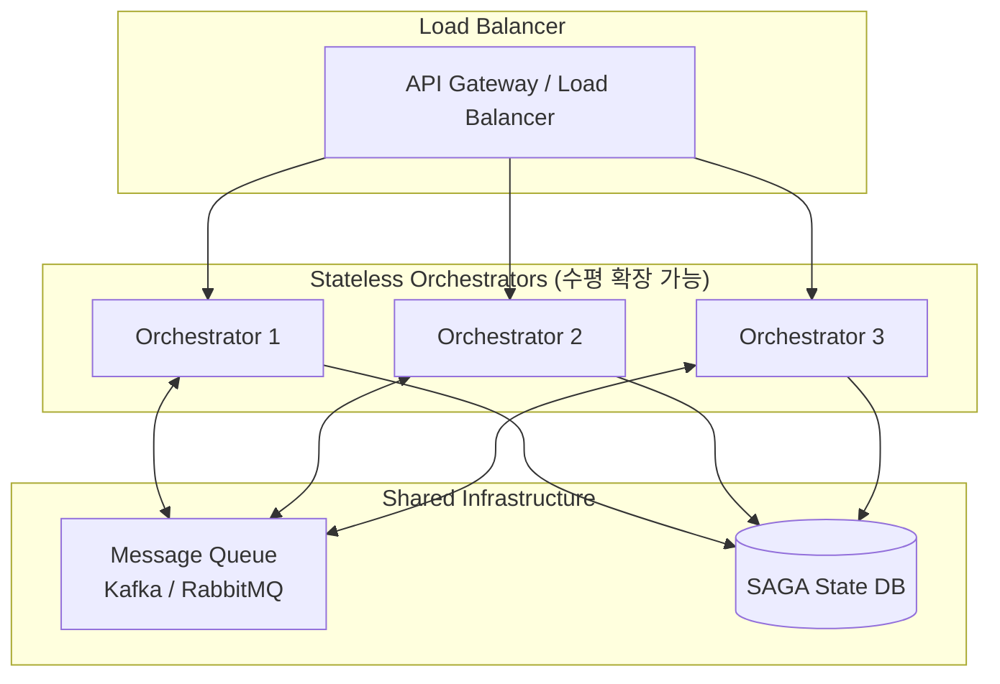

**장애 복구 메커니즘:**

```java
// SAGA 상태 엔티티
@Entity
@Table(name = "saga_state")
public class SagaState {

    @Id
    private String sagaId;

    private Long orderId;

    @Enumerated(EnumType.STRING)
    private SagaStep currentStep;

    @Enumerated(EnumType.STRING)
    private SagaStatus status;  // IN_PROGRESS, COMPLETED, COMPENSATING, FAILED

    private String payload;  // JSON 직렬화된 요청 데이터

    private LocalDateTime startedAt;
    private LocalDateTime lastUpdatedAt;
    private String processingInstanceId;  // 처리 중인 Orchestrator 인스턴스
}

// 고아 SAGA 복구 스케줄러
@Component
@RequiredArgsConstructor
@Slf4j
public class OrphanSagaRecoveryScheduler {

    private final SagaStateRepository sagaStateRepository;
    private final AsyncOrderSagaOrchestrator orchestrator;

    @Scheduled(fixedDelay = 60000)  // 1분마다
    public void recoverOrphanSagas() {
        // 5분 이상 IN_PROGRESS 상태로 멈춘 SAGA 조회
        LocalDateTime threshold = LocalDateTime.now().minusMinutes(5);

        List<SagaState> orphanSagas = sagaStateRepository
            .findByStatusAndLastUpdatedAtBefore(SagaStatus.IN_PROGRESS, threshold);

        for (SagaState saga : orphanSagas) {
            log.warn("고아 SAGA 발견 - sagaId: {}, orderId: {}, lastStep: {}",
                saga.getSagaId(), saga.getOrderId(), saga.getCurrentStep());

            // 보상 트랜잭션 실행
            orchestrator.executeCompensation(saga);
        }
    }
}
```

### 9.5 클라이언트 상태 확인 방식

#### Option 1: 폴링 (Polling)

단순하고 구현이 쉬우나, 불필요한 요청이 발생할 수 있다.

```javascript
// 클라이언트 폴링 예시
async function waitForOrderConfirmation(orderId) {
    const maxAttempts = 30;  // 최대 30초
    const interval = 1000;   // 1초 간격

    for (let i = 0; i < maxAttempts; i++) {
        const response = await fetch(`/api/orders/${orderId}/status`);
        const status = await response.json();

        if (status.status === 'CONFIRMED') {
            return { success: true, order: status };
        }
        if (status.status === 'FAILED') {
            return { success: false, error: status.message };
        }

        await sleep(interval);
    }

    return { success: false, error: 'Timeout' };
}
```

#### Option 2: WebSocket (실시간 알림)

실시간 상태 업데이트가 가능하나, 연결 관리가 필요하다.

```java
@Component
@RequiredArgsConstructor
public class OrderStatusNotifier {

    private final SimpMessagingTemplate messagingTemplate;

    public void notifyOrderStatusChange(Long orderId, UserOrderStatus status) {
        messagingTemplate.convertAndSend(
            "/topic/orders/" + orderId,
            new OrderStatusUpdate(orderId, status)
        );
    }
}
```

### 9.6 성능 비교

| 항목 | 동기식 SAGA | 비동기 SAGA + 즉시 응답 |
|:----|:-----------|:---------------------|
| **응답 시간** | 500ms ~ 4초 | 50ms 이내 |
| **처리량 (TPS)** | 낮음 (커넥션 점유) | 높음 (빠른 반환) |
| **SPOF 리스크** | 높음 | 낮음 (Stateless) |
| **구현 복잡도** | 낮음 | 중간 |
| **상태 추적** | 단순 | 추가 인프라 필요 |
| **사용자 경험** | 대기 시간 길음 | 즉시 피드백 |

### 9.7 권장 구현 전략

1. **1단계 (현재)**: 모놀리식 환경에서 이벤트 기반 비동기 처리 유지
2. **2단계 (MSA 전환 시)**: 비동기 SAGA + 즉시 응답 패턴 적용
3. **3단계 (고도화)**: WebSocket 실시간 알림 + Stateless Orchestrator 분산

MSA 전환 시점에 비동기 SAGA 패턴을 적용하면, 사용자 경험을 유지하면서 시스템 안정성을 확보할 수 있다.
