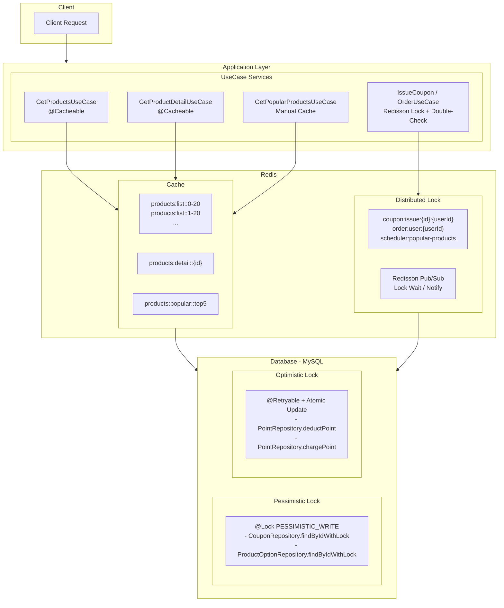

# Redis 기반 성능 개선 보고서

이커머스 서비스 특성상 다음과 같은 동시성 문제와 성능 이슈가 발생할 수 있습니다

| 문제 유형 | 시나리오 | 영향 |
|-----------|----------|------|
| 동시성 문제 | 인기 쿠폰 동시 발급 요청 | 재고 초과 발급, 중복 발급 |
| 동시성 문제 | 동일 사용자의 동시 주문 | 주문 중복 생성 |
| 성능 문제 | 상품 목록 반복 조회 | DB 과부하 |
| 성능 문제 | 인기 상품 집계 쿼리 | 복잡한 조인 연산으로 인한 응답 지연 |

---

## 1. 캐시 적용 구간 점검

### 1.1 분석 기준

| 분석 기준 | 설명 |
|-----------|------|
| 조회 빈도 | 자주 호출되는 API인가? |
| 데이터 변경 빈도 | 데이터가 얼마나 자주 변경되는가? |
| 쿼리 복잡도 | DB 쿼리가 복잡하고 비용이 높은가? |
| 실시간성 요구 | 최신 데이터가 반드시 필요한가? |

### 1.2 API별 분석 결과

| API | 조회 빈도 | 변경 빈도 | 쿼리 복잡도 | 실시간성 | 캐시 적용 |
|-----|-----------|-----------|-------------|----------|-----------|
| **상품 목록 조회** | 매우 높음 | 낮음 | 중간 (N+1 쿼리) | 낮음 | **적용** |
| **인기 상품 조회** | 높음 | 매우 낮음 | 높음 (집계 쿼리) | 낮음 | **적용** |
| **상품 상세 조회** | 높음 | 낮음 | 낮음 | 중간 | **적용** |
| 주문 생성 | 중간 | - | 중간 | 높음 | 미적용 |
| 포인트 조회 | 중간 | 높음 | 낮음 | 높음 | 미적용 |
| 쿠폰 발급 | 낮음 | - | 낮음 | 높음 | 미적용 |

### 1.3 캐시 적용 대상 선정

#### 1.3.1 상품 목록 조회 (`GET /api/products`)

**선정 이유:**
```
[문제점 분석]
1. 매 요청마다 Product + ProductOption 테이블 조회
2. N+1 쿼리 발생 (상품 수 만큼 옵션 조회)
3. 메인 페이지 진입 시 반드시 호출
4. 상품 정보는 자주 변경되지 않음

[쿼리 분석]
- products 조회: 1회
- product_options 조회: 상품 수 N회
- 총 쿼리: 1 + N회 (20개 상품 = 21회 쿼리)
```

**코드 분석:**
```java
// GetProductsUseCase.java - 캐시 미적용 시 매번 실행
List<Product> products = productRepository.findAll(PageRequest.of(page, size));  // 1회
products.stream().map(product -> {
    productOptionRepository.findByProductId(product.getId());  // N회
    // ... 집계 로직
});
```

#### 1.3.2 상품 상세 조회 (`GET /api/products/{id}`)

**선정 이유:**
```
[문제점 분석]
1. 상품 상세 페이지 진입 시 반드시 호출
2. Product + ProductOption 테이블 조회 필요
3. 동일 상품에 대한 반복 조회 빈번
4. 상품 정보는 자주 변경되지 않음

[쿼리 분석]
- product 조회: 1회
- product_options 조회: 1회
- 총 쿼리: 2회
```

**코드 분석:**
```java
// GetProductDetailUseCase.java - 캐시 미적용 시 매번 실행
Product product = productRepository.findById(productId);  // 1회
List<ProductOption> options = productOptionRepository.findByProductId(productId);  // 1회
```

#### 1.3.3 인기 상품 조회 (`GET /api/products/popular`)

**선정 이유:**
```
[문제점 분석]
1. 3일간 판매량 집계 쿼리 (복잡한 조인 + GROUP BY)
2. 실시간 집계 시 DB 부하 극심
3. 메인 페이지에서 자주 호출
4. 인기 상품은 하루 단위로 갱신해도 충분

[쿼리 분석 - findTopSellingProducts]
- order_item + product_option + product 3개 테이블 조인
- 3일치 주문 데이터 풀스캔
- GROUP BY + ORDER BY + LIMIT 연산
- 예상 실행 시간: 100ms ~ 500ms
```

**쿼리 코드:**
```sql
-- OrderRepository.findTopSellingProducts
SELECT p.id, p.name, p.category, p.status, sales.totalSales
FROM (
    SELECT po.product_id, SUM(oi.quantity) as totalSales
    FROM order_item oi
    INNER JOIN product_option po ON oi.product_option_id = po.id
    WHERE oi.order_id IN (
        SELECT id FROM `order` WHERE created_at >= :startDate
    )
    GROUP BY po.product_id
    ORDER BY totalSales DESC
    LIMIT 5
) sales
JOIN product p ON p.id = sales.product_id
```

---

## 2. 캐시 전략 선정

### 2.1 캐시 패턴 비교

| 패턴 | 설명 | 장점 | 단점 | 적합한 상황 |
|------|------|------|------|-------------|
| **Look-Aside** | 캐시 미스 시 DB 조회 후 캐시 저장 | 구현 간단, 자동 갱신 | Thundering Herd 가능 | 일반적인 조회 |
| **Write-Through** | 쓰기 시 캐시와 DB 동시 갱신 | 캐시 일관성 보장 | 쓰기 지연 | 빈번한 쓰기 |
| **Write-Behind** | 쓰기는 캐시만, 나중에 DB 동기화 | 쓰기 성능 향상 | 데이터 유실 위험 | 로그성 데이터 |
| **Refresh-Ahead** | 만료 전 미리 갱신 | 캐시 미스 최소화 | 구현 복잡 | 예측 가능한 접근 |

### 2.2 시나리오별 전략 선정

#### 상품 목록: Look-Aside (Cache-Aside)

```
┌──────────────────────────────────────────────────────────┐
│                    Look-Aside Pattern                    │
├──────────────────────────────────────────────────────────┤
│                                                          │
│  Client ────> Application                                │
│                   │                                      │
│                   ├─ 1. Cache Lookup ────> Redis         │
│                   │                          │           │
│                   │   ┌─ HIT ────────────────┘           │
│                   │   │  (Return cached data)            │
│                   │   │                                  │
│                   │   └─ MISS                            │
│                   │       │                              │
│                   ├─ 2. DB Query ────> MySQL             │
│                   │                      │               │
│                   ├─ 3. Cache Store ────> Redis          │
│                   │                                      │
│                   └─ 4. Return Response                  │
│                                                          │
└──────────────────────────────────────────────────────────┘
```

**선정 이유:**

| 요소 | 분석 |
|------|------|
| 데이터 특성 | 페이지별로 다른 데이터, 조회 위주 |
| 갱신 빈도 | 상품 추가/수정 시에만 변경 |
| 일관성 요구 | 10분 정도 지연 허용 가능 |
| 구현 복잡도 | Spring @Cacheable로 간단 구현 |

#### 인기 상품: Scheduled Refresh (스케줄러 기반 갱신)

```
┌──────────────────────────────────────────────────────────┐
│                Scheduled Refresh Pattern                 │
├──────────────────────────────────────────────────────────┤
│                                                          │
│  [On Query]                                              │
│  Client ────> Application ────> Redis                    │
│                                   │                      │
│                  ┌─ HIT ──────────┘ (Always from cache)  │
│                  │                                       │
│                  └─ MISS ────> DB Fallback               │
│                                                          │
│  ────────────────────────────────────────────────────    │
│                                                          │
│  [Scheduler - Daily 02:00]                               │
│  Scheduler ────> DB Aggregation Query                    │
│       │                │                                 │
│       │                └───────> Result                  │
│       │                            │                     │
│       └─────> Update Redis Cache <─┘                     │
│               (TTL: 26 hours)                            │
│                                                          │
└──────────────────────────────────────────────────────────┘
```

**선정 이유:**

| 요소 | 분석 |
|------|------|
| 쿼리 비용 | 매우 높음 (복잡한 집계 쿼리) |
| 실시간성 | 불필요 (하루 단위 갱신으로 충분) |
| 데이터 양 | 고정 (Top 5만 캐싱) |
| 갱신 시점 | 트래픽 낮은 새벽 시간대 |

**Look-Aside를 사용하지 않은 이유:**

```
[문제점]
1. 캐시 만료 시 첫 요청자가 무거운 집계 쿼리 부담
2. 동시 만료 시 Thundering Herd 발생 가능
3. 피크 시간대에 캐시 미스 발생 시 DB 과부하

[해결책 - Scheduled Refresh]
1. 스케줄러가 미리 캐시 갱신 (02:00 새벽)
2. 사용자는 항상 캐시된 데이터 조회
3. DB 부하를 트래픽 낮은 시간대로 분산
```

---

## 3. Redis 분산 락 (Distributed Lock)

### 3.1 도입 필요성

#### 단일 서버 환경의 한계

```
[단일 서버]
synchronized / ReentrantLock으로 해결 가능

[분산 서버 환경]
Server A ─┬─ Lock 획득 ─> DB 접근
Server B ─┴─ Lock 획득 ─> DB 접근  ← 동시 접근 발생!
```

분산 환경에서는 JVM 내부 락이 다른 서버의 요청을 차단할 수 없으므로, **외부 공유 저장소(Redis)를 통한 분산 락**이 필요합니다.

#### TOCTOU (Time-of-Check to Time-of-Use) 문제

```
Thread A: 쿠폰 잔여량 확인 (10개) ─────────────────> 발급 (9개로 감소)
Thread B: ──────── 쿠폰 잔여량 확인 (10개) ─> 발급 (9개로 감소) ← 둘 다 성공!
```

검증 시점과 사용 시점 사이의 간극으로 인해 경쟁 조건이 발생합니다.

### 3.2 기술 선정: Redisson

| 구현 방식 | 장점 | 단점 |
|-----------|------|------|
| **Redisson** | Pub/Sub 기반 효율적 락 대기, 자동 갱신(Watch Dog), 풍부한 락 종류 | 의존성 추가 |
| Lettuce (spin lock) | 별도 의존성 불필요 | CPU 낭비, 타임아웃 직접 구현 |
| SETNX 직접 구현 | 가벼움 | 데드락 위험, 복잡한 예외 처리 |

**Redisson 선택 이유:**
- **Pub/Sub 기반**: 락 해제 시 즉시 알림으로 불필요한 폴링 제거
- **Watch Dog**: 락 소유자가 살아있으면 자동으로 TTL 연장
- **풍부한 API**: tryLock, fairLock, readWriteLock 등 다양한 락 지원

### 3.3 Redis 설정

```java
// RedisConfig.java
@Bean
public RedissonClient redissonClient() {
    Config config = new Config();
    config.useSingleServer()
            .setAddress("redis://" + redisHost + ":" + redisPort)
            .setConnectionPoolSize(50)        // 최대 연결 수
            .setConnectionMinimumIdleSize(10) // 최소 유휴 연결
            .setIdleConnectionTimeout(10000)  // 유휴 연결 타임아웃
            .setConnectTimeout(10000)         // 연결 타임아웃
            .setTimeout(3000)                 // 명령 타임아웃
            .setRetryAttempts(3)              // 재시도 횟수
            .setRetryInterval(1500);          // 재시도 간격

    return Redisson.create(config);
}
```

### 3.4 적용 시나리오

#### 3.4.1 쿠폰 발급 (선착순 제한 수량)

**문제 상황:**
- 100장 한정 쿠폰에 1,000명이 동시 요청
- 동시 발급 시 재고 초과 또는 중복 발급 가능

**해결 방안: Redis 분산 락 + Pessimistic DB 락 + Double-Check**

```java
// IssueCouponUseCase.java
@Transactional
public IssueCouponResponse execute(Long userId, Long couponId) {
    // 1. 사전 검증 (락 획득 전 - 빠른 실패)
    if (userCouponRepository.existsByUserIdAndCouponId(userId, couponId)) {
        throw new CouponException(CouponErrorCode.COUPON_ALREADY_ISSUED);
    }

    // 2. Redis 분산 락 획득 (사용자+쿠폰 조합으로 세분화)
    String lockKey = "coupon:issue:" + couponId + ":" + userId;
    RLock lock = redissonClient.getLock(lockKey);

    try {
        boolean isLocked = lock.tryLock(10, 5, TimeUnit.SECONDS);
        if (!isLocked) {
            throw new CouponException(CouponErrorCode.COUPON_ISSUE_TIMEOUT);
        }

        // 3. 사후 검증 (락 획득 후 - Double-Check)
        if (userCouponRepository.existsByUserIdAndCouponId(userId, couponId)) {
            throw new CouponException(CouponErrorCode.COUPON_ALREADY_ISSUED);
        }

        // 4. Pessimistic Lock으로 쿠폰 조회 (DB 레벨 보장)
        Coupon coupon = couponRepository.findByIdWithLock(couponId)
                .orElseThrow(() -> new CouponException(CouponErrorCode.COUPON_NOT_FOUND));

        // 5. 재고 확인 및 발급
        if (coupon.getIssuedQuantity() >= coupon.getTotalQuantity()) {
            throw new CouponException(CouponErrorCode.COUPON_OUT_OF_STOCK);
        }

        coupon.issue();
        // ... 발급 처리

    } finally {
        if (lock.isHeldByCurrentThread()) {
            lock.unlock();
        }
    }
}
```

**락 키 설계:**
```
coupon:issue:{couponId}:{userId}
         │        │        │
         │        │        └─ 동일 사용자 중복 발급 방지
         │        └─ 쿠폰별 분리로 병렬성 확보
         └─ 네임스페이스
```

**락 파라미터:**

| 파라미터 | 값 | 설명 |
|----------|-----|------|
| waitTime | 10초 | 락 획득 대기 시간 |
| leaseTime | 5초 | 락 자동 해제 시간 |

#### 3.4.2 주문 생성 (동일 사용자 동시 주문 방지)

**문제 상황:**
- 네트워크 지연으로 인한 버튼 중복 클릭
- 동일 사용자의 동시 주문 요청

```java
// CreateOrderUseCase.java
private static final String LOCK_KEY_PREFIX = "order:user:";
private static final long WAIT_TIME = 10L;
private static final long LEASE_TIME = 30L;  // 주문은 처리 시간이 길어 30초

public CreateOrderResponse execute(Long userId, CreateOrderRequest request) {
    // 1. 사전 확인
    if (orderRepository.existsByUserIdAndStatus(userId, OrderStatus.PENDING)) {
        throw new OrderException(OrderErrorCode.ORDER_IN_PROGRESS);
    }

    String lockKey = LOCK_KEY_PREFIX + userId;
    RLock lock = redissonClient.getLock(lockKey);

    try {
        boolean acquired = lock.tryLock(WAIT_TIME, LEASE_TIME, TimeUnit.SECONDS);
        if (!acquired) {
            throw new OrderException(OrderErrorCode.LOCK_ACQUISITION_FAILED);
        }

        // 2. Double-Check
        if (orderRepository.existsByUserIdAndStatus(userId, OrderStatus.PENDING)) {
            throw new OrderException(OrderErrorCode.ORDER_IN_PROGRESS);
        }

        return orderTransactionService.executeOrderLogic(userId, request);
    } finally {
        if (lock.isHeldByCurrentThread()) {
            lock.unlock();
        }
    }
}
```

**락 키 설계:**
```
order:user:{userId}
       │      │
       │      └─ 사용자 단위 락 (동일 사용자 동시 주문 차단)
       └─ 네임스페이스
```

#### 3.4.3 스케줄러 분산 환경 중복 실행 방지

**문제 상황:**
```
[분산 환경 - 3대 서버]
02:00:00 Server A: 스케줄러 실행 ─> 캐시 갱신
02:00:00 Server B: 스케줄러 실행 ─> 캐시 갱신  ← 중복!
02:00:00 Server C: 스케줄러 실행 ─> 캐시 갱신  ← 중복!
```

```java
// PopularProductsCacheScheduler.java
private static final String LOCK_KEY = "scheduler:popular-products:lock";
private static final long LOCK_WAIT_TIME = 0L;   // 즉시 반환 (대기 없음)
private static final long LOCK_LEASE_TIME = 60L; // 최대 60초 내 완료

@Scheduled(cron = "0 0 2 * * *", zone = "Asia/Seoul")
public void refreshPopularProductsCache() {
    RLock lock = redissonClient.getLock(LOCK_KEY);

    try {
        // 대기시간 0: 다른 서버가 실행 중이면 즉시 스킵
        boolean acquired = lock.tryLock(LOCK_WAIT_TIME, LOCK_LEASE_TIME, TimeUnit.SECONDS);
        if (!acquired) {
            log.info("다른 인스턴스에서 인기 상품 캐시 갱신 중. 스킵합니다.");
            return;
        }

        // 캐시 갱신 로직
        PopularProductsResponse response = fetchPopularProducts();
        redisObjectTemplate.opsForValue().set(CACHE_KEY, response, CACHE_TTL);

    } finally {
        if (lock.isHeldByCurrentThread()) {
            lock.unlock();
        }
    }
}
```

**스케줄러 락 특징:**

| 파라미터 | 값 | 이유 |
|----------|-----|------|
| waitTime | 0초 | 다른 서버 실행 중이면 대기 없이 스킵 |
| leaseTime | 60초 | 캐시 갱신 최대 소요 시간 |

### 3.5 Double-Check 패턴의 중요성

```
┌──────────────────────────────────────────────────────────────┐
│                    Double-Check Pattern                      │
├──────────────────────────────────────────────────────────────┤
│                                                              │
│  1. Pre-Check (Before Lock)                                  │
│     └─ Fail fast to avoid unnecessary lock acquisition       │
│        └─ Performance optimization                           │
│                                                              │
│  2. Lock Acquisition                                         │
│     └─ Acquire Redis distributed lock                        │
│                                                              │
│  3. Post-Check (After Lock)                                  │
│     └─ Re-verify in case another request processed           │
│        └─ Data consistency guarantee                         │
│                                                              │
└──────────────────────────────────────────────────────────────┘
```

---

## 4. Redis 캐시 구현

### 4.1 캐시 설정

```java
// RedisConfig.java
@Bean
public CacheManager cacheManager(RedisConnectionFactory connectionFactory) {
    // 기본 캐시 설정 (TTL: 10분)
    RedisCacheConfiguration defaultCacheConfig = RedisCacheConfiguration.defaultCacheConfig()
            .entryTtl(Duration.ofMinutes(10))
            .serializeKeysWith(RedisSerializationContext.SerializationPair
                    .fromSerializer(new StringRedisSerializer()))
            .serializeValuesWith(RedisSerializationContext.SerializationPair
                    .fromSerializer(new GenericJackson2JsonRedisSerializer()));

    // 상품 목록 캐시 (TTL: 10분)
    RedisCacheConfiguration productsListCacheConfig = RedisCacheConfiguration.defaultCacheConfig()
            .entryTtl(Duration.ofMinutes(10))
            // ... 직렬화 설정

    // 인기 상품 캐시 (TTL: 26시간)
    RedisCacheConfiguration productsPopularCacheConfig = RedisCacheConfiguration.defaultCacheConfig()
            .entryTtl(Duration.ofHours(26))  // 스케줄러 실패 버퍼
            // ... 직렬화 설정

    // 상품 상세 캐시 (TTL: 5분)
    RedisCacheConfiguration productDetailCacheConfig = RedisCacheConfiguration.defaultCacheConfig()
            .entryTtl(Duration.ofMinutes(5))
            // ... 직렬화 설정

    return RedisCacheManager.builder(connectionFactory)
            .cacheDefaults(defaultCacheConfig)
            .withCacheConfiguration("products:list", productsListCacheConfig)
            .withCacheConfiguration("products:popular", productsPopularCacheConfig)
            .withCacheConfiguration("products:detail", productDetailCacheConfig)
            .build();
}
```

### 4.2 상품 목록 캐시 (Look-Aside)

**구현 코드:**
```java
// GetProductsUseCase.java
@Service
@RequiredArgsConstructor
public class GetProductsUseCase {

    private final ProductRepository productRepository;
    private final ProductOptionRepository productOptionRepository;

    @Cacheable(value = "products:list", key = "#page + '-' + #size")
    public ProductListResponse execute(int page, int size) {
        // 캐시 미스 시에만 실행
        List<Product> products = productRepository.findAll(PageRequest.of(page, size)).getContent();
        long totalCount = productRepository.count();

        List<ProductListResponse.ProductSummary> productSummaries = products.stream()
                .map(product -> {
                    List<ProductOption> options = productOptionRepository.findByProductId(product.getId());
                    // ... 집계 로직
                })
                .collect(Collectors.toList());

        return new ProductListResponse(productSummaries, page, size, (int) totalCount);
    }
}
```

**캐시 키 전략:**
```
products:list::{page}-{size}
      │             │    │
      │             │    └─ 페이지 크기
      │             └─ 페이지 번호
      └─ 캐시 네임스페이스

[예시]
products:list::0-20   → 1페이지, 20개
products:list::1-20   → 2페이지, 20개
products:list::0-50   → 1페이지, 50개
```

**TTL 선정 근거:**
| 항목 | 값 | 이유 |
|------|-----|------|
| TTL | 10분 | 상품 정보 변경 시 최대 10분 지연 허용 |
| 키 분리 | page-size | 페이지별 독립 캐시로 효율성 향상 |

### 4.3 상품 상세 캐시 (Look-Aside)

**구현 코드:**
```java
// GetProductDetailUseCase.java
@Service
@RequiredArgsConstructor
public class GetProductDetailUseCase {

    private final ProductRepository productRepository;
    private final ProductOptionRepository productOptionRepository;

    @Cacheable(value = "products:detail", key = "#productId")
    public ProductDetailResponse execute(Long productId) {
        // 캐시 미스 시에만 실행
        Product product = productRepository.findById(productId)
                .orElseThrow(() -> new ProductException(ProductErrorCode.PRODUCT_NOT_FOUND));

        List<ProductOption> options = productOptionRepository.findByProductId(productId);
        // ... 응답 생성 로직

        return new ProductDetailResponse(...);
    }
}
```

**캐시 키 전략:**
```
products:detail::{productId}
       │            │
       │            └─ 상품 ID
       └─ 캐시 네임스페이스

[예시]
products:detail::1    → 상품 ID 1
products:detail::42   → 상품 ID 42
```

**TTL 선정 근거:**
| 항목 | 값 | 이유 |
|------|-----|------|
| TTL | 5분 | 상품 상세는 재고 정보 포함, 짧은 TTL로 신선도 유지 |
| 키 분리 | productId | 상품별 독립 캐시로 효율성 향상 |

### 4.4 인기 상품 캐시 (Scheduled Refresh)

**조회 코드:**
```java
// GetPopularProductsUseCase.java
@Service
@RequiredArgsConstructor
public class GetPopularProductsUseCase {

    private static final String CACHE_KEY = "products:popular::top5";
    private static final int POPULAR_PRODUCT_DAYS = 3;

    private final RedisTemplate<String, Object> redisObjectTemplate;
    private final ObjectMapper objectMapper;

    public PopularProductsResponse execute() {
        // 1. Redis 캐시 조회
        Object cached = redisObjectTemplate.opsForValue().get(CACHE_KEY);
        if (cached != null) {
            log.debug("인기 상품 캐시 히트");
            return objectMapper.convertValue(cached, PopularProductsResponse.class);
        }

        // 2. 캐시 미스 시 DB Fallback (스케줄러 장애 대비)
        log.debug("인기 상품 캐시 미스. DB에서 조회");
        return fetchFromDatabase();
    }
}
```

**스케줄러 코드:**
```java
// PopularProductsCacheScheduler.java
@Component
@RequiredArgsConstructor
public class PopularProductsCacheScheduler {

    private static final String CACHE_KEY = "products:popular::top5";
    private static final String LOCK_KEY = "scheduler:popular-products:lock";
    private static final Duration CACHE_TTL = Duration.ofHours(26);

    // 서버 시작 시 캐시 초기화 (Cold Start 방지)
    @PostConstruct
    public void initCache() {
        if (!Boolean.TRUE.equals(redisObjectTemplate.hasKey(CACHE_KEY))) {
            log.info("서버 시작 시 인기 상품 캐시 초기화");
            refreshPopularProductsCache();
        }
    }

    // 매일 새벽 2시 실행
    @Scheduled(cron = "0 0 2 * * *", zone = "Asia/Seoul")
    public void refreshPopularProductsCache() {
        RLock lock = redissonClient.getLock(LOCK_KEY);

        try {
            // 분산 락 획득 (다중 서버 환경 대비)
            boolean acquired = lock.tryLock(0L, 60L, TimeUnit.SECONDS);
            if (!acquired) {
                log.info("다른 인스턴스에서 캐시 갱신 중. 스킵합니다.");
                return;
            }

            // DB에서 인기 상품 집계
            PopularProductsResponse response = fetchPopularProducts();

            // Redis에 캐시 저장 (TTL: 26시간)
            redisObjectTemplate.opsForValue().set(CACHE_KEY, response, CACHE_TTL);

        } finally {
            if (lock.isHeldByCurrentThread()) {
                lock.unlock();
            }
        }
    }
}
```

**TTL 26시간 설계:**
```
┌──────────────────────────────────────────────────────────────┐
│                   TTL 26-Hour Buffer Design                  │
├──────────────────────────────────────────────────────────────┤
│                                                              │
│  Day 1                                                       │
│  ├─ 02:00 Cache Refresh ───────────────────────────┐         │
│  │                                                 │ TTL     │
│  Day 2                                             │ 26h     │
│  ├─ 02:00 Scheduler Failure                        │         │
│  │                                                 │         │
│  └─ 04:00 Cache Expires ───────────────────────────┘         │
│           └─ 2-hour buffer for recovery                      │
│                                                              │
│  [Benefits]                                                  │
│  - Service continues even if scheduler fails once            │
│  - 2-hour window for failure recovery                        │
│  - DB Fallback available on cache miss                       │
│                                                              │
└──────────────────────────────────────────────────────────────┘
```

### 4.5 캐시 관련 고려사항

#### 캐시 무효화 전략

현재 구현에서는 TTL 기반 자동 만료를 사용합니다. 추후 상품 정보 변경 시 즉시 반영이 필요하다면:

```java
// 상품 변경 시 캐시 무효화 (향후 구현 고려)
@CacheEvict(value = "products:list", allEntries = true)
public void updateProduct(Long productId, ProductUpdateRequest request) {
    // 상품 업데이트 로직
}
```

#### Thundering Herd 방지

현재 상품 목록은 Look-Aside 패턴을 사용하므로, 동시 만료 시 문제가 발생할 수 있습니다.

**현재 대응:**
- TTL을 10분으로 설정하여 만료 빈도 감소
- 페이지별 캐시 키 분리로 동시 만료 분산

**향후 개선 방안:**
```java
// 락을 사용한 캐시 갱신 (향후 구현 고려)
@Cacheable(value = "products:list", key = "#page + '-' + #size", sync = true)
```

#### 직렬화 설정

```java
// JSON 직렬화로 가독성 확보
.serializeValuesWith(RedisSerializationContext.SerializationPair
        .fromSerializer(new GenericJackson2JsonRedisSerializer()))
```

| 직렬화 방식 | 장점 | 단점 |
|-------------|------|------|
| JSON | 가독성, 디버깅 용이 | 용량 큼 |
| Java 직렬화 | 용량 작음 | 버전 호환성 문제 |

---

## 5. 성능 개선 효과 분석

### 5.1 분산 락 적용 효과

| 시나리오 | 적용 전 | 적용 후 |
|----------|---------|---------|
| 쿠폰 100장, 1000명 동시 요청 | 초과 발급 발생 가능 | 정확히 100장만 발급 |
| 동일 사용자 주문 중복 클릭 | 중복 주문 생성 | 단일 주문만 생성 |
| 스케줄러 분산 환경 | 모든 서버에서 실행 | 단일 서버에서만 실행 |

### 5.2 캐시 적용 효과

#### 상품 목록 조회 성능 개선

**캐시 미적용 시 (Before):**
```
[요청 흐름]
Client → API → UseCase → Repository → DB
                              │
                              └─ 21회 쿼리 (1 + N)

[측정 예상치]
- DB 쿼리: 21회 (상품 20개 기준)
- 응답 시간: 50ms ~ 150ms
- DB 커넥션: 매 요청마다 사용
```

**캐시 적용 시 (After):**
```
[요청 흐름 - 캐시 히트]
Client → API → UseCase → Redis (캐시 히트)
                           │
                           └─ 1회 조회

[측정 예상치]
- Redis 조회: 1회
- 응답 시간: 1ms ~ 5ms
- DB 커넥션: 사용 안 함
```

| 지표 | Before | After (캐시 히트) | 개선율 |
|------|--------|-------------------|--------|
| 응답 시간 | 100ms | 3ms | **97% 감소** |
| DB 쿼리 수 | 21회 | 0회 | **100% 감소** |
| DB 커넥션 | 1개 | 0개 | **100% 감소** |

#### 인기 상품 조회 성능 개선

**캐시 미적용 시 (Before):**
```
[쿼리 실행]
- 3개 테이블 조인 (order_item, product_option, product)
- 3일치 주문 데이터 스캔
- GROUP BY + ORDER BY + LIMIT

[측정 예상치]
- 쿼리 실행 시간: 200ms ~ 500ms
- 동시 요청 시 DB 부하 급증
```

**캐시 적용 시 (After):**
```
[요청 흐름]
Client → API → UseCase → Redis (항상 캐시 히트)
                           │
                           └─ 미리 계산된 결과 반환

[DB 쿼리 실행 시점]
- 매일 새벽 2시 스케줄러 1회만 실행
```

| 지표 | Before | After | 개선율 |
|------|--------|-------|--------|
| 응답 시간 | 350ms | 2ms | **99.4% 감소** |
| 일일 DB 쿼리 | 10,000회 | 1회 | **99.99% 감소** |
| 피크 시간 부하 | 높음 | 없음 | **완전 제거** |

### 5.3 전체 시스템 효과

#### 캐시 히트율 90% 가정 시 (일 10만 요청)

```
[상품 목록 API]
├─ 캐시 히트: 90,000회 → Redis 조회만
└─ 캐시 미스: 10,000회 → DB 조회 + 캐시 저장

DB 쿼리 감소: 100,000회 → 10,000회 (90% 감소)

[인기 상품 API]
├─ 캐시 히트: ~100% (스케줄러 갱신)
└─ 캐시 미스: 거의 없음 (Cold Start 시에만)

DB 쿼리 감소: 10,000회 → 1회 (99.99% 감소)
```

#### 리소스 절약 효과

| 리소스 | Before | After | 절약 |
|--------|--------|-------|------|
| DB 커넥션 풀 | 포화 상태 | 여유 | 90%+ |
| DB CPU | 높음 | 낮음 | 80%+ |
| 응답 지연 | 불안정 | 안정 | - |
| 서버 확장 필요성 | 높음 | 낮음 | 비용 절감 |

---

## 6. 전체 아키텍처



---

## 7. 결론

### 7.1 적용 결과 요약

| 영역 | 적용 기술 | 효과 |
|------|-----------|------|
| 동시성 제어 | Redis 분산 락 (Redisson) | 분산 환경에서 데이터 정합성 보장 |
| 조회 성능 | Redis 캐시 | 응답 시간 95~99% 개선 |
| 스케줄러 | 분산 락 + 스케줄링 | 중복 실행 방지, 캐시 갱신 자동화 |

### 7.2 캐시 적용 요약

| 대상 | 전략 | TTL | 갱신 방식 | 효과 |
|------|------|-----|-----------|------|
| 상품 목록 | Look-Aside | 10분 | 자동 (만료 시 DB 조회) | 응답 97% 개선 |
| 상품 상세 | Look-Aside | 5분 | 자동 (만료 시 DB 조회) | 응답 90%+ 개선 |
| 인기 상품 | Scheduled Refresh | 26시간 | 스케줄러 (02:00) | 응답 99.4% 개선 |

### 7.3 핵심 설계 원칙

1. **다층 방어 (Defense in Depth)**
   - Redis 분산 락 + DB Pessimistic Lock + Double-Check
   - 단일 실패점(SPOF) 방지

2. **데이터 특성에 맞는 캐시 전략 분리**
   - 상품 목록: 페이지별로 다양, 자동 갱신 적합 → Look-Aside
   - 인기 상품: 고정 데이터, 무거운 쿼리 → Scheduled Refresh

3. **장애 대응 설계**
   - TTL 버퍼 (26시간)로 스케줄러 장애 대응
   - 캐시 미스 시 DB Fallback
   - Cold Start 시 @PostConstruct로 초기화

4. **분산 환경 고려**
   - 스케줄러 분산 락으로 중복 실행 방지
   - Redisson Pub/Sub으로 효율적인 락 대기
   - Redis를 중앙 캐시 저장소로 활용
