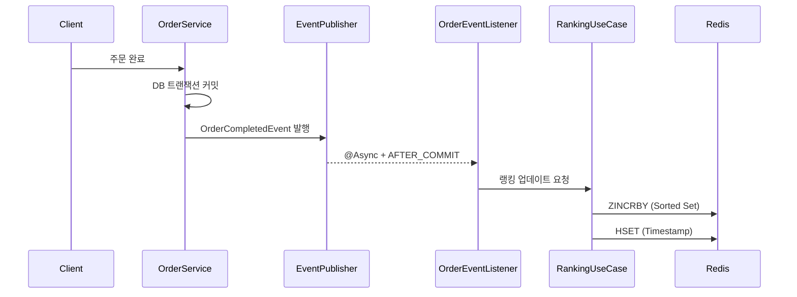
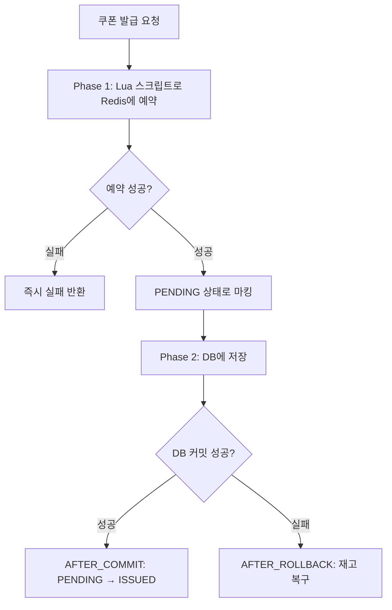
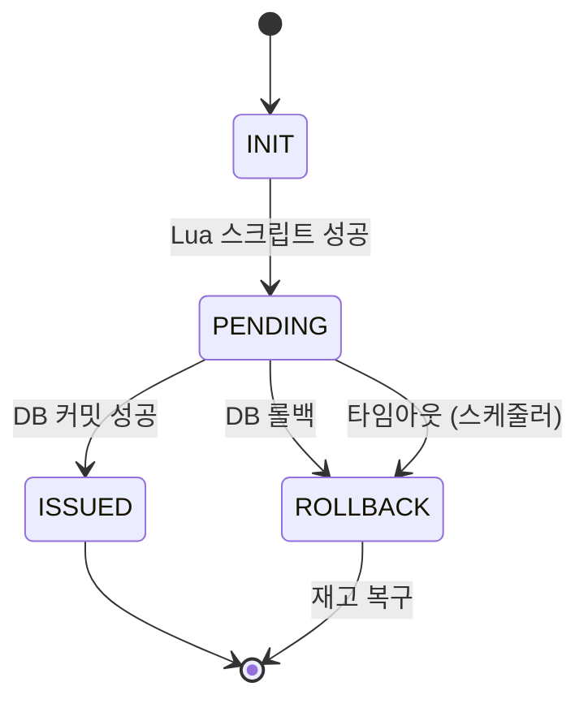

# 시스템 디자인 설계 및 개발 회고

이번 문서에서는 두 가지 주요 기능인 **실시간 상품 랭킹 시스템**과 **쿠폰 발급 시스템**의 설계 및 개발 과정을 회고한다.

---

## 1. 실시간 상품 랭킹 시스템

### 1.1 초기 접근 방식

랭킹 기능을 처음 설계할 때는 단순한 방식을 고려하였다.

```sql
SELECT product_id, SUM(quantity) as total_sold
FROM order_items
WHERE created_at >= NOW() - INTERVAL 3 DAY
GROUP BY product_id
ORDER BY total_sold DESC
LIMIT 5;
```

그러나 이 방식에는 문제가 있었다. 매번 조회할 때마다 전체 주문 테이블을 스캔해야 하고, 주문이 쌓일수록 성능이 저하될 것이 명확했다. 인덱스를 적용하더라도 집계 쿼리 자체의 부하는 피할 수 없었다.

### 1.2 기술 선택: Redis Sorted Set

여러 대안을 비교 검토하였다.

| 방식 | 장점 | 단점 |
|:-----|:-----|:-----|
| DB 집계 쿼리 | 구현이 단순하고 데이터 정확성 보장 | 조회마다 무거운 쿼리 실행 |
| 애플리케이션 메모리 (Map) | 매우 빠른 응답 속도 | 서버 재시작 시 데이터 유실, 분산 환경에서 동기화 불가 |
| **Redis Sorted Set** | O(log N) 성능, 서버 간 데이터 공유, TTL 지원 | Redis 인프라 추가 필요 |

최종적으로 Redis Sorted Set을 선택하였다. `ZINCRBY` 명령어 하나로 점수 증가와 정렬 유지가 동시에 가능하여, 랭킹 시스템에 적합한 자료구조라고 판단하였다.

### 1.3 동점 처리 문제

구현 후 테스트 과정에서 예상하지 못한 문제를 발견하였다. **판매량이 동일한 상품들의 순서가 조회할 때마다 달라지는 현상**이었다.

처음에는 동점일 경우 순서가 바뀌어도 무방하다고 생각하였으나, 사용자 경험 측면에서 새로고침할 때마다 순서가 변경되는 것은 적절하지 않다고 판단하였다. 이에 동점일 경우 **최근 판매된 상품을 우선** 노출하는 전략을 채택하였다.

```java
// RedisRankingRepository.java
@Override
public void incrementScore(RankingType type, Long productId, double score) {
    String rankingKey = generateRankingKey(type);
    String timestampKey = rankingKey + TIMESTAMP_SUFFIX;
    String productIdStr = productId.toString();

    // 1. 점수 증가
    redisTemplate.opsForZSet().incrementScore(rankingKey, productIdStr, score);

    // 2. 타임스탬프 기록 (동점 시 정렬 기준)
    redisTemplate.opsForHash().put(timestampKey, productIdStr,
            String.valueOf(System.currentTimeMillis()));
}
```

점수용 Sorted Set과 별도로 Hash에 타임스탬프를 저장하여, 조회 시 동점인 경우 타임스탬프로 2차 정렬하도록 구현하였다.

### 1.4 최종 아키텍처



`@Async`를 적용한 이유는 랭킹 업데이트 실패가 주문 자체에 영향을 주어서는 안 된다고 판단했기 때문이다. 랭킹은 부가 기능이므로 핵심 비즈니스 로직과 분리하였다.

### 1.5 Redis 키 설계

```
ranking:daily:2024-01-15      → 일별 랭킹 (TTL: 25시간)
ranking:weekly:2024:03        → 주별 랭킹 (TTL: 8일)
ranking:daily:2024-01-15:timestamp → 동점 처리용
```

TTL을 25시간, 8일로 설정한 것은 여유 시간을 확보하기 위함이다. 정확히 24시간, 7일로 설정할 경우 자정에 키가 만료되면서 일시적으로 랭킹이 비어 보이는 현상이 발생할 수 있다.

---

## 2. 쿠폰 발급 시스템

### 2.1 초기 구현: Redisson 분산 락

선착순 쿠폰 발급은 동시성 제어가 필수적이었다. 초기에는 Redisson Lock을 사용하여 구현하였다.

```
1. Redisson Lock 획득
2. DB에서 재고 확인
3. 쿠폰 발급 처리
4. DB 커밋
5. Lock 해제
```

기능적으로는 정상 동작하였으나, 부하 테스트를 수행한 결과 다음과 같은 문제가 발견되었다.

- Lock을 점유하는 동안 다른 모든 요청이 대기 상태로 전환
- 동시 요청 1,000건 테스트 시 다수의 타임아웃 발생
- 예상보다 낮은 TPS (Transactions Per Second)

### 2.2 문제 분석

Lock 구간이 DB 트랜잭션 전체를 포함하고 있어 Lock 점유 시간이 과도하게 길었다.

더 심각한 문제도 발견하였다. **DB 커밋은 성공했으나 Lock 해제 직전에 서버 장애가 발생할 경우**, Redis에는 발급 완료 상태가 반영되지 않아 동일 사용자가 중복 발급받을 수 있는 상황이었다.

### 2.3 해결: Lua 스크립트 + 2단계 커밋 패턴

문제 해결을 위해 다음과 같은 구조로 재설계하였다.


단계별 처리 흐름:
1. **먼저 Redis에서 예약** (PENDING 상태)
2. **이후 DB에 저장**
3. **결과에 따라 Redis 상태를 확정**

### 2.4 Lua 스크립트 도입 배경

Redis에서 "재고 확인 → 재고 감소 → PENDING 기록"을 수행해야 하는데, 이를 개별 명령어로 전송하면 명령어 사이에 다른 요청이 개입할 수 있다.

예시:
```
요청A: GET stock → 1
요청B: GET stock → 1
요청A: DECR stock → 0
요청B: DECR stock → -1  // 재고 음수 발생
```

Lua 스크립트를 사용하면 여러 명령어가 **원자적으로** 실행되어 중간에 다른 요청이 개입할 수 없다.

```lua
-- 쿠폰 발급 Lua 스크립트
-- KEYS[1]: stock, KEYS[2]: issued set, KEYS[3]: pending hash

-- 1. 이미 발급받은 사용자인지 확인
if redis.call('SISMEMBER', KEYS[2], ARGV[1]) == 1 then
    return -1  -- 이미 발급 완료
end

-- 2. 발급 진행 중인지 확인 (중복 요청 방지)
local pendingTime = redis.call('HGET', KEYS[3], ARGV[1])
if pendingTime then
    local elapsed = tonumber(ARGV[2]) - tonumber(pendingTime)
    if elapsed < tonumber(ARGV[3]) then
        return -4  -- 이미 진행 중
    end
    -- 타임아웃된 pending 정리 후 재시도 허용
    redis.call('HDEL', KEYS[3], ARGV[1])
    redis.call('INCR', KEYS[1])
end

-- 3. 재고 확인
local stock = redis.call('GET', KEYS[1])
if stock == false then return -3 end  -- 초기화되지 않음
if tonumber(stock) <= 0 then return -2 end  -- 재고 소진

-- 4. 재고 감소 + PENDING 기록
local newStock = redis.call('DECR', KEYS[1])
if newStock < 0 then
    redis.call('INCR', KEYS[1])  -- 롤백
    return -2
end
redis.call('HSET', KEYS[3], ARGV[1], ARGV[2])

return 1  -- 성공
```

### 2.5 상태 전이 다이어그램



### 2.6 Stale Pending 문제

구현을 완료했다고 생각했으나, 추가적인 예외 케이스가 존재하였다.

> Lua 스크립트는 성공하여 PENDING 상태가 되었으나, DB 저장 전에 서버 장애가 발생하면?

이 경우 PENDING 상태가 영구적으로 유지되어 재고를 점유하게 된다. `@TransactionalEventListener`의 AFTER_ROLLBACK 이벤트도 발행되지 않으므로 자동 복구가 불가능하다.

이를 해결하기 위해 **정리 스케줄러**를 추가하였다.
- 60초 간격으로 실행
- PENDING 상태에서 60초 이상 경과한 항목을 정리
- 분산 환경에서 중복 실행 방지를 위해 Redisson Lock 사용

```java
@Scheduled(fixedRateString = "${coupon.pending.cleanup-interval-ms:60000}")
public void cleanupStalePending() {
    RLock lock = redissonClient.getLock(LOCK_KEY);
    // 락 획득 후 정리 로직 수행
}
```

### 2.7 Redis 키 구조

| 키 패턴 | 타입 | 용도 | TTL |
|:--------|:-----|:-----|:----|
| `coupon:stock:{couponId}` | String | 남은 재고 수량 | 31일 |
| `coupon:issued:{couponId}` | Set | 발급 완료된 userId 집합 | 31일 |
| `coupon:pending:{couponId}` | Hash | 진행 중인 userId:timestamp | 31일 |

---

## 3. 기술적 결정 사항

### 3.1 Redisson Lock vs Lua 스크립트

| 비교 항목 | Redisson Lock | Lua 스크립트 |
|:----------|:--------------|:-------------|
| 처리량 | Lock 대기로 인한 병목 | 원자적 실행으로 높은 처리량 |
| 구현 난이도 | 상대적으로 용이 | 스크립트 작성 필요 |
| 확장성 | Lock 경합 증가 | 선형적 확장 가능 |

선착순 쿠폰은 순간적으로 수천 건의 요청이 집중되는 특성이 있다. Lock 방식으로는 해당 트래픽을 감당하기 어렵다고 판단하여 Lua 스크립트를 선택하였다.

### 3.2 비동기 vs 동기 이벤트 처리

**랭킹 업데이트 → 비동기 (`@Async`)**

```java
@Async
@TransactionalEventListener(phase = TransactionPhase.AFTER_COMMIT)
public void handleOrderCompleted(OrderCompletedEvent event) {
    updateProductRankingUseCase.execute(productId, quantity);
}
```

랭킹 업데이트 실패가 주문 처리에 영향을 주어서는 안 되며, 응답 시간 단축 효과도 있다.

**쿠폰 Confirm → 동기 + Retry**

```java
@TransactionalEventListener(phase = TransactionPhase.AFTER_COMMIT)
@Retryable(maxAttempts = 3, backoff = @Backoff(delay = 100))
public void handleCouponIssued(CouponIssuedEvent event) {
    couponIssueManager.confirm(event.couponId(), event.userId());
}
```

이 작업은 반드시 성공해야 한다. PENDING → ISSUED 전환이 실패하면 동일 사용자가 중복 발급받을 수 있기 때문이다.

**쿠폰 Rollback → AFTER_ROLLBACK**

```java
@TransactionalEventListener(phase = TransactionPhase.AFTER_ROLLBACK)
public void handleCouponRollback(CouponIssuedEvent event) {
    couponIssueManager.rollback(event.couponId(), event.userId());
}
```

DB 트랜잭션이 롤백되면 AFTER_ROLLBACK 이벤트가 발행되어 Redis의 PENDING 상태를 정리하고 재고를 복구한다. 이를 통해 Lua 스크립트에서 예약한 재고가 정상적으로 반환된다.

---

## 4. 회고

### 4.1 잘된 점

**1. Lua 스크립트를 통한 원자성 확보**

Race Condition 우려 없이 동시성 처리가 가능해졌다. Lock 없이도 높은 처리량을 달성할 수 있었다.

**2. 이벤트 기반 아키텍처 적용**

주문 로직에서 랭킹 업데이트 로직을 완전히 분리할 수 있었다. `@TransactionalEventListener`를 활용하여 트랜잭션 결과에 따라 다르게 처리하는 구조가 깔끔하였다.

**3. 실패 케이스에 대한 고려**

초기에는 성공 시나리오만 고려하였으나, 점차 "이 단계에서 실패하면?", "이 시점에 서버 장애가 발생하면?"과 같은 질문을 스스로에게 던지게 되었다. Stale Pending 정리 스케줄러가 그 결과물이다.

### 4.2 개선이 필요한 점

**1. 메시지 큐 미도입**

현재 `@Async`와 `ApplicationEventPublisher`를 사용하고 있어 서버 장애 시 이벤트가 유실될 수 있다. Kafka나 RabbitMQ를 도입했다면 더 안정적인 구조가 되었을 것이다.

```
현재: OrderService → ApplicationEvent → @Async Listener
개선: OrderService → Kafka → Consumer
```

**2. Redis 단일 장애점 (SPOF)**

Redis 장애 시 쿠폰 발급 전체가 중단된다. Redis Cluster나 Sentinel 구성, 또는 Circuit Breaker 패턴을 적용하여 DB Fallback을 구현하는 것이 필요하다.

**3. 모니터링 부재**

PENDING 상태가 비정상적으로 누적되거나 스케줄러가 실패해도 감지할 방법이 없다. Prometheus를 통한 메트릭 수집과 Grafana 알림 설정이 필요하다.

### 4.3 배운 점

**1. 분산 시스템에서 일관성 보장의 핵심은 보상 트랜잭션**

Redis와 DB를 단일 트랜잭션으로 묶을 수 없다. 따라서 실패 시 복구하는 보상 로직이 필수적이다.

| 상황 | 처리 흐름 |
|:-----|:---------|
| 정상 | Lua → DB Commit → Confirm |
| DB 실패 | Lua → DB Rollback → 재고 복구 |
| 서버 장애 | Lua → (장애) → 스케줄러 정리 |

**2. Lua 스크립트는 강력하지만 디버깅이 어렵다**

로직 오류가 발생해도 원인 파악이 쉽지 않았다. 반환값 규약을 명확히 정의하고, 단위 테스트를 충분히 작성하는 것이 중요하다.

**3. 비동기 처리 시 실패 전략을 선제적으로 수립해야 한다**

| 기능 | 실패 허용 여부 | 전략 |
|:-----|:--------------|:-----|
| 랭킹 업데이트 | 허용 (서비스 영향 없음) | 로그 기록 후 무시 |
| 쿠폰 Confirm | 불허 (데이터 불일치 발생) | 재시도 + 최종 보상 |

"일단 비동기로 처리하자"가 아니라, 실패 시 대응 방안을 먼저 수립해야 한다.
